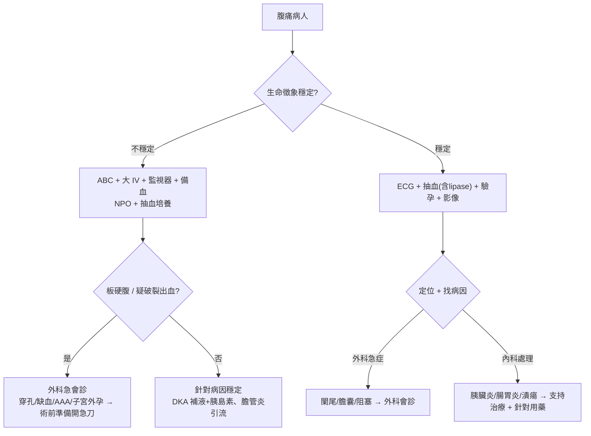

# Abdominal Pain（腹痛）

> [!danger] 🚨 紅旗警訊（must-not-miss，急腹症助記「BIOPI」＋不可漏的心臟/血管）
> **BIOPI**（腹部急症五大機轉，先想「要不要開刀/會不會死」）
> 1. **Bleeding 出血** → [[Aortic dissection(主動脈剝離)]]/AAA 破裂、[[Ectopic Pregnancy(子宮外孕)]]破裂、脾破裂、消化道大出血 → 休克、腹脹、Cullen/Turner sign
> 2. **Ischemia 缺血** → [[Acute Mesenteric Ischemia(急性腸繫膜缺血)]] → **疼痛與理學不成比例**、心房顫動/血管病史、乳酸↑
> 3. **Obstruction 阻塞** → [[Bowel Obstruction(腸阻塞)]]、[[Incarcerated hernia(箝頓型疝氣)]]、輸尿管/膽結石 → 腹脹、嘔吐、無排氣排便
> 4. **Perforation 穿孔** → [[Perforated Peptic Ulcer (消化性潰瘍穿孔)]] → 突發劇痛、板硬腹、free air
> 5. **Infection/Inflammation 感染發炎** → [[Appendicitis(闌尾炎)]]、[[Acute cholecystitis(急性膽囊炎)]]、[[Pancreatitis(胰臟炎)]]、[[Diverticulitis(憩室炎)]]、[[Peritonitis(腹膜炎)]]
> 6. **腹痛的「非腹部」殺手** → **上腹痛小心 [[Acute Myocardial infarction(急性心肌梗塞)]]**（下壁 MI）、[[Diabetic Ketoacidosis(糖尿病酮酸血症)]]、[[Herpes zoster(帶狀疱疹)]]（皮節痛）
>
> ⚡ **板硬腹（peritoneal signs）＋不穩定生命徵象 → 外科急會診，先穩定 ABC 再影像**

## 🔀 鑑別診斷 DDx（值班依「疼痛部位」定位，再連疾病）
| 部位 / 疾病 | 支持特徵 | rule-out 線索 |
| --- | --- | --- |
| **右上腹** [[Acute cholecystitis(急性膽囊炎)]] / [[Acute Cholangitis(急性膽管炎)]] | 悶痛放射右背、Murphy sign(+)、Charcot 三徵（膽管炎：發燒+黃疸+右上腹痛） | 肝膽指數/膽紅素正常 + 超音波無結石/膽囊壁增厚 |
| **上腹** [[Peptic ulcer disease(消化性潰瘍)]] / [[Pancreatitis(胰臟炎)]] | 潰瘍：空腹/飯後灼痛；胰臟炎：突發劇痛放射背、彎腰緩解、lipase >3× | lipase/amylase 正常 + 無穿孔徵象（但仍需排 MI） |
| **上腹（偽裝）** [[Acute Myocardial infarction(急性心肌梗塞)]] | 上腹壓迫感、放射下巴/手臂、冷汗、ECG 變化、troponin↑ | ECG 正常 + serial troponin(-) |
| **左上腹** 脾臟（[[Splenic Rupture(脾臟破裂)]]/梗塞/膿腫） | 外傷史、左肩轉移痛(Kehr sign)、脾腫 | 無外傷 + 影像脾正常 |
| **右下腹** [[Appendicitis(闌尾炎)]] | 臍周痛→轉移右下腹(McBurney)、噁心嘔吐、Rovsing/Psoas/Obturator(+) | Alvarado 低分 + 影像正常 |
| **左下腹** [[Diverticulitis(憩室炎)]] | 持續左下腹痛、發燒、排便習慣改變 | CT 無憩室發炎 |
| **下腹/骨盆** 婦科（[[Ectopic Pregnancy(子宮外孕)]]、[[Pelvic Inflammatory Disease(骨盆腔發炎)]]）、[[Ureteral Stone(輸尿管結石)]]、[[Acute urinary retention(急性尿液滯留)]] | 育齡女性驗孕、絞痛放射會陰+血尿(結石)、膀胱脹尿不出(尿滯留) | 驗孕(-) + U/A 正常 + 無泌尿症狀 |
| **全腹/瀰漫** [[Bowel Obstruction(腸阻塞)]]、[[Acute Mesenteric Ischemia(急性腸繫膜缺血)]]、[[Peritonitis(腹膜炎)]]、[[Diabetic Ketoacidosis(糖尿病酮酸血症)]]、[[Acute Gastroenteritis(急性腸胃炎)]] | 阻塞：腹脹嘔吐無排氣；缺血：痛/理學不成比例；DKA：血糖高+喘+酮體 | 腹軟無壓痛 + 影像/生化正常 |

> [!warning] **育齡女性腹痛一律先驗孕**（排子宮外孕）；**老人/糖尿病/免疫低下腹痛症狀常不典型**，門檻放低

## ❓ 問診 / 身體檢查重點
- **OPQRST**：突發最劇（穿孔/剝離/缺血）vs 漸進（發炎）；絞痛（阻塞/結石）vs 持續（發炎/缺血）；轉移痛型態（闌尾臍周→右下、膽囊右背）
- **關鍵伴隨症**：嘔吐/排氣排便（阻塞）、血便黑便（出血）、發燒黃疸（膽道）、泌尿/婦科症狀、月經史與**驗孕**
- **腹部理學（順序：屈膝 → 視聽觸扣）**：
  - 視：腹脹、手術疤、疝氣、Cullen/Turner sign（[[Hemorrhagic Pancreatitis(出血性胰臟炎)]]）
  - 聽：bowel sound（阻塞高亢/腹膜炎消失）、bruit
  - 觸：**從不痛處先壓**、反彈痛/板硬（腹膜炎）、Murphy sign、Rovsing/Psoas/Obturator（闌尾）、摸肝脾
  - 扣：tympanic/dullness、shifting dullness（腹水）、CVA 敲擊痛
- **必做**：DRE（疑消化道出血/阻塞）、疝氣孔檢查、**全身皮膚看帶狀疱疹**

## 🩺 初步 workup（該開的檢查 / 影像）
> [!note] 值班基本四件套：**抽血（含 lipase）＋ ECG（排下壁 MI）＋ CXR（立位看 free air）＋ 育齡女驗孕**
- **抽血**：CBC/DC、電解質、肝膽功能、**lipase/amylase**、lactate（缺血）、凝血、血型備血（疑出血）
- **尿檢**：U/A、育齡女性 **β-hCG**
- **ECG**（上腹痛排 MI）
- **影像**：立位 CXR/KUB（free air、腸脹氣氣液平面）→ **腹部超音波**（膽道/腹水/AAA）→ **腹部 CT（含顯影）**（闌尾/憩室/缺血/穿孔/阻塞的主力）
- 檢查 [[Lipase(脂解酶)]]　影像 [[Abdominal CT(腹部電腦斷層)]]

## ⚡ 值班即時處置（穩定 vs 不穩定分流）

- **不穩定/急腹症**：NPO、大 IV 輸液、備血、外科急會診；穿孔/缺血/絞窄性阻塞/破裂 → 開急刀
- **止痛**：**嚴重腹痛給適當止痛不會增加誤診率**（可放心給，不會掩蓋外科需求）
- **針對性**：闌尾/絞窄阻塞/穿孔/缺血 → 手術；膽囊炎 → 抗生素+NPO（急性期後擇期手術，難控制才 PTGBD/急刀，注意暫時性菌血症可能瞬間休克）；胰臟炎 → 輸液+NPO+支持（Ranson 分層）；膽管炎 → 抗生素+ERCP 引流
- ⚠️ **育齡女性下腹痛未驗孕前，不可當普通腸胃炎放行**

## 📊 臨床評分 / 風險分層（scoring）
> 腹痛的 score 多為「特定疾病可能性/嚴重度」輔助，**不取代臨床判斷與影像**

| 評分 | 用途 | 分數 → 處置分流 |
| --- | --- | --- |
| **Alvarado score** | 闌尾炎可能性（0–10；MANTRELS） | 低分可觀察/追蹤，中高分 → 影像/外科評估 |
| **Ranson criteria** | 急性胰臟炎嚴重度（入院 5 項 + 48h 6 項） | 分數越高死亡率越高 → 加護監測 |
| **Glasgow-Blatchford** | 上消化道出血風險（是否需介入） | 0 分低風險可門診，>0 → 住院/內視鏡 |
| **qSOFA** | 合併敗血症（膽管炎/腹膜炎/穿孔） | ≥2 → 疑敗血症，比照 sepsis bundle |

## 🔗 相關
- 疾病：[[Appendicitis(闌尾炎)]]　[[Acute cholecystitis(急性膽囊炎)]]　[[Pancreatitis(胰臟炎)]]　[[Bowel Obstruction(腸阻塞)]]　[[Acute Mesenteric Ischemia(急性腸繫膜缺血)]]　[[Perforated Peptic Ulcer (消化性潰瘍穿孔)]]　[[Ectopic Pregnancy(子宮外孕)]]
- 檢查：[[Lipase(脂解酶)]]　[[Abdominal CT(腹部電腦斷層)]]
- 症狀：[[Chest pain(胸痛)]]（上腹痛↔心因）　[[Jaundice(黃疸)]]　[[Lower GI bleeding(下消化道出血)]]

## 📚 來源
[^1]: BIOPI 急腹症五機轉 + 部位定位鑑別（值班教學共識，延續舊卡臨床架構）
[^2]: 嚴重腹痛給止痛不增加誤診 — Cochrane / 外科急症共識
[^3]: Ranson criteria / Alvarado score / Glasgow-Blatchford — 各疾病嚴重度與風險分層工具
[^4]: 育齡女性腹痛必驗孕排子宮外孕 — 急診標準流程

## 🎴 Flashcards & 自我測驗（Ollama qwen2.5:7b 自動生成 2026-07-03）
<!-- flashcard-gen:start -->

### 記憶卡（Spaced Repetition 相容 · `Q::A`）
腹痛的紅旗警訊有哪些？::出血、缺血、阻塞、穿孔、感染發炎

急性膽囊炎支持特徵是什麼？::Murphy sign(+)，Charcot 三徵（發燒+黃疸+右上腹痛）

急性心肌梗塞的腹痛如何鑑別？::上腹壓迫感、放射下巴/手臂、ECG 變化、troponin↑

闌尾炎的典型轉移痛型態是什麼？::臍周痛→轉移右下腹(McBurney)

急性胰臟炎嚴重度如何評分？::Ranson criteria（入院 5 項 + 48h 6 項）

急性腸胃出血風險如何評分？::Glasgow-Blatchford score

腹痛的板硬腹指什麼？::腹膜炎

育齡女性下腹痛必須先做哪個檢查？::驗孕

急性膽管炎如何治療？::抗生素+ERCP 引流

急性胰臟炎的止痛劑量是什麼？::嚴重腹痛給適當止痛

### 自我測驗（選擇題，答案摺疊）
**Q1.** 一位育齡女性因下腹部疼痛來診，您首先應該做哪個檢查？
- A. 腹部超音波
- B. 驗孕
- C. 血液檢查
- D. ECG

> [!success]- 答案
> **B** — 根據筆記內容，育齡女性腹痛一律先驗孕以排除子宮外孕。

**Q2.** 一位患者因急性上腹痛來診，ECG 正常且無心肌梗塞的症狀，您下一步應該做哪個檢查？
- A. 腹部超音波
- B. 血液檢查
- C. ECG 再次
- D. 驗孕

> [!success]- 答案
> **A** — 根據筆記內容，上腹痛可考慮急性胰臟炎或消化性潰瘍，需做血液檢查和腹部超音波。

**Q3.** 一位患者因全腹疼痛來診，生命徵象穩定，您下一步應該如何處理？
- A. 立即手術
- B. 做立位 CXR 與腹部超音波
- C. 開始抗生素治療
- D. 住院觀察

> [!success]- 答案
> **B** — 根據筆記內容，全腹疼痛需先做立位 CXR 與腹部超音波以排除急性腸梗阻或穿孔。

<!-- flashcard-gen:end -->
