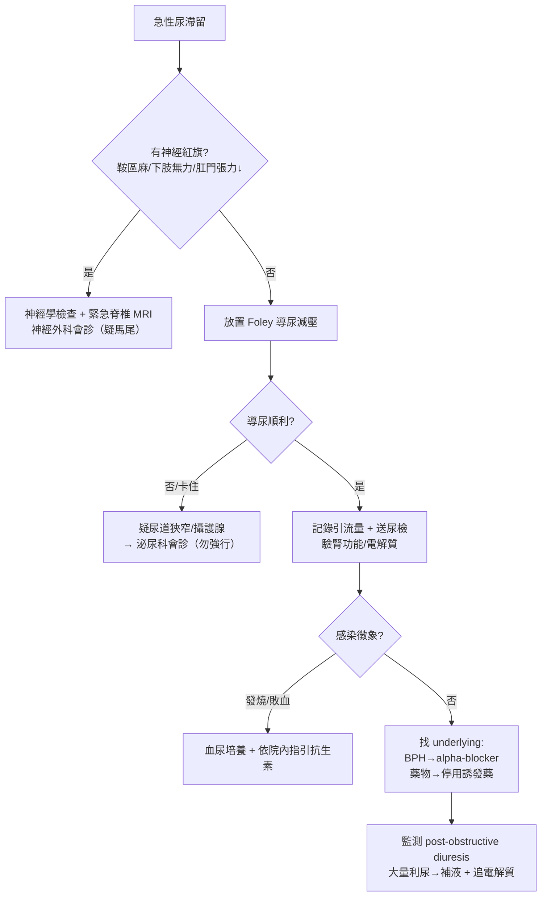

# Acute Urine Retention（急性尿滯留）

> [!danger] 🚨 紅旗警訊（must-not-miss，先排除致命/不可逆病因）
> **助記「神・腎・膿」— 先問「會不會癱、會不會壞腎、會不會敗血」**
> 1. **馬尾症候群 / 脊髓壓迫**（Cauda equina / cord compression）→ 尿滯留 + 鞍區感覺麻木、雙下肢無力、肛門張力↓ → **神經外科急症，MRI 不能拖**
> 2. **阻塞性腎病 / 腎後性 AKI**（Post-renal AKI）→ 長時間阻塞 → Cr 上升、高血鉀、代謝性酸中毒
> 3. **導尿後多尿（Post-obstructive diuresis）**→ 解除阻塞後大量利尿 → 脫水、電解質失衡，需監測尿量與補液
> 4. **泌尿道感染 / 敗血症**（Prostatitis、Pyelonephritis → urosepsis）→ 發燒、寒顫、血壓下降
> 5. **膀胱過度膨脹破裂**（罕見，外傷/長時間未解）
>
> ⚡ **第一步永遠是放 Foley 減壓**（同時是診斷也是治療）；但放置前若疑馬尾/脊髓 → 神經學檢查不可省

## 🔀 鑑別診斷 DDx（值班從這裡連到疾病）
| 疾病 | 支持特徵 | rule-out 線索 |
| --- | --- | --- |
| [[Benign Prostatic Hyperplasia(攝護腺肥大症)]] | 男性最常見；老年、夜尿/尿柱變細病史、DRE 攝護腺對稱腫大平滑 | 女性、無阻塞下段症狀 |
| [[Prostate Cancer(攝護腺癌)]] | DRE 硬結/不規則、PSA↑、體重減輕/骨痛 | DRE 平滑、PSA 正常 |
| [[Prostatitis(攝護腺炎)]] | 發燒、會陰痛、DRE 攝護腺壓痛（**避免用力按壓怕菌血症**） | 無發燒、無壓痛 |
| [[Urethral Stricture(尿道狹窄)]] | 器械操作/骨盆外傷/尿道炎病史、導尿卡在特定深度 | 無相關病史、Foley 順利進入 |
| 血塊填塞（clot retention） | 近期血尿/膀胱鏡/腫瘤病史、導尿引流血尿 | 尿色清 |
| [[Ureteral Stone(輸尿管結石)]] / 膀胱結石 | 腰腹絞痛、血尿；膀胱出口結石可急性阻塞 | 影像無結石 |
| [[Pelvic Organ Prolapse(骨盆腔器官脫垂)]] / 骨盆腫瘤 | 女性、下墜感、內診見脫垂或腫塊壓迫 | 內診正常 |
| 神經性膀胱 / 馬尾（cauda equina、脊髓損傷、DM 神經病變） | 鞍區麻木、下肢無力、反射異常、肛門張力↓ | 神經學檢查完全正常 |
| [[Detrusor Underactivity(逼尿肌無力)]] | 長期憋尿/糖尿病、無阻塞證據、殘尿多但無明顯出口阻力 | 有明確機械阻塞 |
| 藥物誘發 | **抗膽鹼、抗組織胺、擬交感藥（感冒藥）**、opioids、術後麻醉未退 | 無相關用藥 |

> [!warning] 感冒藥（抗組織胺 + 擬交感）是老年男性 AUR 的常見誘因，**病史一定要問到近期用藥**。

## ❓ 問診 / 身體檢查重點
- **病史**：解尿困難時程、有無完全解不出、下段症狀（尿柱細、夜尿、餘尿感）、血尿、發燒、近期用藥（感冒藥/抗膽鹼）、器械操作/骨盆外傷、背痛/下肢麻無力
- **系統回顧**：發燒寒顫（感染）、下肢無力/鞍區麻（神經）、體重減輕骨痛（攝護腺癌）
- **關鍵理學**：
  - 下腹部觸診 + 叩診（脹大膀胱、恥骨上濁音）
  - **肛門指診 DRE**：攝護腺大小/質地/壓痛、便祕塊、**肛門張力（anal tone）**、鞍區/會陰感覺
  - 女性加做內診（PV）評估脫垂/腫塊
  - **神經學**：雙下肢肌力/感覺/反射/肌張力（疑馬尾必做）

## 🩺 初步 workup（該開的檢查 / 影像）
> [!note] 黃金第一步：**放置 Foley 導尿減壓**——記錄立即引流量（>400 mL 支持真性滯留），同時緩解腎後阻塞。導尿即診斷即治療。
- **膀胱超音波 / bladder scan**：測餘尿量（PVR），無法導尿時定位
- **尿液常規 + 尿培養**：感染、血尿
- **腎功能 / 電解質**（Cr、K、酸鹼）：評估腎後性 AKI；導尿後追蹤 post-obstructive diuresis
- **PSA**：懷疑攝護腺癌（**急性滯留/導尿後 PSA 會假性升高，時機要注意**）
- **影像**：KUB / 腎臟超音波看水腎、結石；疑馬尾 → **脊椎 MRI（急）**
- 疑攝護腺 → [[Benign Prostatic Hyperplasia(攝護腺肥大症)]]；血尿血塊 → 膀胱鏡

## ⚡ 值班即時處置（穩定 vs 不穩定分流）

- **導尿為核心**：一般 Foley；卡住/尿道狹窄勿強行 → 泌尿科（可能需 coudé、膀胱造廔）
- **BPH 導致** → 開始 **alpha-blocker**（如 tamsulosin），提高後續拔管成功率（TWOC）
- **藥物誘發** → 停用抗膽鹼/擬交感藥
- **感染** → 抗生素依院內指引；疑攝護腺炎 DRE 勿用力
- ⚠️ **導尿後多尿**：解除阻塞後可大量利尿，監測尿量/血壓/電解質，必要時補液

## 📊 臨床評分 / 風險分層（scoring）★本卡核心
> AUR 沒有單一「決定 admit」的分數；靠 **餘尿量 + 腎功能 + IPSS（評估 BPH 嚴重度與後續處置）** 綜合判斷。

### ① 導尿引流量 / 餘尿量（PVR）判讀
| 引流量 / PVR | 意義 | 處置方向 |
| --- | --- | --- |
| **< 200 mL** | 未必真性滯留 | 找其他病因，勿貿然長期留管 |
| **200–400 mL** | 支持滯留 | 減壓 + 找 underlying |
| **> 400 mL** | 明確急性滯留 | 留置導尿 + 安排 TWOC |
| **> 1000 mL** | 高量滯留 | **警覺 post-obstructive diuresis**，監測尿量/電解質 |

### ② IPSS（International Prostate Symptom Score，BPH 嚴重度，7 題各 0–5 分，總 0–35）
| 分數段 | 嚴重度 | 意義 |
| --- | --- | --- |
| **0–7** | 輕度 | 觀察 / 生活型態調整 |
| **8–19** | 中度 | 藥物治療（alpha-blocker ± 5-ARI） |
| **20–35** | 重度 | 積極藥物 / 評估手術（TURP） |

> 7 題：① 餘尿感 ② 頻尿（<2h 又想尿）③ 間歇（斷續）④ 急尿 ⑤ 尿柱無力 ⑥ 需用力起始 ⑦ 夜尿次數。第 8 題另計「生活品質 QoL」0–6 分。**AUR 急性期問卷不準，穩定後再評估。**

### ③ 腎後性 AKI 警示（導尿後追蹤）
- Cr 上升 + 雙側水腎 + 少尿 → 阻塞性腎病，解除後多可回復
- 追蹤 K（高血鉀）、酸鹼、尿量

## 🔗 相關
- 疾病：[[Benign Prostatic Hyperplasia(攝護腺肥大症)]]　[[Prostate Cancer(攝護腺癌)]]　[[Prostatitis(攝護腺炎)]]　[[Urethral Stricture(尿道狹窄)]]　[[Detrusor Underactivity(逼尿肌無力)]]　[[Pelvic Organ Prolapse(骨盆腔器官脫垂)]]
- 症狀：[[Hematuria(血尿)]]　[[Frequency(頻尿)]]

## 📚 來源
[^1]: AUR 評估與處置 — AUA/EAU BPH guideline；UpToDate "Acute urinary retention"
[^2]: IPSS 分級 — Barry MJ et al. AUA Symptom Index (1992)；台灣泌尿科醫學會 BPH 診療共識
[^3]: Post-obstructive diuresis 與腎後性 AKI 監測 — 值班泌尿急症教學共識

## 🎴 Flashcards & 自我測驗（Ollama qwen2.5:7b 自動生成 2026-07-03）
<!-- flashcard-gen:start -->

### 記憶卡（Spaced Repetition 相容 · `Q::A`）
急性尿滯留紅旗警訊::馬尾症候群、阻塞性腎病、泌尿道感染

鑑別診斷神經性膀胱::鞍區麻木、下肢無力、反射異常、肛門張力↓

急性尿滯留第一步治療::放置 Foley 導尿減壓

泌尿道感染支持特徵::發燒、寒顫、血壓下降

膀胱過度膨脹破裂::外傷/長時間未解，罕見

前列腺肥大症支持特徵::男性最常見；老年、夜尿/尿柱變細病史、DRE 攝護腺對稱腫大平滑

前列腺癌支持特徵::DRE 硬結/不規則、PSA↑、體重減輕/骨痛

逼尿肌無力支持特徵::長期憋尿/糖尿病、無阻塞證據、殘尿多但無明顯出口阻力

急性尿滯留導尿引流量分類::< 200 mL 萬一真性滯留，200–400 mL 支持滯留，> 400 mL 明確急性滯留

急性尿滯留腎功能監測::Cr、K、酸鹼

### 自我測驗（選擇題，答案摺疊）
**Q1.** 患者為65歲男性，有長期憋尿史，近期解尿困難，導尿後引流量大約1000 mL。您下一步應如何處理？
- A. 留置Foley導尿管並監測多尿症狀
- B. 立即拔除Foley導尿管
- C. 設定留置時間為24小時，無需特別處理
- D. 進行膀胱鏡檢查

> [!success]- 答案
> **A** — 根據筆記，引流量大於1000 mL屬於高量滯留，應警覺post-obstructive diuresis，因此需要留置Foley導尿管並監測多尿症狀。

**Q2.** 患者為75歲男性，有攝護腺肥大病史，近期解尿困難，導尿引流量約300 mL。您下一步應如何處理？
- A. 立即拔除Foley導尿管
- B. 進行膀胱鏡檢查
- C. 設定留置時間為24小時並評估症狀
- D. 留置Foley導尿管並監測多尿症狀

> [!success]- 答案
> **C** — 根據筆記，引流量在200–400 mL之間支持滯留，應減壓並找underlying病因。

**Q3.** 患者為50歲男性，近期有使用感冒藥物史，導尿後引流量約150 mL。您下一步應如何處理？
- A. 立即拔除Foley導尿管
- B. 進行膀胱鏡檢查
- C. 設定留置時間為24小時並評估症狀
- D. 停用誘發藥物，設置留置時間並監測多尿症狀

> [!success]- 答案
> **D** — 根據筆記，感冒藥物是老年男性AUR的常見誘因，應停用誘發藥物並設置留置時間以監測多尿症狀。

<!-- flashcard-gen:end -->
