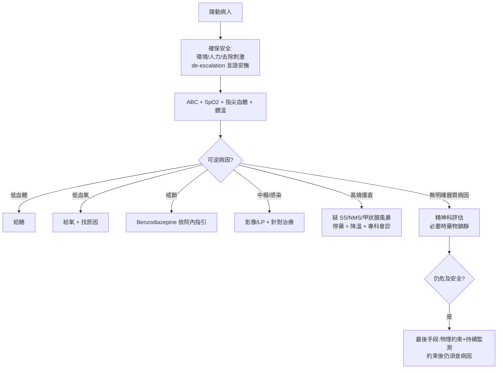

# Agitation（躁動）

> [!danger] 🚨 紅旗警訊（must-not-miss，躁動先當「器質性 delirium」處理，別急著貼精神病標籤）
> **助記「缺氧・低糖・戒斷・腦・毒」— 先排會死人的可逆病因再想精神科**
> 1. **低血氧 Hypoxia** → 任何躁動先量 **SpO2**，缺氧本身會躁動
> 2. **低血糖 Hypoglycemia** → 指尖血糖是第一步，低糖躁動給糖立即改善
> 3. **戒斷 Withdrawal**（酒精 / benzodiazepine）→ 顫抖、冒汗、心搏過速、可進展癲癇/DT（震顫性譫妄，死亡率高）
> 4. **中樞病變**（顱內出血 / 腦膜腦炎 / 癲癇後 / 中風）→ 局灶神經徵象、發燒、頭痛、頸部僵硬
> 5. **中毒 / 藥物**（擬交感、抗膽鹼、**血清素症候群 / NMS**）+ **甲狀腺風暴** → 高燒、肌僵直、自律神經不穩
>
> ⚡ **躁動病人先保護自身與病人安全（環境/人力/約束為最後手段）**，同時 ABC + 血糖 + SpO2，找可逆病因

## 🔀 鑑別診斷 DDx（值班先分「器質性 vs 精神科」）
| 疾病 / 類別 | 支持特徵 | rule-out 線索 |
| --- | --- | --- |
| [[Delirium(譫妄)]]（器質性，最重要） | 急性起病、注意力↓、意識波動、日夜顛倒、常見於老人/術後/感染 | 意識清、注意力正常、慢性穩定病程 |
| [[Hypoglycemia(低血糖)]] | 冒汗、心悸、給糖後迅速改善 | 血糖正常 |
| [[Hypoxmia(低血氧)]] | SpO2↓、發紺、呼吸窘迫 | SpO2 正常 |
| [[Alcohol withdrawal(酒精戒斷)]] / BZD 戒斷 | 停酒/停藥史、顫抖冒汗、心搏過速、幻覺、可癲癇 | 無物質使用史 |
| [[Toxin(中毒)]] / 藥物（擬交感、抗膽鹼） | 用藥/毒物暴露、瞳孔變化、抗膽鹼 toxidrome（乾熱紅） | 無暴露史、toxidrome 不符 |
| 血清素症候群 / [[Malignant Syndrome(惡性症候群)]] NMS | 近期精神科/血清素藥、高燒、肌僵直、反射亢進（SS）/ 鉛管僵直（NMS） | 無相關用藥 |
| 中樞病變（[[IntraCerebral Hemorrhage(腦實質出血)]]、[[Meningitis(腦膜炎)]]、[[Encephalitis(腦炎)]]、[[Seizure(癲癇)]]後） | 局灶神經徵象、頭痛、發燒、頸僵、抽搐後 | 神經學/影像正常 |
| [[Thyroid storm(甲狀腺風暴)]] | 高燒、心搏過速/房顫、甲亢病史 | 甲狀腺功能正常 |
| 原發精神疾病（躁症、精神病、恐慌） | 意識清、注意力保留、有精神科病史、無器質病因 | **屬排除診斷**，須先排器質性 |

> [!warning] **老人新發躁動 = delirium 直到證明並非如此**。別把 delirium 誤當「失智惡化」或「精神病」而只給鎮靜——會遮蔽致命病因。

## ❓ 問診 / 身體檢查重點
- **病史（常需向家屬/看護取得）**：起病急慢、意識是否波動、用藥/停藥（酒、BZD、精神科藥）、毒物暴露、發燒頭痛、既往精神病史、近期感染/術後
- **系統回顧**：發燒、頭痛、局灶無力、抽搐、心悸、便祕/尿滯留（抗膽鹼）
- **關鍵理學**：
  - 生命徵象 + **SpO2 + 指尖血糖 + 體溫**（發燒必查感染/SS/NMS/甲狀腺風暴）
  - 意識/注意力評估（CAM）、瞳孔、局灶神經徵象、頸部僵硬
  - 肌張力/反射（SS 反射亢進+陣攣、NMS 鉛管僵直）、皮膚（乾熱=抗膽鹼、濕=擬交感/SS）

## 🩺 初步 workup（該開的檢查 / 影像）
> [!note] 黃金第一步：**指尖血糖 + SpO2**——兩個床邊 30 秒可逆病因，任何躁動先做。
- **血糖、動脈/靜脈血氧、電解質**（Na、Ca）、腎/肝功能、氨（肝性腦病）
- **感染評估**：CBC、發炎指標、尿檢、必要時血培養/胸片（找 delirium 病因）
- **毒物 / 藥物濃度**：酒精、必要時毒物篩檢
- **甲狀腺功能**（疑甲狀腺風暴）
- **腦影像 CT**：局灶神經徵象、頭部外傷、頭痛
- **腰椎穿刺**：疑腦膜炎/腦炎（發燒 + 意識改變 + 頸僵）
- **EKG**：QTc（用鎮靜前基準）、心律

## ⚡ 值班即時處置（安全優先 + 找病因）

- **de-escalation 優先**（言語安撫、減少刺激），藥物與約束是後線
- **鎮靜藥選擇看病因**：
  - 戒斷（酒/BZD）→ **benzodiazepine**（禁用抗精神病藥當首選）
  - 原發精神病躁動 → 抗精神病藥（如 haloperidol）± BZD，**依院內指引**、注意 QTc
  - **譫妄 delirium 核心是治病因**，鎮靜僅為安全，避免過度使用（可惡化 delirium）
- **物理約束**：僅在危及安全時作為最後手段，須持續監測 + 定期解除評估，且不取代病因追查
- ⚠️ 疑 **SS/NMS** → 立即停止致病藥、積極降溫、專科會診（不是單純鎮靜可解）

## 📊 臨床評分 / 風險分層（scoring）★本卡核心

### ① RASS（Richmond Agitation-Sedation Scale，−5 ~ +4）
| 分數 | 狀態 | 描述 |
| --- | --- | --- |
| **+4** | 攻擊性 combative | 明顯暴力、危及工作人員 |
| **+3** | 非常躁動 | 拔管路/導管、有攻擊性 |
| **+2** | 躁動 agitated | 頻繁無目的動作、抗拒 |
| **+1** | 不安 restless | 焦慮但動作不具攻擊 |
| **0** | 清醒平靜 | — |
| **−1** | 嗜睡 | 呼喚可持續睜眼 >10 秒 |
| **−2** | 輕度鎮靜 | 呼喚睜眼 <10 秒 |
| **−3** | 中度鎮靜 | 呼喚有動作但不睜眼 |
| **−4** | 深度鎮靜 | 對聲音無反應，對疼痛有動作 |
| **−5** | 無法喚醒 | 對聲音與疼痛皆無反應 |

> 用途：客觀量化躁動/鎮靜程度，追蹤治療反應與鎮靜目標（多數病人目標 0 ~ −2）。

### ② CAM（Confusion Assessment Method，診斷 delirium）
| 特徵 | 內容 |
| --- | --- |
| **① 急性起病 + 波動病程** | 必要 |
| **② 注意力不集中** | 必要 |
| **③ 思考紊亂** | ③或④其一 |
| **④ 意識程度改變** | ③或④其一 |

> **診斷 delirium = ①且② + （③或④）**。躁動老人套 CAM 陽性 → 積極找 delirium 病因，別只鎮靜。

### ③ 器質 vs 功能性快速鑑別線索
- **器質性偏向**：急性起病、意識波動、注意力差、局灶神經徵象、異常生命徵象、視幻覺、老人/無精神病史
- **功能性偏向**：意識清楚、注意力保留、聽幻覺為主、有精神病史、生理檢查正常

## 🔗 相關
- 疾病：[[Delirium(譫妄)]]　[[Alcohol withdrawal(酒精戒斷)]]　[[Hypoglycemia(低血糖)]]　[[Malignant Syndrome(惡性症候群)]]　[[Thyroid storm(甲狀腺風暴)]]
- 症狀：[[Conscious Change(意識障礙)]]

## 📚 來源
[^1]: RASS — Sessler CN et al. *Am J Respir Crit Care Med* 2002
[^2]: CAM — Inouye SK et al. *Ann Intern Med* 1990（Confusion Assessment Method）
[^3]: 急性躁動處置與 de-escalation — AAEP Project BETA；UpToDate "Assessment and emergency management of the acutely agitated"

## 🎴 Flashcards & 自我測驗（Ollama qwen2.5:7b 自動生成 2026-07-03）
<!-- flashcard-gen:start -->

### 記憶卡（Spaced Repetition 相容 · `Q::A`）
躁動病人首步驟是什麼？::量SpO2及血糖

哪種情況需立即給氧？::低血氧Hypoxia

哪種情況需立即給糖？::低血糖Hypoglycemia

酒精戒斷症狀有哪些？::顫抖、冒汗、心搏過速、幻覺

何時考慮腰椎穿刺？::發燒+意識改變+頸僵

哪種情況需停藥並積極降溫？::血清素症候群/Malignant Syndrome NMS

RASS分數多少為攻擊性Combative？::+4

CAM診斷譫妄的必要條件是什麼？::急性起病+波動病程

何時考慮使用鎮靜藥物？::有危及安全之虞

RASS分數多少為清醒平靜？::0

### 自我測驗（選擇題，答案摺疊）
**Q1.** 病人出現躁動，SpO2 85%，血糖 4.5 mmol/L。根據筆記建議，下一步應如何處理？
- A. 立即給氧
- B. 立即給糖
- C. 觀察無需立即處理
- D. 調查其他可逆病因

> [!success]- 答案
> **A** — 根據筆記，躁動病人首步驟是量SpO2及血糖。低血氧Hypoxia需立即給氧，因此選擇A。

**Q2.** 一位長期飲酒患者突然出現躁動，伴隨心悸、冒汗和震顫。根據筆記建議，下一步應如何處理？
- A. 立即使用鎮靜藥物
- B. 調查酒精戒斷症狀並考慮給糖
- C. 觀察無需立即處理
- D. 調查其他可逆病因

> [!success]- 答案
> **B** — 根據筆記，躁動先排「器質性」病因，低血氧、低血糖、戒斷等。酒精戒斷症狀伴隨心悸、冒汗和震顫，需考慮給糖，因此選擇B。

**Q3.** 一位病人出現高燒、肌僵直及反射亢進，根據筆記建議，下一步應如何處理？
- A. 立即使用鎮靜藥物
- B. 調查血清素症候群/Malignant Syndrome NMS
- C. 觀察無需立即處理
- D. 調查其他可逆病因

> [!success]- 答案
> **B** — 根據筆記，病人出現高燒、肌僵直及反射亢進，需考慮血清素症候群/Malignant Syndrome NMS。因此選擇B。

<!-- flashcard-gen:end -->
