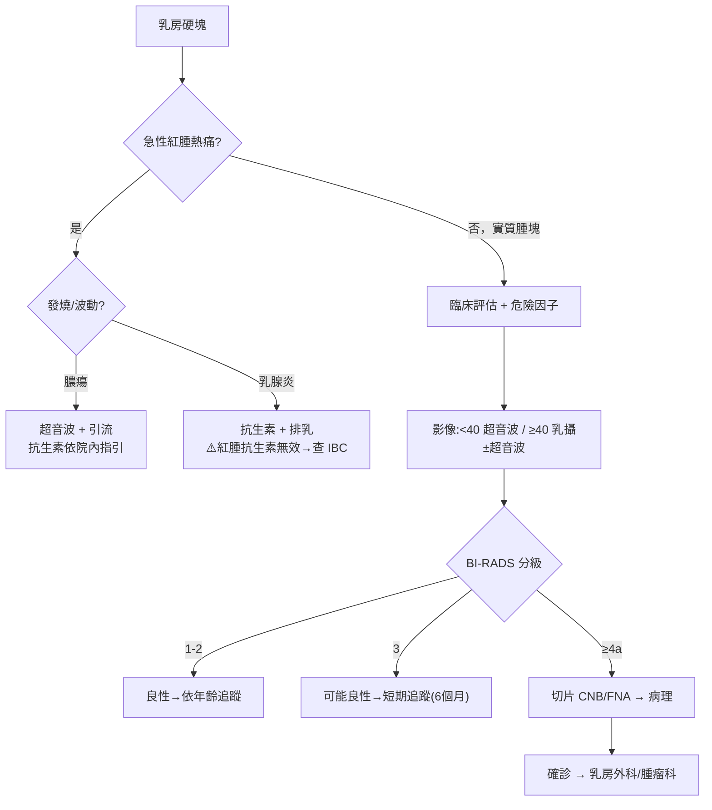

# Breast lumps（乳房硬塊）

> [!danger] 🚨 紅旗警訊（must-not-miss，先排除惡性與感染急症）
> **助記「硬・固・皮・淋・血・炎」— 摸到硬塊先問這幾點**
> 1. **乳癌 Breast cancer** → 硬、不規則、固定不可移動、無痛、單側、年齡↑
> 2. **皮膚變化** → 橘皮樣（peau d'orange）、凹陷（dimpling/retraction）、乳頭內縮 → 高度可疑
> 3. **發炎性乳癌 IBC** → 快速紅腫熱脹「像乳腺炎但抗生素無效」→ 不可當單純乳腺炎拖延
> 4. **腋下/鎖骨上淋巴結腫大** → 硬、固定 → 疑轉移
> 5. **血性/單孔自發乳頭分泌物** → 疑管內病灶/乳癌
> 6. **乳腺膿瘍 + 敗血** → 發燒、波動性腫塊 → 需引流
>
> ⚡ **任何實質性硬塊（尤其停經後）→ 走 triple assessment，不因「看起來良性」就放掉**

## 🔀 鑑別診斷 DDx（值班從這裡連到疾病）
| 疾病 | 支持特徵 | rule-out 線索 |
| --- | --- | --- |
| [[Breast Cancer(乳癌)]] | 硬、邊緣不規則(spiculated)、固定、無痛、皮膚/乳頭變化、淋巴結腫、年齡↑、家族史 | 影像/病理良性、triple assessment 一致良性 |
| [[Fibroadenoma(纖維腺瘤)]] | 年輕女性、硬但**可移動(rubbery, mobile)**、邊緣光滑、無痛 | 固定、不規則、快速增大 |
| 乳房囊腫 Cyst | 停經前、觸感較軟可壓、可隨月經變化、超音波單純囊腫 | 實心、複雜性囊腫需切片 |
| [[Fibrocystic change(乳房纖維囊腫)]] | 停經前常見、雙側、按壓疼痛、隨月經（經前變大）變化 | 單一固定硬塊 |
| [[Galactocele(乳囊腫)]] | 哺乳期女性、乳汁滯留囊腫 | 非哺乳期 |
| [[Mastitis(乳腺炎)]] / 膿瘍 | 紅腫熱痛、發燒、哺乳期常見、可波動 | 無發炎徵象；**紅腫但抗生素無效 → 想 IBC** |
| Phyllodes tumor 葉狀瘤 | 快速增大的硬塊，可良可惡 | 穩定不長大 |

> [!warning] **可移動 ≠ 一定良性**：任何無法明確判定的實質腫塊都要影像 + 必要時病理，尤其 **BI-RADS ≥4a 需切片**。

## ❓ 問診 / 身體檢查重點
- **病史**：發現時間與變化速度、是否隨月經變化、疼痛與否、乳頭分泌物（單/雙側、顏色、自發/擠壓）、哺乳狀態
- **乳癌危險因子（助記 NAAHCC）**：**N**ulliparity 未生育／晚生育、**A**ge 年齡↑、**A**lcohol、**H**ormone（初經早/停經晚、HRT）、**C**ancer 個人/家族史（BRCA）、**C**hest radiation 胸部放療史
- **理學檢查（先取得同意 + 請護理師陪同）**：
  - 6 步驟「先視後觸，四坐二臥」
  - **視診**：雙手叉腰，看對稱、外觀、皮膚（橘皮/凹陷）、乳頭內縮
  - **觸診**：系統性不遺漏（順時鐘或垂直帶狀），描述病灶——
    - **位置**：幾點鐘方向 + 距乳頭距離
    - **性質**：大小、深度、可否移動、邊緣（smooth/spiculated）、形狀、可否壓縮
  - **淋巴結**：腋下 + 鎖骨上下（需足夠力道），評估硬度/固定

## 🩺 初步 workup（該開的檢查 / 影像）
> [!note] 核心原則：**三重評估 Triple Assessment = 臨床 + 影像 + 病理**——三者一致才可放心，任一不符就升級。
- **影像（依年齡選）**：
  - **< 35–40 歲** → 首選 **乳房超音波**（緻密乳房）
  - **≥ 35–40 歲** → **乳房攝影 mammography** ± 超音波
  - MRI：高危險族群/評估範圍
- **病理**：
  - **FNA（細針抽吸）**：囊性 vs 實性、細胞學
  - **CNB（粗針切片）**：實質腫塊確診 + 免疫組化（ER/PR/HER2），BI-RADS ≥4a 首選
- 影像分級 → [[Breast Cancer(乳癌)]]（BI-RADS 見下）

## ⚡ 值班即時處置（分流）

- **值班定位**：乳房硬塊多非急症；重點是**辨識紅旗 + 啟動正確的門診 triple assessment**，別自行斷定良性
- **急性感染**：乳腺炎抗生素 + 排乳；膿瘍需引流；**紅腫對抗生素無反應務必排除 IBC**
- 確診惡性 → 乳房外科/腫瘤內科團隊

## 📊 臨床評分 / 風險分層（scoring）★本卡核心

### ① BI-RADS（Breast Imaging Reporting and Data System，0–6）
| 分級 | 意義 | 惡性風險 | 處置 |
| --- | --- | --- | --- |
| **0** | 評估未完成 | — | 加做其他影像/比對舊片 |
| **1** | 陰性 | ~0% | 常規篩檢 |
| **2** | 良性 | ~0% | 常規篩檢 |
| **3** | 可能良性 | **< 2%** | **短期追蹤（6 個月）** |
| **4** | 可疑（4a/4b/4c） | **~2%–95%** | **切片** |
| — 4a | 低度可疑 | 2–10% | 切片 |
| — 4b | 中度可疑 | 10–50% | 切片 |
| — 4c | 高度可疑 | 50–95% | 切片 |
| **5** | 高度提示惡性 | **≥ 95%** | 切片 + 治療準備 |
| **6** | 已病理證實惡性 | 100% | 治療 |

> 值班/門診用途：**BI-RADS ≥4 → 一定切片**；3 → 短期追蹤而非直接切；治療決策看病理不看影像分級單獨下。

### ② Triple Assessment 判讀原則
| 三項（臨床 / 影像 / 病理） | 結論 |
| --- | --- |
| 三者皆良性且一致 | 可放心，依建議追蹤 |
| 任一項可疑或不一致 | **升級處置**（切片 / 手術評估），不採「多數決」 |

## 🔗 相關
- 疾病：[[Breast Cancer(乳癌)]]　[[Fibroadenoma(纖維腺瘤)]]　[[Fibrocystic change(乳房纖維囊腫)]]　[[Galactocele(乳囊腫)]]　[[Mastitis(乳腺炎)]]
- 症狀：（乳頭分泌物、乳房疼痛）

## 📚 來源
[^1]: BI-RADS 分級與惡性風險 — ACR BI-RADS Atlas 5th ed.
[^2]: Triple assessment — NICE/UK breast lump referral guideline；UpToDate "Clinical evaluation of a breast lump"
[^3]: 乳房檢查 6 步驟與病灶描述 — 台灣乳房醫學會臨床檢查教學共識

## 🎴 Flashcards & 自我測驗（Ollama qwen2.5:7b 自動生成 2026-07-03）
<!-- flashcard-gen:start -->

### 記憶卡（Spaced Repetition 相容 · `Q::A`）
乳房硬塊的紅旗警訊有哪些？::乳癌、皮膚變化、發炎性乳癌、腋下淋巴結腫大、血性乳頭分泌物、乳腺膿瘍

BI-RADS 分級 4a 細胞學風險是多少？::2–10%

BI-RADS 分級 5 的惡性風險是多少？::≥95%

乳房硬塊的鑑別診斷中，哪種情況需要立即引流？::乳腺膿瘍

BI-RADS 分級 4b 細胞學風險是多少？::10–50%

乳房硬塊的紅旗警訊中，哪種情況需要考慮轉移可能？::腋下淋巴結腫大

BI-RADS 分級 4c 細胞學風險是多少？::50–95%

乳房硬塊的紅旗警訊中，哪種情況需要考慮急性乳腺炎？::發炎性乳癌、急性紅腫熱痛

BI-RADS 分級 3 的惡性風險是多少？::<2%

乳房硬塊的紅旗警訊中，哪種情況需要考慮乳頭內縮？::皮膚變化

### 自我測驗（選擇題，答案摺疊）
**Q1.** 一位停經後婦女來診，主訴右側乳房有一硬塊，無痛，按壓不變形。初步評估應如何處理？
- A. 立即切片
- B. 開始抗生素治療
- C. 要求超音波檢查
- D. 三重評估

> [!success]- 答案
> **D** — 根據筆記，任何實質性硬塊（尤其停經後）需走三重評估。

**Q2.** 一位35歲婦女來診，主訴乳房有硬塊，按壓無痛且可移動。初步影像檢查應如何進行？
- A. 乳房超音波
- B. 乳房攝影
- C. MRI
- D. FNA

> [!success]- 答案
> **A** — 根據筆記，<35–40 歲婦女首選乳房超音波。

**Q3.** 一位28歲婦女來診，主訴右側乳房有硬塊，按壓無痛且可移動。初步評估中發現腋下淋巴結腫大，固定不可移動。下一步應如何處理？
- A. 立即切片
- B. 開始抗生素治療
- C. 要求超音波檢查
- D. 三重評估

> [!success]- 答案
> **A** — 根據筆記，腋下淋巴結腫大固定不可移動需考慮轉移可能，應進行切片。

<!-- flashcard-gen:end -->
