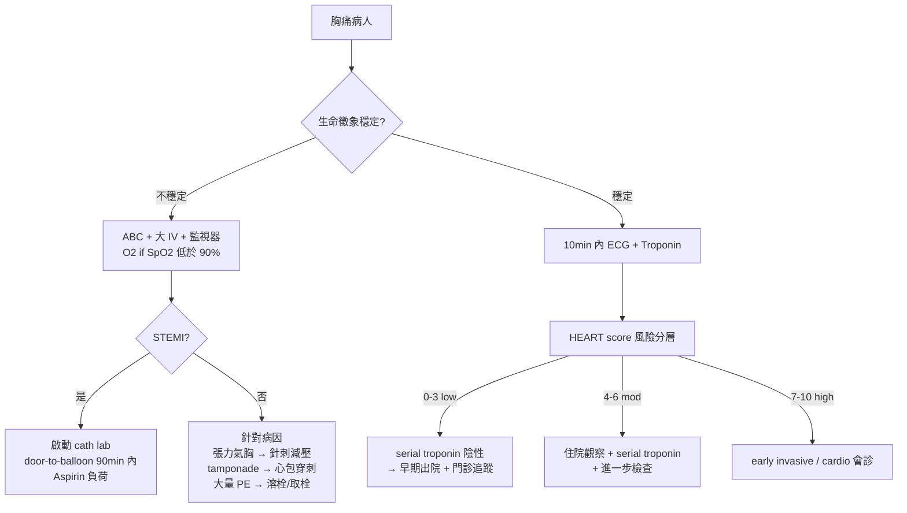

# Chest Pain（胸痛）

> [!danger] 🚨 紅旗警訊（must-not-miss，先排除 6 大致命病因再想常見病）
> **助記「六殺手」**：先問「會不會死人」再問「是什麼」
> 1. **ACS**（AMI / unstable angina）→ 壓迫性、放射左臂/下巴、冷汗、噁心
> 2. **Aortic dissection**（主動脈剝離）→ 突發撕裂痛、前胸↔背移動、兩側血壓差 >20 mmHg
> 3. **Pulmonary embolism**（肺栓塞）→ 胸膜性痛、呼吸急促、tachycardia、單側腿腫
> 4. **Tension pneumothorax**（張力性氣胸）→ 患側呼吸音消失、氣管偏移、頸靜脈怒張、低血壓
> 5. **Cardiac tamponade**（心包填塞）→ Beck 三徵：低血壓 + 頸靜脈怒張 + 心音遙遠；奇脈
> 6. **Esophageal rupture / Boerhaave**（食道破裂）→ 劇烈嘔吐後胸痛、皮下氣腫、Hamman's crunch
>
> ⚡ **任一不穩定生命徵象 → 先穩定 ABC，不要等診斷**

## 🔀 鑑別診斷 DDx（值班從這裡連到疾病）
| 疾病 | 支持特徵 | rule-out 線索 |
| --- | --- | --- |
| [[Acute Coronary Syndrome(急性冠心症)]] | 壓迫/緊縮感、放射、勞動誘發、冷汗、ECG ST 變化、troponin ↑ | ECG 正常 + serial troponin 陰性 + 低 HEART score |
| [[Aortic Dissection(主動脈剝離)]] | 突發最劇痛、撕裂樣、移動性、兩側 BP 差、縱膈腔變寬 | ADD-RS ≤1 + D-dimer <500 |
| [[Pulmonary Embolism(肺栓塞)]] | 胸膜性痛、呼吸困難、低血氧、DVT 徵象、心搏過速 | Wells 低 + PERC(-) 或 D-dimer(-) |
| [[Pneumothorax(氣胸)]] | 突發單側痛 + 呼吸困難、患側呼吸音↓、瘦高年輕男 | CXR / POCUS 無 lung sliding 缺失 |
| [[Pericarditis(心包炎)]] | 銳痛、前傾減輕/平躺加劇、廣泛 ST 上升 + PR 下降、摩擦音 | 無 troponin↑ 大量、無局部 ST |
| [[GERD(胃食道逆流)]] / 食道痙攣 | 灼熱感、平躺/飯後加劇、制酸劑緩解 | 屬排除診斷，先排心因性 |
| 肌肉骨骼（costochondritis） | 局部壓痛可重現、隨姿勢/呼吸變化 | 可觸痛複製 = 心因性可能性↓（但不能單靠此排除） |

> [!warning] 觸診可複製的胸痛「降低」但**不排除** ACS（約 5–7% AMI 有胸壁壓痛）

## ❓ 問診 / 身體檢查重點
- **OPQRST**：
  - **O**nset 突發 vs 漸進（突發最劇 → dissection/PE/氣胸）
  - **P**rovoke/Palliate 勞動誘發 + 休息緩解 → angina；前傾緩解 → pericarditis；制酸劑緩解 → GERD
  - **Q**uality 壓迫/緊縮 → ACS；撕裂 → dissection；銳/胸膜性 → PE/氣胸/心包
  - **R**adiation 左臂/下巴/雙臂 → ACS；背/肩胛間 → dissection
  - **S**everity 及 **T**ime course + 誘發事件（劇烈嘔吐後 → Boerhaave）
- **系統回顧**：呼吸困難、暈厥、心悸、發燒、下肢腫、咳血
- **關鍵理學**：**兩側血壓 + 脈搏對稱**（dissection）、呼吸音（氣胸/PE）、心音摩擦/遙遠（心包）、頸靜脈怒張、下肢 DVT、皮下氣腫

## 🩺 初步 workup（該開的檢查 / 影像）
> [!note] 黃金第一步：**到院 10 分鐘內 12-lead [[ECG(心電圖)]]** — 決定 STEMI 分流的分水嶺
- **ECG**（10 min 內，可疑時 serial + 右側/後壁導程 V7-V9）→ 連 [[STEMI(ST上升型心肌梗塞)]]、[[NSTEMI(非ST上升型心梗)]]
- **High-sensitivity Troponin**：0h / 1h（或 0h/3h）serial → 連 [[Troponin(肌鈣蛋白)]]
- **CXR**：縱膈腔變寬（dissection）、氣胸、肺水腫、free air
- **D-dimer**：搭配 ADD-RS / Wells 使用（高預測值時**不要**單獨開，會被假陽性綁架）
- **POCUS**：心包積液、RV strain（PE）、lung sliding（氣胸）、主動脈根部
- 影像升級：**CTA**（dissection / PE 確診）　檢查 [[D-dimer]]　影像 [[CTA(電腦斷層血管攝影)]]

## ⚡ 值班即時處置（穩定 vs 不穩定分流）

- **穩定線**：ECG → troponin → HEART 分層（見下 scoring）
- **不穩定線**：先穩定再診斷；STEMI → aspirin 負荷 + 立即 PCI；O2 **only if** SpO2 <90%（常規給氧無益甚至有害）；morphine 謹慎（掩蓋症狀 + 死亡率疑慮）
- ⚠️ **懷疑 dissection 時 → 抗凝/溶栓是禁忌**，開 troponin 前先想「這會不會是剝離」

## 📊 臨床評分 / 風險分層（scoring）★本卡核心
> 值班胸痛的分流靠 score 說話，不靠感覺。**先 ADD-RS 排剝離 → 再 HEART 分 ACS 風險**

### ① HEART Score（ACS 主力，總分 0–10）
| 項目 | 0 分 | 1 分 | 2 分 |
| --- | --- | --- | --- |
| **H**istory 病史可疑度 | 輕度可疑 | 中度可疑 | 高度可疑 |
| **E**CG | 正常 | 非特異性 ST/T 變化、LBBB、pacing | 顯著 ST 偏移 |
| **A**ge 年齡 | <45 | 45–64 | ≥65 |
| **R**isk factors 危險因子* | 無 | 1–2 個 | ≥3 個 或已知動脈硬化疾病 |
| **T**roponin | ≤正常上限 | 1–3× 上限 | >3× 上限 |

> *危險因子：高血壓、糖尿病、高血脂、吸菸、早發 CAD 家族史、肥胖（BMI>30）

| 總分 | 風險 | 6 週 MACE | 處置分流 |
| --- | --- | --- | --- |
| **0–3** | 低 | <2%（見下註） | serial troponin(-) 後可早期出院 + 門診追蹤 |
| **4–6** | 中 | 12–16% | 住院觀察 + serial troponin + 進一步檢查 |
| **7–10** | 高 | 50–65% | early invasive strategy / 心臟科會診 |

> [!caution] 近年研究質疑 **HEART=3** 的 MACE 可能 >2%，低風險出院前務必配 serial hs-troponin + shared decision，別只看分數放人。

### ② ADD-RS（主動脈剝離偵測，三類各 1 分，總 0–3）
| 類別（符合任一該類 = 該類 1 分） | 高風險項目 |
| --- | --- |
| **高風險病史/體質** | Marfan/結締組織病、主動脈疾病家族史、已知主動脈瓣病變、近期主動脈手術、已知胸主動脈瘤 |
| **高風險疼痛** | 突發、劇烈、撕裂/tearing/ripping 樣 |
| **高風險理學** | 脈搏差異/兩側 BP 不對稱、局灶神經缺損+疼痛、新發 AR 雜音、低血壓/休克 |

| ADD-RS | 處置 |
| --- | --- |
| **0–1** | 低–中風險 → 加驗 **D-dimer**；<500 ng/mL 可停剝離 workup（ADD-RS<1 + D-dimer(-)：NPV 99.7%、sens 98.8%） |
| **≥2** | 高風險 → **直接 CTA / 定義性影像**，不靠 D-dimer |

### ③ 其他常用（依情境）
- **PE**：Wells score / PERC rule → 低機率用 PERC 或 age-adjusted D-dimer 排除，連 [[Pulmonary Embolism(肺栓塞)]]
- **TIMI / GRACE**：已確診 ACS 後的預後與 invasive timing 分層（GRACE >140 → early invasive）

## 🔗 相關
- 疾病：[[Acute Coronary Syndrome(急性冠心症)]]　[[Aortic Dissection(主動脈剝離)]]　[[Pulmonary Embolism(肺栓塞)]]　[[Pneumothorax(氣胸)]]　[[Pericarditis(心包炎)]]
- 檢查：[[ECG(心電圖)]]　[[Troponin(肌鈣蛋白)]]　[[D-dimer]]
- 症狀：[[Dyspnea(呼吸困難)]]

## 📚 來源
[^1]: HEART score MACE 分層 — Chest Pain Risk Stratification in the ED (PMC10853047); AAFP HEART Score (2018/0715); ABEM Key Advances HEART Score (2024)
[^2]: ADD-RS — Rogers AM et al. *Circulation* 2011（IRAD 衍生）; Nazerian P et al. *Circulation* 2018（ADD-RS + D-dimer, NPV 99.7%）
[^3]: 6 lethal causes of chest pain — 值班急症教學共識（EM 標準）

## 🎴 Flashcards & 自我測驗（Ollama qwen2.5:7b 自動生成 2026-07-03）
<!-- flashcard-gen:start -->

### 記憶卡（Spaced Repetition 相容 · `Q::A`）
胸痛紅旗警訊有幾種？::6種

急性冠心症（ACS）的典型症狀是什麼？::壓迫性、放射左臂/下巴、冷汗、噁心

主動脈剝離的紅旗警訊有哪些？::突發撕裂痛、前胸↔背移動、兩側血壓差 >20 mmHg

肺栓塞的典型症狀是什麼？::胸膜性痛、呼吸急促、tachycardia、單側腿腫

心包填塞的紅旗警訊有哪些？::低血壓 + 頸靜脈怒張 + 心音遙遠；奇脈

急性冠心症（ACS）的 HEART 分數 7-10 被視為何種風險？::高風險

ADD-RS 索引分數 ≥2 表示什麼？::高風險，需直接 CTA / 定義性影像

急性冠心症（ACS）的 HEART 分數 4-6 被視為何種風險？::中風險

### 自我測驗（選擇題，答案摺疊）
**Q1.** 一名50歲男性患者，主訴胸痛，疼痛位置在左胸部，放射至背部，疼痛持續30分鐘。問診時患者表示疼痛在勞動時加重，在休息時減輕。查體發現兩側血壓正常，心音清晰。
- A. 肌肉骨骼疾病
- B. 急性冠心症（ACS）
- C. 主動脈剝離
- D. 心包填塞

> [!success]- 答案
> **B** — 根據患者的疼痛特徵，如勞動誘發、休息緩解等，符合急性冠心症（ACS）的典型症狀。兩側血壓正常排除了主動脈剝離的可能性。

**Q2.** 一名45歲女性患者，主訴突然出現胸痛，疼痛位置在左胸部，放射至左臂，伴有冷汗和噁心。查體發現兩側血壓正常。
- A. 肌肉骨骼疾病
- B. 急性冠心症（ACS）
- C. 主動脈剝離
- D. 心包填塞

> [!success]- 答案
> **B** — 根據患者的疼痛特徵，如突然出現、放射至左臂、冷汗和噁心等，符合急性冠心症（ACS）的典型症狀。兩側血壓正常排除了主動脈剝離的可能性。

**Q3.** 一名60歲男性患者，主訴胸痛，疼痛位置在前胸部，放射至背部，伴有呼吸急促和低氧血症。查體發現兩側血壓差 >20 mmHg。
- A. 肌肉骨骼疾病
- B. 急性冠心症（ACS）
- C. 主動脈剝離
- D. 心包填塞

> [!success]- 答案
> **C** — 根據患者的疼痛特徵，如突然出現、放射至背部和呼吸急促等，符合主動脈剝離的典型症狀。兩側血壓差 >20 mmHg 是其紅旗警訊之一。

<!-- flashcard-gen:end -->
