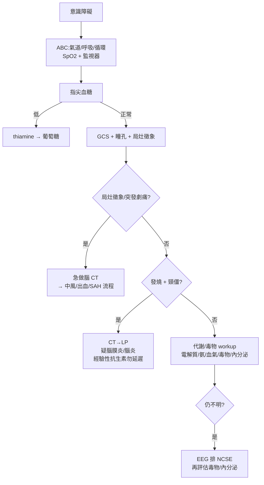

# Conscious Change（意識障礙）

> [!danger] 🚨 紅旗警訊（must-not-miss，先 ABC + 血糖，再鑑別）
> **助記「AEIOU-TIPS」— 把可逆致命病因掃過一輪，先救命再定位**
> 1. **A**lcohol / **A**nemia — 酒精、[[Alcohol withdrawal(酒精戒斷)]]、貧血
> 2. **E**lectrolyte / **E**ndocrine — [[Electrolyte imbalance(電解質不平衡)]]（Na/Ca）、[[Myxedema Coma(黏液水腫性昏迷)]]、[[Thyroid storm(甲狀腺風暴)]]、[[Adrenal insufficiency(腎上腺不全)]]
> 3. **I**nsulin — [[Hypoglycemia(低血糖)]] / [[Hyperglycemia(高血糖)]]（DKA/HHS）
> 4. **O**verdose / **O**xygen — [[Toxin(中毒)]]、[[Hypoxmia(低血氧)]]、[[Carbon Monoxide Poisoning(一氧化碳中毒)]]、CO2 滯留
> 5. **U**remia — [[Uremia(尿毒症)]]、肝性腦病（氨↑）
> 6. **T**rauma / **T**emperature / **T**umor — [[SubDural Hematoma(硬腦膜下血腫)]]、[[IntraCerebral Hemorrhage(腦實質出血)]]、[[Heat stroke(中暑)]]、[[Hypothermia(低體溫)]]、腦瘤
> 7. **I**nfection — [[Meningitis(腦膜炎)]]、[[Encephalitis(腦炎)]]、[[Septic shock(敗血性休克)]]
> 8. **P**sychogenic / **P**orphyria
> 9. **S**troke / **S**eizure / **S**AH / **S**hock — [[Stroke(中風)]]、[[Seizure(癲癇)]]、[[SubArachnoid Hemorrhage(蜘蛛膜下腔出血)]]、[[Shock(休克)]]
>
> ⚡ **順序：① 呼吸道/呼吸/循環（ABC）→ ② 指尖血糖 → ③ 再系統鑑別**。別跳過血糖直接做腦 CT。

## 🔀 鑑別診斷 DDx（先分「瀰漫代謝性 vs 結構性 vs 精神性」）
| 類別 | 支持特徵 | rule-out 線索 |
| --- | --- | --- |
| **代謝/毒物（瀰漫）** [[Hypoglycemia(低血糖)]]、[[Electrolyte imbalance(電解質不平衡)]]、[[Uremia(尿毒症)]]、肝性腦病、[[Toxin(中毒)]]、[[Hypoxmia(低血氧)]] | 漸進、無局灶徵象、對稱、可有撲翼樣震顫(asterixis) | 有明確局灶神經徵象 |
| **結構性（局灶）** [[Stroke(中風)]]、[[IntraCerebral Hemorrhage(腦實質出血)]]、[[SubDural Hematoma(硬腦膜下血腫)]]、[[SubArachnoid Hemorrhage(蜘蛛膜下腔出血)]]、腦瘤 | 突發、**局灶神經徵象**、瞳孔不等、單側無力、影像有病灶 | 影像正常、無局灶徵象 |
| **感染** [[Meningitis(腦膜炎)]]、[[Encephalitis(腦炎)]]、[[Septic shock(敗血性休克)]] | 發燒、頸僵、頭痛、意識改變、敗血徵象 | 無發燒/發炎證據 |
| **癲癇相關** [[Seizure(癲癇)]]（postictal / non-convulsive status） | 抽搐後嗜睡、咬舌/失禁、意識波動、EEG 癲癇波 | EEG 正常、無癲癇史 |
| **內分泌** [[Myxedema Coma(黏液水腫性昏迷)]]、[[Thyroid storm(甲狀腺風暴)]]、[[Adrenal insufficiency(腎上腺不全)]] | 甲狀腺/腎上腺病史、體溫異常、電解質異常 | 內分泌功能正常 |
| **精神性** | 意識實則保留、神經檢查一致性差、正常生理數值 | **屬排除診斷**，先排器質性 |

> [!warning] 意識障礙譜：**清醒/警覺 → 嗜睡(drowsy) → 木僵(stupor) → 昏迷(coma)**。並區分 [[Delirium(譫妄)]]（急性、波動、注意力↓）vs [[Dementia(失智症)]]（慢性、進行性），別把急性 delirium 當失智放掉。

## ❓ 問診 / 身體檢查重點
- **病史（多向家屬/EMS 取得）**：起病急慢、最後正常時間（LKW，關乎中風溶栓）、外傷、藥物/毒物、酒精、慢性病（DM/肝腎/甲狀腺）、發燒頭痛、抽搐
- **關鍵理學**：
  - **生命徵象 + SpO2 + 指尖血糖 + 體溫**
  - **GCS / 瞳孔（大小、對稱、反射）**、眼球運動、眼底
  - **局灶神經徵象**：肢體無力對稱性、病理反射、頸部僵硬（腦膜刺激）
  - 撲翼樣震顫(asterixis，代謝性)、皮膚（黃疸、瘀斑、針孔）、口氣（酒精/酮味/尿毒）

## 🩺 初步 workup（該開的檢查 / 影像）
> [!note] 黃金第一步：**ABC + 指尖血糖**——低血糖是最快可逆的昏迷病因，給糖前先抽血（必要時 thiamine 先於葡萄糖，防 Wernicke）。
- **血液**：血糖、電解質（Na/Ca/Mg）、腎/肝功能、氨、血氨、血氣（含 CO-Hb）、CBC、發炎指標、必要時毒物/酒精、TSH、cortisol
- **腦影像 CT（急）**：局灶徵象/外傷/突發劇烈頭痛（疑出血/SAH）
- **腰椎穿刺**：疑腦膜炎/腦炎（發燒 + 頸僵 + 意識改變，CT 排除禁忌後）
- **EEG**：疑非抽搐性癲癇重積（NCSE，不明原因持續意識障礙）
- **EKG**：心律、電解質效應
- 中風流程 → [[Stroke(中風)]]（時間窗！）；出血 → [[IntraCerebral Hemorrhage(腦實質出血)]]

## ⚡ 值班即時處置（穩定 + 找病因）

- **急救順序固定**：氣道保護（GCS ≤8 考慮插管）→ 血糖 → 針對病因
- **經驗性**：疑 Wernicke/酒精 → thiamine；疑鴉片 → naloxone；疑腦膜炎 → **抗生素勿因等 LP/CT 而延遲**（依院內指引）
- **中風**：把握 LKW 時間窗，走急性中風流程
- 病因治療為主，鎮靜只在躁動危及安全時（見 [[Agitation(躁動)]]）

## 📊 臨床評分 / 風險分層（scoring）★本卡核心

### ① Glasgow Coma Scale（GCS，總 3–15；記錄 E_V_M_）
| 眼 Eye（E，1–4） | 語言 Verbal（V，1–5） | 動作 Motor（M，1–6） |
| --- | --- | --- |
| 4 自發睜眼 | 5 對答切題 | 6 依指令動作 |
| 3 呼喚睜眼 | 4 答非所問(confused) | 5 疼痛能定位 |
| 2 疼痛睜眼 | 3 不當字句 | 4 疼痛回縮(withdrawal) |
| 1 無反應 | 2 無意義聲音 | 3 疼痛異常屈曲(去皮質) |
| — | 1 無反應 | 2 疼痛異常伸展(去大腦) |
| — | — | 1 無反應 |

| 總分 | 嚴重度 | 臨床意義 |
| --- | --- | --- |
| **13–15** | 輕度 | 觀察 |
| **9–12** | 中度 | 密切監測 |
| **≤ 8** | 重度 | **考慮插管保護氣道**（"GCS 8, intubate"） |

> 記錄方式建議寫成 **E_V_M_**（如 E3V4M5=12），比只寫總分更有臨床資訊；插管者 V 記 "T"。

### ② FOUR Score（Full Outline of UnResponsiveness，四項各 0–4，總 0–16）
| 項目 | 內容 |
| --- | --- |
| **Eye** | 睜眼 + 追視/眨眼指令 |
| **Motor** | 依指令手勢 / 疼痛反應 |
| **Brainstem** | 瞳孔、角膜、咳嗽反射 |
| **Respiration** | 呼吸型態 / 呼吸器同步 |

> 優於 GCS 之處：**含腦幹反射與呼吸型態**，可評估插管（無 verbal）病人與較深昏迷；適合 ICU。

### ③ 代謝性 vs 結構性快速鑑別
| 傾向代謝性 | 傾向結構性 |
| --- | --- |
| 漸進、對稱、無局灶徵象 | 突發、局灶徵象、瞳孔不等 |
| 撲翼樣震顫、肌陣攣 | 單側無力、病理反射 |
| 瞳孔對稱有反應 | 瞳孔不等/固定 |

## 🔗 相關
- 疾病：[[Stroke(中風)]]　[[IntraCerebral Hemorrhage(腦實質出血)]]　[[SubArachnoid Hemorrhage(蜘蛛膜下腔出血)]]　[[Meningitis(腦膜炎)]]　[[Hypoglycemia(低血糖)]]　[[Delirium(譫妄)]]
- 症狀：[[Agitation(躁動)]]　[[Syncope(昏厥)]]

## 📚 來源
[^1]: GCS — Teasdale G, Jennett B. *Lancet* 1974；ATLS 氣道保護 GCS≤8 原則
[^2]: FOUR score — Wijdicks EFM et al. *Ann Neurol* 2005
[^3]: AEIOU-TIPS 意識障礙鑑別 — 急診/內科值班標準教學；Pocket Medicine (MGH) 8th ed. p.561

## 🎴 Flashcards & 自我測驗（Ollama qwen2.5:7b 自動生成 2026-07-03）
<!-- flashcard-gen:start -->

### 記憶卡（Spaced Repetition 相容 · `Q::A`）
意識障礙的紅旗警訊先做什麼？::ABC + 指尖血糖

AEIOU-TIPS 中 A 為何？::酒精、酒精戒斷、貧血

代謝性昏迷常見於哪種電解質異常？::電解質不平衡（Na/Ca）

低血糖的 GCS 分數範圍是？::<8

FOUR Score 中哪一項評估腦幹反射？::Brainstem

急性癲癇狀態（NCSE）需做何檢查？::EEG

中風溶栓的 LKW 時間窗是？::3 小時內

哪種昏迷會出現撲翼樣震顫？::代謝性

急性發燒、頸僵、意識改變，疑何病？::腦膜炎/腦炎

低血糖的急救順序是？::thiamine → 葡萄糖

### 自我測驗（選擇題，答案摺疊）
**Q1.** 患者昏迷，GCS 8 分，無局灶徵象。最可能的原因是：
- A. 醫療誤傷
- B. 碳酸鈣中毒
- C. 腦膜炎
- D. 低血糖

> [!success]- 答案
> **D** — 根據 AEIOU-TIPS，低血糖是快速可逆的昏迷原因。GCS 8 分且無局灶徵象符合代謝性昏迷特徵。

**Q2.** 患者昏迷，CT 正常，但有突發劇烈頭痛。下一步應做何檢查？
- A. 腦脊液穿刺
- B. 血糖測試
- C. 碳酸鈣中毒篩查
- D. 腦電圖

> [!success]- 答案
> **A** — CT 正常但有突發劇烈頭痛，應考慮出血或蛛網膜下腔出血（SAH），下一步是腰椎穿刺。

**Q3.** 患者昏迷，GCS 12 分，瞳孔等大等圓，無局灶徵象。最可能的原因是：
- A. 腦膜炎
- B. 碳酸鈣中毒
- C. 低血糖
- D. 癲癇狀態

> [!success]- 答案
> **C** — GCS 12 分且無局灶徵象，符合代謝性昏迷特徵。碳酸鈣中毒和腦膜炎會有局灶徵象或突發劇烈頭痛，癲癇狀態通常會有抽搐史。

<!-- flashcard-gen:end -->
