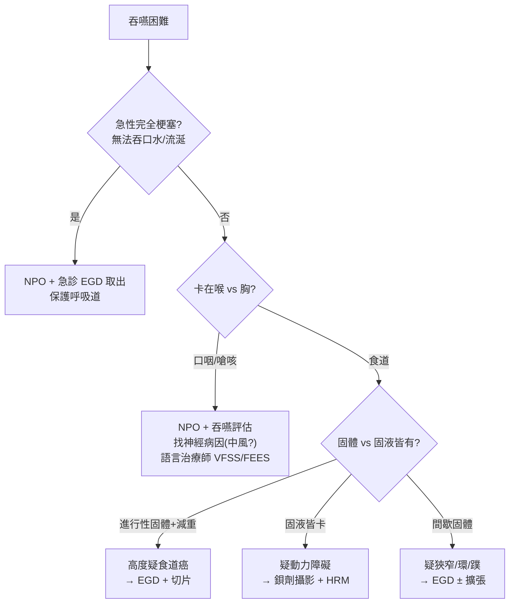

# Dysphagia（吞嚥困難）

> [!danger] 🚨 紅旗警訊（must-not-miss，先排惡性與吸入/阻塞急症）
> **助記「進行・減重・血・卡・嗆」**
> 1. **食道癌 Esophageal cancer** → **進行性**（先固體後液體）吞嚥困難 + 體重減輕 + 年長/吸菸飲酒 → 內視鏡不能拖
> 2. **體重減輕 / 貧血** → 惡性警訊
> 3. **吐血 / 黑便** → 上消化道惡性或出血病灶
> 4. **急性完全性 Food impaction（食物梗塞）** → 無法吞口水、流涎 → 急診內視鏡取出
> 5. **嗆咳 / 誤吸**（尤其中風、神經退化）→ **吸入性肺炎風險**，先 NPO + 吞嚥評估
> 6. **異物 + 呼吸道阻塞** → 立即處理呼吸道
>
> ⚡ **NPO（禁食）直到吞嚥安全性確認**，尤其急性中風/意識/嗆咳病人

## 🔀 鑑別診斷 DDx（第一步：分 Oropharyngeal vs Esophageal）
> **定義**：吞嚥困難是主觀「食物下嚥困難」的感受。**先分兩大類**：
> - **口咽型 Oropharyngeal**：吞嚥起始困難，食物卡在咽喉、嗆咳/鼻逆流 → 多為**神經肌肉**問題
> - **食道型 Esophageal**：食物吞下後卡在胸口 → 多為**機械阻塞或蠕動**問題

### 口咽型 Oropharyngeal（起始困難、嗆咳、鼻逆流）
| 疾病 | 支持特徵 | rule-out 線索 |
| --- | --- | --- |
| [[Stroke(中風)]] | 突發、伴其他局灶神經徵象、嗆咳 | 無神經徵象、影像正常 |
| [[Motor Neuron Disease(運動神經元疾病)]] / [[Parkinson's disease(帕金森氏症)]] | 進行性、合併肢體/構音症狀 | 無神經退化證據 |
| [[Myasthenia Gravis(重症肌無力)]] | 易疲勞性、傍晚加重、複視/眼瞼下垂 | 無疲勞性波動 |
| 口腔問題（牙齒差、[[Sjogren’s syndrome(修格蘭氏症候群)]] 口乾、潰瘍/腫瘤） | 準備期困難、口乾、口腔病灶 | 口腔檢查正常 |
| 咽部腫瘤 / 頸椎骨刺 | 阻塞感、頸部腫塊/影像壓迫 | 影像無阻塞 |
| Zenker 憩室 | 口臭、反芻未消化食物、夜咳 | 食道攝影無憩室 |

### 食道型 Esophageal（食物卡胸口）
| 疾病 | 支持特徵 | rule-out 線索 |
| --- | --- | --- |
| **食道癌 / 惡性狹窄** | **進行性固體→液體**、體重減輕、年長吸菸飲酒 | 內視鏡陰性 |
| Food impaction（食物梗塞） | **突發**、常有底層狹窄/嗜酸性食道炎 | 無梗塞、可正常進食 |
| 良性狹窄 / Schatzki ring / 蹼(web) | 固體為主、間歇、GERD/缺鐵病史 | 內視鏡無狹窄 |
| [[Achalasia(食道弛緩不能)]] | **固體+液體皆困難**、遠端蠕動差 + LES 無法放鬆、食道擴張 | 測壓正常 |
| 食道痙攣 / 蠕動障礙 | 間歇、固液皆有、常伴胸痛 | 測壓正常 |
| [[Scleroderma(硬皮病)]] | 系統性硬化病史（90% 侵犯食道平滑肌）、GERD 明顯 | 無硬皮病 |
| 外壓（[[Double aortic arch(雙主動脈弓)]]、[[Left ventricular hypertrophy(左心肥大)]]、縱膈腫瘤） | 影像見外部壓迫 | 影像無壓迫 |
| 功能性吞嚥困難 | 無結構/動力異常但持續症狀 | **屬排除診斷** |

> [!warning] **機械性 vs 動力性快速鑑別**：只卡「固體」且**進行性** → 想機械阻塞（狹窄/癌）；**固體+液體都卡** → 想動力障礙（achalasia/痙攣）。

## ❓ 問診 / 身體檢查重點
- **關鍵三問**：① 卡在**哪**（喉/胸）② 卡**固體還是固液皆有** ③ **進行性還是間歇**
- **伴隨症狀**：疼痛（odynophagia）、窒息/嗆咳感、聲音沙啞、鼻逆流、反芻、體重減輕、吐血/黑便
- **吞嚥四階段**：準備期（咬碎）→ 口腔運送期 → 咽部期 → 食道期（蠕動送入胃）——定位障礙落在哪一期
- **病史**：神經疾病、GERD、放療/腐蝕傷、缺鐵、結締組織病、藥物（雙磷酸鹽/四環素致食道炎）
- **理學**：神經學（腦神經 IX/X/XII、肢體）、口咽檢查、頸部腫塊、飲水試驗（觀察嗆咳）

## 🩺 初步 workup（該開的檢查 / 影像）
> [!note] 黃金第一步（食道型）：**上消化道內視鏡 EGD**——同時可診斷（切片排癌）+ 治療（擴張/取異物）；有紅旗（進行性+減重）務必做。
- **口咽型**：床邊吞嚥評估 / **改良鋇劑吞嚥造影（VFSS / MBS）** 或 FEES（喉鏡下吞嚥）+ 語言治療師評估；找神經病因（腦影像、神經傳導）
- **食道型**：
  - **EGD**（首選，可切片 + 擴張 + 取梗塞）
  - **鋇劑吞嚥攝影 barium swallow**：achalasia「鳥嘴狀」、狹窄、憩室、環/蹼
  - **高解析食道測壓 HRM**：疑動力障礙（achalasia/痙攣）
- 急性 food impaction → **急診 EGD 取出**（尤其無法吞口水者）

## ⚡ 值班即時處置（分流）

- **急性梗塞/異物**：NPO、保護呼吸道、急診內視鏡取出
- **嗆咳/中風吞嚥困難**：**NPO 直到吞嚥安全確認**，避免吸入性肺炎；請語言治療師吞嚥評估、決定進食質地或鼻胃管
- **紅旗（進行性 + 減重）**：安排 EGD 排食道癌
- 依病因轉專科（胃腸/神經/耳鼻喉）

## 📊 臨床評分 / 風險分層（scoring）★本卡核心

### ① EAT-10（Eating Assessment Tool，10 題各 0–4 分，總 0–40）
> 吞嚥困難自評問卷；**總分 ≥ 3 提示吞嚥異常**，需進一步評估。
| 分數段 | 意義 |
| --- | --- |
| **0–2** | 正常範圍 |
| **≥ 3** | 吞嚥效率/安全異常 → 進一步吞嚥評估 |

> 10 題涵蓋：體重減輕、外食受限、吞液體/固體/藥丸費力、吞嚥痛、進食樂趣↓、卡喉、咳嗽、緊張。每題 0（無問題）~ 4（嚴重）。

### ② GUSS（Gugging Swallowing Screen，急性中風吞嚥篩檢，總 0–20）
| 階段 | 內容 | 意義 |
| --- | --- | --- |
| 間接（吞口水） | 意識、咳嗽/清喉、吞口水 | 未過 → NPO |
| 直接（半固體→液體→固體） | 逐級測試，觀察吞嚥/咳嗽/流涎/聲音改變 | 分級決定質地 |

| 總分 | 嚴重度 | 飲食建議 |
| --- | --- | --- |
| **20** | 無/輕微 | 正常飲食（可考慮） |
| **15–19** | 輕度 | 軟質 + 慢慢喝液體，進一步評估 |
| **10–14** | 中度 | 吞嚥困難質地調整 + VFSS/FEES |
| **0–9** | 重度 | **NPO** + 專業吞嚥評估 |

> 用途：中風病人**進食前**床邊快速篩檢誤吸風險，未通過先 NPO 防吸入性肺炎。

### ③ 機械性 vs 動力性定位（決定 workup）
| 線索 | 傾向 | 首選檢查 |
| --- | --- | --- |
| 只卡固體、進行性 | 機械阻塞（狹窄/癌） | EGD + 切片 |
| 固體+液體皆卡、間歇 | 動力障礙（achalasia/痙攣） | 鋇劑攝影 + HRM |
| 起始困難、嗆咳、鼻逆流 | 口咽型（神經肌肉） | VFSS/FEES + 神經評估 |

## 🔗 相關
- 疾病：[[Achalasia(食道弛緩不能)]]　[[Stroke(中風)]]　[[Scleroderma(硬皮病)]]　[[Myasthenia Gravis(重症肌無力)]]　[[Parkinson's disease(帕金森氏症)]]
- 症狀：[[Weight loss(體重減輕)]]　[[Cough(咳嗽)]]

## 📚 來源
[^1]: 口咽型 vs 食道型鑑別與 workup — ACG/AGA Dysphagia Guideline；UpToDate "Approach to the evaluation of dysphagia in adults"
[^2]: EAT-10 — Belafsky PC et al. *Ann Otol Rhinol Laryngol* 2008
[^3]: GUSS — Trapl M et al. *Stroke* 2007（急性中風吞嚥篩檢）

## 🎴 Flashcards & 自我測驗（Ollama qwen2.5:7b 自動生成 2026-07-03）
<!-- flashcard-gen:start -->

### 記憶卡（Spaced Repetition 相容 · `Q::A`）
吞嚥困難的紅旗警訊::進行性、減重、血、卡、嗆

食道癌的主要症狀::進行性固體→液體吞嚥困難，體重減輕

急性完全性食物梗塞的處理::NPO + 急診內視鏡取出

體重減輕和貧血是什麼警訊？::惡性警訊

嗆咳/誤吸的風險因素有哪些？::中風、神經退化

口咽型吞嚥困難的病因::中風、運動神經元疾病、重症肌無力等

食道型吞嚥困難的常見病因::食道癌/惡性狹窄，食物梗塞，良性狹窄等

EAT-10評分≥3的意義::提示吞嚥效率或安全異常，需進一步評估

GUSS評分20分表示什麼？::無/輕微風險，可正常飲食

機械性 vs 動力性定位的首選檢查::只卡固體、進行性→EGD + 切片；固體+液體皆卡→鋇劑攝影 + HRM

### 自我測驗（選擇題，答案摺疊）
**Q1.** 患者因吞嚥困難就診，主訴食物卡在胸口。初步檢查發現患者有進行性體重減輕和吸菸史。下一步應優先考慮哪種檢查？
- A. EGD
- B. 鋇劑吞嚥攝影
- C. VFSS/FEES
- D. 腦影像

> [!success]- 答案
> **A** — 根據紅牌警訊，進行性體重減輕和吸菸史提示食道癌的可能性大。因此首選EGD檢查以排除惡性腫瘤並進行必要的治療。

**Q2.** 患者因吞嚥困難就診，主訴喝水時有嗆咳感。初步評估後決定進行改良鋇劑吞嚥造影（VFSS / MBS）。該檢查主要用於哪種類型的吞嚥障礙？
- A. 食道癌
- B. 口咽型吞嚥困難
- C. 良性狹窄
- D. Achalasia

> [!success]- 答案
> **B** — 改良鋇劑吞嚥造影主要用於評估口咽型吞嚥障礙，特別是神經肌肉問題。

**Q3.** 患者因急性完全性食物梗塞就診，無法吞口水且流涎嚴重。應採取哪種即時處置措施？
- A. NPO + 吞嚥評佔
- B. 急診內視鏡取出
- C. 高解析食道測壓 HRM
- D. 腦影像

> [!success]- 答案
> **B** — 急性完全性食物梗塞需要立即處理以防止吸入性肺炎，因此應進行急診內視鏡取出。

<!-- flashcard-gen:end -->
