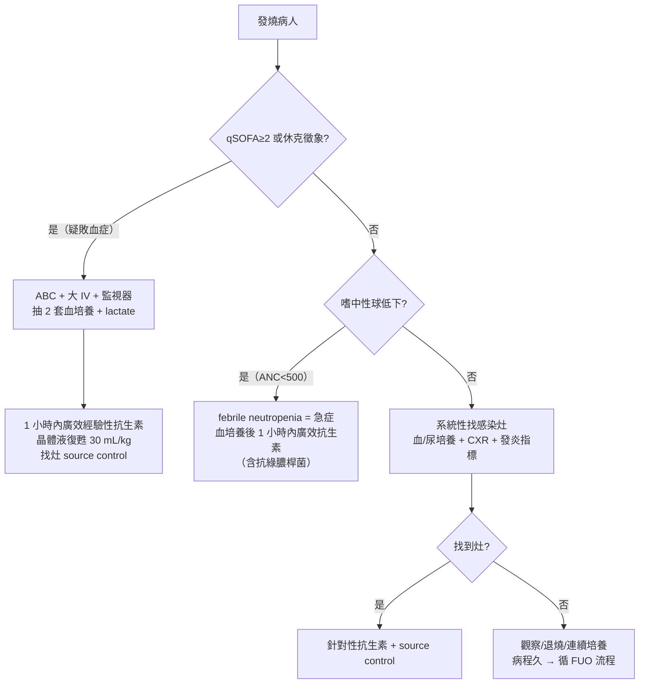

# Fever（發燒）

> [!danger] 🚨 紅旗警訊（must-not-miss，先問「會不會敗血症/會不會死人」）
> **助記：燒起來先找「灶」＋看「有沒有休克」**
> 1. **Sepsis / Septic shock**（敗血症/敗血性休克）→ qSOFA ≥2、低血壓、乳酸↑、意識改變、尿量↓
> 2. **Meningitis / Encephalitis**（腦膜炎/腦炎）→ 頭痛、頸僵、畏光、意識改變、Kernig/Brudzinski sign、皮膚瘀斑（腦膜炎雙球菌）
> 3. **Febrile neutropenia**（嗜中性球低下發燒）→ 化療/血液病史、ANC <500，**視為急症，1 小時內廣效抗生素**
> 4. **Necrotizing soft tissue infection**（壞死性軟組織感染/壞死性筋膜炎）→ 疼痛「不成比例」、皮膚瘀黑/水泡、捻髮音、毒性外觀
> 5. **Infective endocarditis**（感染性心內膜炎）→ 新雜音、栓塞徵象、IVDU/瓣膜病史、Janeway/Osler
> 6. **Toxic shock / 特殊宿主**（免疫低下、脾切除、近期旅遊瘧疾區）→ 快速惡化
>
> ⚡ **懷疑敗血症 → 抽血培養後 1 小時內給抗生素（Surviving Sepsis「1-hour bundle」），不要等培養結果**

## 🔀 鑑別診斷 DDx（值班從「找感染灶」下手）
| 疾病 / 感染灶 | 支持特徵 | rule-out 線索 |
| --- | --- | --- |
| [[Meningitis(腦膜炎)]] | 頭痛、頸僵、畏光、意識改變、Kernig/Brudzinski(+) | 無腦膜刺激徵 + 神智清醒（不能單獨排除，高度懷疑仍需 LP） |
| [[Pneumonia(肺炎)]] | 咳嗽、膿痰、呼吸音變化、rales、CXR 浸潤 | CXR 清晰 + 無呼吸道症狀 |
| [[Urinary Tract Infection(泌尿道感染)]] / [[Acute Pyelonephritis(腎盂腎炎)]] | 頻尿/尿痛、腰痛、CVA 敲擊痛、膿尿 | U/A 正常 + 無泌尿症狀 |
| [[Intra-Abdominal Infections(腹腔內感染)]] / [[Acute Cholangitis(急性膽管炎)]] | 腹痛、Charcot 三徵（發燒+黃疸+右上腹痛）、腹膜刺激徵 | 腹部軟、無壓痛、肝膽指數正常 |
| 皮膚軟組織（cellulitis / [[Pressure Ulcer(褥瘡)]] / 壞死性筋膜炎） | 紅腫熱痛、傷口膿液、疼痛不成比例（壞死性） | 全身皮膚檢查無病灶 |
| [[Infective Endocarditis(感染性心內膜炎)]] | 新雜音、栓塞徵象、持續菌血症、IVDU | 無雜音 + 血培養陰性（Duke criteria） |
| Catheter-related（CRBSI）/ device 感染 | 有中央靜脈導管/植入物、導管入口紅腫、拔管後退燒 | 無留置裝置 |
| 非感染性：[[Fever of Unknown Origin(不明熱)]]（腫瘤/自體免疫/藥物熱/VTE） | 病程 >3 週、B symptoms、鮭魚色疹(AOSD)、停藥退燒(drug fever) | 屬排除診斷，先排感染急症 |

> [!warning] 老人、免疫低下、糖尿病患者**可能不發燒甚至低體溫**卻已敗血症 → 不能用「沒燒」排除感染

## ❓ 問診 / 身體檢查重點
- **發燒特徵**：起始/持續時間、熱型、畏寒顫抖（rigor 常暗示菌血症）、退燒藥反應
- **找灶問診**：頭痛/頸僵、咳嗽膿痰、尿路症狀、腹痛腹瀉、傷口紅腫、關節痛
- **宿主/暴露**：近期住院/手術/導管、化療或免疫抑制、旅遊史（瘧疾/登革）、動物/性接觸、藥物史
- **系統性理學（全身找灶，勿漏）**：
  - HEENT/口腔膿瘍、頸部淋巴結、腦膜刺激徵
  - 心音（新雜音 → IE）、呼吸音（rales/濕囉音）
  - 腹部壓痛/Murphy sign、CVA 敲擊痛
  - **全身皮膚**：傷口、褥瘡、肛周膿瘍、瘀斑、導管入口、不正常分泌物

## 🩺 初步 workup（該開的檢查 / 影像）
> [!note] 敗血症黃金第一步：**給抗生素前先抽兩套血培養**（不同部位），並驗 **lactate**
- **血培養 ×2 套**（抗生素前）＋ **CBC/DC**（看 WBC、band、ANC 算嗜中性球）
- **U/A + 尿培養**、**CXR**、**發炎指標 CRP / procalcitonin**、**lactate**（分流敗血症嚴重度）
- **肝腎功能、電解質**、必要時 blood gas
- 依灶延伸：懷疑腦膜炎 → **LP（腰椎穿刺，有意識改變/局部神經缺損先做腦部影像）**；腹腔 → 腹部超音波/CT；IE → 心臟超音波（連 [[Blood Culture(血液培養)]]）
- 特殊宿主：嗜中性球低下、旅遊史 → 加對應檢查（瘧疾抹片等）

## ⚡ 值班即時處置（穩定 vs 不穩定分流）

- **不穩定線**：疑敗血症 → 培養後 1 小時內抗生素 + 液體復甦 + 找並處理感染源（引流/移除導管）
- **嗜中性球低下**：即使外觀穩定也是急症，勿等 → 立即廣效（涵蓋綠膿桿菌）抗生素
- **穩定線**：找灶後針對性治療；退燒藥（acetaminophen）緩解不適，但**退燒不等於治療**，不可掩蓋病程
- ⚠️ 經驗性抗生素選擇依院內抗藥性、宿主、疑似灶而定（**本卡不列確切藥物/劑量**，依感染科/院內指引）

## 📊 臨床評分 / 風險分層（scoring）
> 發燒的分流重點是「**這是不是敗血症**」→ 用 qSOFA 快篩、SOFA 定義器官衰竭

### ① qSOFA（床邊快篩，任一 1 分，≥2 分高風險）
| 項目 | 標準 |
| --- | --- |
| 意識改變 | GCS <15 |
| 收縮壓 | ≤100 mmHg |
| 呼吸次數 | ≥22 /min |

> **qSOFA ≥2** → 器官衰竭與死亡風險上升，升級評估與監測（qSOFA 是「警訊篩檢」，敏感度有限，陰性不能排除敗血症）

### ② Sepsis-3 定義（供理解分層）
- **Sepsis**＝疑似感染 ＋ SOFA 增加 ≥2 分（器官功能失調）
- **Septic shock**＝需升壓劑維持 MAP ≥65 mmHg ＋ lactate >2 mmol/L（已充分液體復甦後）

### ③ 其他常用（依情境）
- **NEWS/NEWS2**：一般病房早期惡化偵測
- **febrile neutropenia**：MASCC score 分低/高風險（是否可門診口服治療）

## 🔗 相關
- 疾病：[[Meningitis(腦膜炎)]]　[[Pneumonia(肺炎)]]　[[Urinary Tract Infection(泌尿道感染)]]　[[Infective Endocarditis(感染性心內膜炎)]]　[[Fever of Unknown Origin(不明熱)]]
- 檢查：[[Blood Culture(血液培養)]]
- 症狀：[[Shock(休克)]]　[[Conscious Change(意識障礙)]]

## 📚 來源
[^1]: Surviving Sepsis Campaign — hour-1 bundle（血培養→抗生素 1h→液體 30 mL/kg→lactate）
[^2]: Sepsis-3 定義（Singer M et al. *JAMA* 2016）：qSOFA / SOFA / septic shock 定義
[^3]: Febrile neutropenia 處置 — IDSA/ASCO 指引（1h 內廣效抗生素、MASCC 風險分層）
[^4]: FUO 鑑別 — 感染/腫瘤/自體免疫/藥物熱四大類（值班教學共識，延續舊卡臨床要點）

## 🎴 Flashcards & 自我測驗（Ollama qwen2.5:7b 自動生成 2026-07-03）
<!-- flashcard-gen:start -->

### 記憶卡（Spaced Repetition 相容 · `Q::A`）
發燒病人 qSOFA ≥2 的指標有哪些？::意識改變、低血壓（<100 mmHg）、呼吸次數≥22/min

疑似敗血症的紅旗警訊是什麼？::qSOFA ≥2 或休克徵象

嗜中性球低下發燒應立即給予何種抗生素？::廣效經驗性抗生素，含抗綠膿桿菌

敗血症黃金第一步是什麼？::抽兩套血培養（不同部位）並驗 lactate

懷疑腦膜炎時應先做何種檢查？::腰椎穿刺（LP），有意識改變/局部神經缺損先做腦部影像

急性膽管炎的典型症狀是什麼？::Charcot 三徵：發燒+黃疸+右上腹痛

敗血性休克的定義是什麼？::需升壓劑維持 MAP ≥65 mmHg ＋ lactate >2 mmol/L（已充分液體復甦後）

發燒病人找感染灶時，哪些情況應考慮皮膚軟組織感染？::疼痛不成比例、皮膚瘀黑/水泡、捻髮音、毒性外觀

急性心內膜炎的典型症狀有哪些？::新雜音、栓塞徵象、持續菌血症、IVDU/瓣膜病史

發燒病人退燒藥反應如何？::退燒藥無效常暗示菌血症

### 自我測驗（選擇題，答案摺疊）
**Q1.** 一患者來院，主訴發燒3天，伴頭痛、頸僵，體溫39°C。查體發現頸部抵抗，但神智清楚。下一步最應先做何種檢查？
- A. 腰椎穿刺（LP）
- B. 血液培養
- C. 胸部X光片
- D. 尿液分析

> [!success]- 答案
> **A** — 根據筆記，頭痛、頸僵是腦膜炎的典型症狀。因此應先做腰椎穿刺（LP）以確認是否為腦膜炎。

**Q2.** 一患者來院，主訴發燒1周，伴腹痛、黃疸及右上腹痛。查體發現腹部壓痛，Murphy sign陽性。下一步最應先做何種檢查？
- A. 腹部超音波
- B. 血液培養
- C. 尿液分析
- D. 胸部X光片

> [!success]- 答案
> **A** — 根據筆記，Charcot 三徵（發燒+黃疸+右上腹痛）是急性膽管炎的典型症狀。因此應先做腹部超音波以確認是否為急性膽管炎。

**Q3.** 一患者來院，主訴發燒2天，伴皮膚瘀斑、疼痛不成比例。查體發現皮膚瘀黑/水泡，捻髮音。下一步最應先做何種檢查？
- A. 腸部超音波
- B. 血液培養
- C. 尿液分析
- D. 皮膚細菌培養

> [!success]- 答案
> **B** — 根據筆記，疼痛不成比例、皮膚瘀黑/水泡、捻髮音是壞死性軟組織感染的典型症狀。因此應先做血液培養以確認是否有感染源。

<!-- flashcard-gen:end -->
