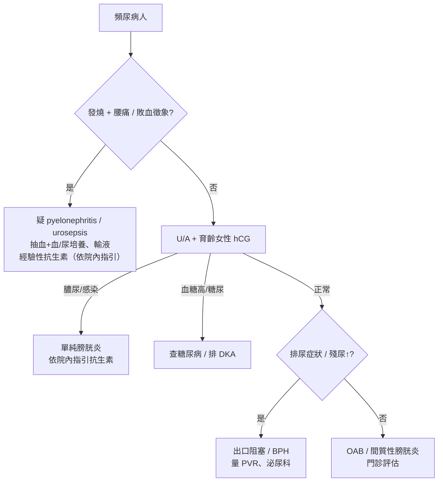

# Frequency（頻尿）

> [!danger] 🚨 紅旗警訊（must-not-miss，先排除致命/重症病因）
> **助記「燒、血、退、渴」**
> 1. **發燒 + 腰痛（CVA knocking pain）+ 頻尿** → [[Acute Pyelonephritis(腎盂腎炎)]] / urosepsis（可休克）
> 2. **無痛性血尿 + 頻尿 + 體重減輕**（尤其抽菸老年男） → [[Bladder Cancer(膀胱癌)]] 等泌尿道惡性腫瘤
> 3. **神經學缺損 / 鞍區麻木 / 尿滯留-溢尿** → 脊髓 / 馬尾病變（神經性膀胱）
> 4. **多喝多尿 + 體重減輕 / 意識改變** → 新發糖尿病 / DKA（此為「多尿 polyuria」非單純頻尿，見下鑑別）
>
> ⚡ **先分清「頻尿 frequency」（小量、次數多、有急迫感）vs「多尿 polyuria」（總尿量大 >3 L/day）** — 兩者病因完全不同（見 [[Polyuria(多尿)]]）

## 🔀 鑑別診斷 DDx（值班從這裡連到疾病）
| 疾病 | 支持特徵 | rule-out 線索 |
| --- | --- | --- |
| [[Urinary Tract Infection(泌尿道感染)]] | 頻尿 + 尿急 + 排尿灼痛、恥骨上不適、膿尿/亞硝酸鹽(+) | U/A 正常、無菌尿 |
| [[Acute Pyelonephritis(腎盂腎炎)]] | 上述 + 發燒、寒顫、腰痛、CVA 敲痛 | 無發燒 + CVA(-) |
| [[Overactive Bladder(過動性膀胱)]] | 尿急為主、夜尿、無感染證據、無殘尿 | U/A 有感染、有出口阻塞 |
| [[Benign Prostatic Hyperplasia(攝護腺肥大症)]] / 出口阻塞 | 老年男、排尿慢/斷續/滴瀝、殘尿↑、夜尿 | 女性、無阻塞症狀 |
| [[Interstitial Cystitis(間質性膀胱炎)]] | 膀胱脹痛、頻尿、無菌性、K-tamine 使用史 | 感染證據、對抗生素有效 |
| 糖尿病（滲透性利尿） | 多喝多尿多吃、血糖↑、體重減輕 | 血糖正常、單純小量頻尿 |
| [[Pregnancy(懷孕)]] | 育齡女性、子宮壓迫膀胱、hCG(+) | hCG(-) |
| 泌尿道腫瘤 | 無痛血尿、老年、抽菸、體重減輕 | 影像/cytology 陰性 |

> [!warning] 頻尿在育齡女性一律先驗 **尿妊娠試驗**；在老年男先想 BPH / 出口阻塞（並量殘尿）；有發燒務必排 pyelonephritis。

## ❓ 問診 / 身體檢查重點
- **儲尿症狀**（尿還在膀胱時）：頻尿、夜尿、尿急、失禁、尿床
- **排尿症狀**（排尿過程）：尿慢、斷斷續續、滴瀝、費力 → 想出口阻塞 / [[Underactive Bladder(膀胱收縮無力)]]
- **排尿後症狀**：尿不乾淨感（殘尿）
- **量化**：一天幾次？每次量多少（小量 = 頻尿；大量 = 多尿）？夜尿幾次？喝水量？
- **系統回顧**：發燒、血尿、腰痛、排尿灼痛、多喝多吃、體重減輕、藥物（利尿劑）、糖尿病史
- **關鍵理學**：敲 CVA（腎盂腎炎）、恥骨上觸痛/膀胱脹（尿滯留）、肛診攝護腺（男）、生殖道 / 脫垂檢查（女，[[Stress Urinary Incontinence(應力性尿失禁)]]）、量殘尿（bladder scan）

## 🩺 初步 workup（該開的檢查 / 影像）
> [!note] 黃金第一步：**尿液分析（U/A）+ 育齡女性尿 hCG** — 便宜、快速，直接分出感染 / 血尿 / 糖尿 / 懷孕四大方向。
- **尿液分析 + 尿液培養**（膿尿、亞硝酸鹽、白血球酯酶、血尿、糖 / 酮體）
- **血糖 / HbA1c**（區分滲透性多尿）
- **殘尿量（PVR，bladder scan）**：懷疑出口阻塞 / 尿滯留
- **抽血**：CBC、腎功能；發燒 + 重症加 blood culture
- **進階（門診）**：尿路動力學、膀胱鏡（懷疑腫瘤 / 間質性膀胱炎）、腎臟超音波

## ⚡ 值班即時處置（穩定 vs 不穩定分流）

- **不穩定線**：urosepsis → 輸液穩定 + 血/尿培養後經驗性抗生素（劑量與選擇依院內指引 / 抗生素指引）
- **穩定線**：U/A + hCG 分流；急性尿滯留（膀胱脹痛 + 解不出）→ 導尿減壓
- ⚠️ 老年男頻尿 + 解不出來，可能是**溢尿型尿滯留**，不要當單純頻尿；量殘尿

## 📊 臨床評分 / 風險分層（scoring）★下泌尿道症狀量化
> 值班用來量化嚴重度、追蹤治療反應。**IPSS（國際攝護腺症狀評分）** 是 LUTS 標準工具（男女皆可用於量化，命名源自攝護腺）。

### IPSS（7 題，每題 0–5 分，總 0–35）
| 過去一個月，以下情形發生頻率 | 0 | 1 | 2 | 3 | 4 | 5 |
| --- | --- | --- | --- | --- | --- | --- |
| ① 尿不乾淨感（排尿後） | 沒有 | <1/5 次 | <半數 | 約半數 | >半數 | 幾乎總是 |
| ② 排尿後 2 小時內又要尿（**頻尿**） | 沒有 | <1/5 | <半數 | 約半數 | >半數 | 幾乎總是 |
| ③ 排尿斷斷續續 | 同上刻度 | | | | | |
| ④ 尿急（憋不住） | 同上刻度 | | | | | |
| ⑤ 尿流變細/變弱 | 同上刻度 | | | | | |
| ⑥ 排尿需要用力 | 同上刻度 | | | | | |
| ⑦ 夜尿次數 | 0 次=0 | 1=1 | 2=2 | 3=3 | 4=4 | ≥5=5 |

| 總分 | 嚴重度 | 處置分流 |
| --- | --- | --- |
| **0–7** | 輕度 | 觀察、生活型態調整 |
| **8–19** | 中度 | 藥物治療（α-blocker / 5-ARI，依科別建議） |
| **20–35** | 重度 | 積極藥物 + 評估手術、泌尿科轉診 |

> 另附獨立 **生活品質（QoL）題**（0 很好 ~ 6 很糟），評估症狀對生活的困擾度。急性感染性頻尿不適用 IPSS（那是慢性 LUTS 工具）。

## 🔗 相關
- 疾病：[[Urinary Tract Infection(泌尿道感染)]]　[[Acute Pyelonephritis(腎盂腎炎)]]　[[Benign Prostatic Hyperplasia(攝護腺肥大症)]]　[[Overactive Bladder(過動性膀胱)]]　[[Bladder Cancer(膀胱癌)]]
- 症狀：[[Polyuria(多尿)]]　[[Hematuria(血尿)]]　[[Acute Urine Retention(急性尿滯留)]]

## 📚 來源
[^1]: IPSS — Barry MJ et al. *J Urol* 1992（AUA Symptom Index）；AUA/EAU BPH 指引
[^2]: LUTS 分類（儲尿 / 排尿 / 排尿後）— ICS（International Continence Society）標準
[^3]: 頻尿 vs 多尿鑑別 + urosepsis 紅旗 — 值班泌尿急症共識

## 🎴 Flashcards & 自我測驗（Ollama qwen2.5:7b 自動生成 2026-07-03）
<!-- flashcard-gen:start -->

### 記憶卡（Spaced Repetition 相容 · `Q::A`）
發燒、腰痛和頻尿應先排除何病？::急性腎盂腎炎 / 尿敗血症

無痛性血尿伴隨頻尿和體重減輕可能為何？::膀胱癌等泌尿道惡性腫瘤

神經學缺損、鞍區麻木或尿滯留/溢尿提示何病？::脊髓 / 馬尾病變（神經性膀胱）

多喝多尿伴體重減輕和意識改變提示何病？::新發糖尿病 / 糖尿病酮酸中毒

頻尿在育齡女性應先驗什麼試驗？::尿妊娠試驗

老年男性頻尿伴解不出來可能為何？::溢流型尿滯留，注意不要誤診為單純頻尿

急性尿敗血症的初步治療是什麼？::抽血+血/尿培養、輸液、經驗性抗生素（依院內指引）

IPSS總分8-19分，應如何處理？::藥物治療（α-blocker / 5-ARI，依科別建議）

IPSS總分20-35分，應如何處理？::積極藥物+評估手術、泌尿科轉診

頻尿伴發燒和腰痛提示何病？::急性腎盂腎炎 / 尿敗血症

### 自我測驗（選擇題，答案摺疊）
**Q1.** 一位65歲男性，有長期飲酒史，主訴頻尿、夜尿增多且排尿困難。初步檢查發現殘尿量增加。最可能的診斷是？
- A. 尿道感染
- B. 慢性前列腺炎
- C. 腎盂腎炎
- D. 慢性膀胱炎

> [!success]- 答案
> **B** — 此情境中，患者有頻尿、夜尿增多和排尿困難的症狀，且殘尿量增加。慢性前列腺炎常見於老年男性，並伴有這些症狀，因此最可能診斷為慢性前列腺炎。而其他選項如尿道感染、腎盂腎炎和慢性膀胱炎則較少見或不符合描述。

**Q2.** 一位育齡女性主訴頻尿伴隨排尿灼痛及膿尿，最可能的診斷是？
- A. 尿道感染
- B. 膀胱癌
- C. 糖尿病
- D. 妊娠

> [!success]- 答案
> **A** — 此情境中，患者為育齡女性且有頻尿、排尿灼痛及膿尿。這些症狀提示泌尿道感染的可能性較大，因此最可能診斷為尿道感染。其他選項如膀胱癌、糖尿病和妊娠雖然也可能出現頻尿，但通常不會伴隨排尿灼痛及膿尿。

**Q3.** 一位45歲男性主訴頻尿且夜尿增多，無其他症狀。初步檢查未見感染證據。最可能的診斷是？
- A. 尿道感染
- B. 膀胱癌
- C. 慢性膀胱炎
- D. 過動性膀胱

> [!success]- 答案
> **D** — 此情境中，患者主訴頻尿且夜尿增多，但無其他症狀如排尿灼痛或感染證據。這些症狀提示可能是過動性膀胱（OAB），因此最可能診斷為過動性膀胱。其他選項如尿道感染、膀胱癌和慢性膀胱炎雖然也可能出現頻尿，但通常會伴隨其他症狀。

<!-- flashcard-gen:end -->
