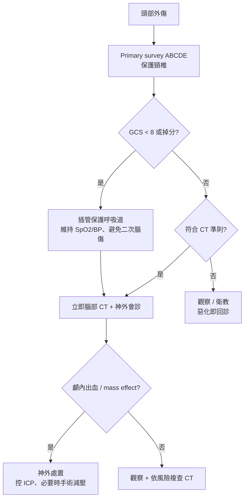

# Head Trauma（頭部外傷）

> [!danger] 🚨 紅旗警訊（must-not-miss，先穩定 ABC 再想診斷）
> **助記「掉、瞳、庫、顱、藥、吐」**
> 1. **GCS 掉分 / GCS <8** → 保護呼吸道、插管；持續掉分 = 顱內血腫擴大
> 2. **瞳孔不等大 / 對光反射消失** → 天幕疝脫（uncal herniation），神經外科急症
> 3. **Cushing 三徵**（高血壓 + 心搏過緩 + 呼吸不規則）→ 顱內壓上升
> 4. **顱底骨折徵象**：熊貓眼（raccoon eyes）、Battle sign、耳/鼻漏 CSF、鼓室積血（hemotympanum）
> 5. **抗凝 / 抗血小板 / 凝血異常** → 即使輕傷也要放寬 CT 標準
> 6. **反覆嘔吐、癲癇、清醒後再惡化（lucid interval）** → 典型 [[Epidural Hematoma(硬腦膜上腔出血)]]（中腦膜動脈）
>
> ⚡ **Primary survey（ABCDE）永遠優先於做 CT**；擺位保護頸椎（假設 C-spine 損傷直到排除）

## 🔀 鑑別診斷 DDx（值班從這裡連到疾病）
| 診斷 | 支持特徵 | rule-out 線索 |
| --- | --- | --- |
| [[Epidural Hematoma(硬腦膜上腔出血)]] | 顳骨骨折 + 中腦膜動脈、**lucid interval**、CT 凸透鏡（biconvex）不越縫合線 | CT 陰性 |
| [[Subdural Hematoma(硬腦膜下腔出血)]] | 老人 / 抗凝 / 酗酒、橋靜脈、CT 新月形（crescent）越縫合線 | CT 陰性 |
| 外傷性 [[Subarachnoid Hemorrhage(蜘蛛膜下腔出血)]] | 溝裂高密度、劇烈頭痛、頸僵 | CT 陰性 |
| 腦挫傷 / 出血 contusion | 對衝傷（contrecoup）、局部神經缺損 | CT 陰性 |
| 瀰漫性軸突損傷 DAI | 高速減速傷、GCS 與 CT 不成比例（初期 CT 可正常） | MRI 陰性 |
| 顱骨骨折 | 凹陷 / 顱底、局部壓痛、CSF 漏 | 影像陰性 |
| 腦震盪 concussion | 短暫意識喪失 / 失憶、CT 陰性、症狀自限 | 有結構性出血 |

> [!warning] 初期 CT 正常**不能**完全排除 DAI 與遲發性出血；抗凝病人 / 高風險機轉需觀察 + 必要時複查 CT。

## ❓ 問診 / 身體檢查重點
- **AMPLE 病史**：Allergy / Medication（**抗凝、抗血小板**）/ Past illness（含懷孕、舊 [[CerebroVascular Accident(腦血管意外傷害)]]、開過顱內刀）/ Last meal / Events（受傷機轉、高處墜落、車速、有無意識喪失）
- **破傷風疫苗**：5 年內是否接種
- **關鍵理學**：GCS（連續追蹤，看趨勢）、瞳孔大小 + 對光、局部神經缺損、顱底骨折徵象、頭皮傷口/凹陷、頸椎壓痛（保護 C-spine）
- **輔助 primary survey**：CXR、FAST、C-spine 影像、monitor

## 🩺 初步 workup（該開的檢查 / 影像）
> [!note] 黃金第一步：**穩定 ABCDE + 連續 GCS + 瞳孔** — 決定要不要立即插管與是否為神經外科急症；再依 CT 準則決定影像。
- **非顯影腦部 CT**：頭部外傷影像首選（急性出血、骨折、mass effect）
- **CT 適應症（放寬標準的情境）**：意識狀態改變、出血傾向 / 抗凝、局部神經缺損、年齡極端、受傷初期意識喪失、合併顏面創傷 / 顱底骨折徵象、反覆嘔吐、癲癇、危險機轉
- **C-spine 影像**：合併頸椎壓痛 / 神經症狀 / 危險機轉
- 神經外科會診：任何顱內出血 / GCS 掉分 / 局部缺損

## ⚡ 值班即時處置（穩定 vs 不穩定分流）

- **穩定線**：符合 CT 準則 → CT；陰性且低風險 → 觀察 + 衛教（惡化紅旗回診）
- **不穩定線**：避免「二次腦傷」— 維持氧合、血壓（避免低血壓/低血氧）、正常體溫、normocapnia；疑腦疝先與神外討論滲透壓治療 / 過度換氣為橋接
- ⚠️ **低血壓在單純頭部外傷少見** — 若休克要找其他出血源（FAST、骨盆 / 長骨 / 胸腹）

## 📊 臨床評分 / 風險分層（scoring）★本卡核心
> 值班兩把尺：**GCS** 定嚴重度與呼吸道決策；**Canadian CT Head Rule** 定輕傷要不要照 CT。

### ① Glasgow Coma Scale（GCS，總 3–15）
| 睜眼 Eye (E) | 語言 Verbal (V) | 動作 Motor (M) |
| --- | --- | --- |
| 4 自發睜眼 | 5 對答切題 | 6 遵從指令 |
| 3 呼喚睜眼 | 4 對答混亂 | 5 疼痛定位 |
| 2 疼痛睜眼 | 3 不當字句 | 4 疼痛回縮 |
| 1 無反應 | 2 無意義聲音 | 3 異常屈曲(去皮質) |
| | 1 無反應 | 2 異常伸展(去大腦) |
| | | 1 無反應 |

| 總分 | 嚴重度 | 處置 |
| --- | --- | --- |
| **13–15** | 輕度 | 依 CT 準則決定影像 |
| **9–12** | 中度 | CT + 密切觀察 / 收住院 |
| **≤8** | 重度 | **插管保護呼吸道** + 立即 CT + 神外 |

> 記錄格式 E_V_M_（如 E3V4M5=12）；插管者 V 標「T」。**趨勢比單次數字更重要**。

### ② Canadian CT Head Rule（輕度 TBI，GCS 13–15 且有意識喪失/失憶/失定向）
| 高風險（→ 需要神外介入的預測，任一即照 CT） |
| --- |
| 受傷後 2 小時 GCS < 15 |
| 疑似開放性 / 凹陷性顱骨骨折 |
| 任何顱底骨折徵象（熊貓眼、Battle sign、耳漏、鼓室積血） |
| 嘔吐 ≥2 次 |
| 年齡 ≥65 歲 |

| 中風險（→ 臨床重要腦損傷，任一即照 CT） |
| --- |
| 受傷前失憶 ≥30 分鐘 |
| 危險機轉（行人被撞、乘客被拋出、>3 尺 / 5 階墜落） |

> 排除條件（不適用本規則）：抗凝 / 出血疾病、癲癇發作、年齡 <16、明顯神經缺損 → 這些直接放寬照 CT。

## 🔗 相關
- 疾病：[[Epidural Hematoma(硬腦膜上腔出血)]]　[[Subdural Hematoma(硬腦膜下腔出血)]]　[[Subarachnoid Hemorrhage(蜘蛛膜下腔出血)]]　[[CerebroVascular Accident(腦血管意外傷害)]]
- 症狀：[[Conscious Change(意識障礙)]]　[[Headache(頭痛)]]

## 📚 來源
[^1]: GCS — Teasdale & Jennett *Lancet* 1974；GCS-40 週年更新版
[^2]: Canadian CT Head Rule — Stiell IG et al. *Lancet* 2001
[^3]: ATLS Primary/Secondary survey、避免二次腦傷 — ATLS 10th ed. / 神經外傷共識

## 🎴 Flashcards & 自我測驗（Ollama qwen2.5:7b 自動生成 2026-07-03）
<!-- flashcard-gen:start -->

### 記憶卡（Spaced Repetition 相容 · `Q::A`）
GCS <8 表現::保護呼吸道、插管

瞳孔不等大表示::天幕疝脫（uncal herniation）

Cushing 三徵指什麼::高血壓 + 心搏過緩 + 呼吸不規則

顱底骨折典型症狀::熊貓眼、Battle sign、耳/鼻漏 CSF、鼓室積血

抗凝患者頭部外傷應如何處理::放寬 CT 標準

硬腦膜上腔出血典型症狀::顳骨骨折 + 中腦膜動脈、lucid interval、CT 凸透鏡（biconvex）不越縫合線

硬腦膜下腔出血支持特徵::老人 / 抗凝 / 酗酒、橋靜脈、CT 新月形（crescent）越縫合線

蛛網膜下腔出血支持特徵::劇烈頭痛、頸僵、CT 陰性

腦挫傷/出血 contusion 特點::對衝傷（contrecoup）、局部神經缺損、CT 陰性

瀰漫性軸突損傷 DAI 分流標準::MRI 陰性

### 自我測驗（選擇題，答案摺疊）
**Q1.** 患者頭部受傷後，出現昏迷10分鐘後清醒，但隨後再次陷入昏迷。最可能的診斷是？
- A. 腦挫傷
- B. 硬腦膜上腔出血
- C. 硬腦膜下腔出血
- D. 瀰漫性軸突損傷

> [!success]- 答案
> **B** — 根據筆記，反覆嘔吐、癲癇、清醒後再惡化（lucid interval）是硬腦膜上腔出血的典型症狀。

**Q2.** 一名58歲女性患者因車禍頭部受傷，GCS 12分，有局部神經缺損但無其他特殊症狀。根據加拿大CT頭部規則，是否需要立即進行CT檢查？
- A. 需要
- B. 不需要
- C. 觀察30分鐘後再決定
- D. 由神經外科醫生決定

> [!success]- 答案
> **B** — 根據加拿大CT頭部規則，GCS 12分且有局部神經缺損的患者不需要立即進行CT檢查。

**Q3.** 一名40歲男性患者頭部受傷後出現意識喪失，隨後恢復並能回答問題，但30分鐘後再次昏迷。應如何處理？
- A. 觀察
- B. 立即進行CT檢查
- C. 給予鎮靜劑
- D. 無需處理

> [!success]- 答案
> **B** — 根據筆記，清醒後再惡化（lucid interval）是硬腦膜上腔出血的典型症狀。因此需要立即進行CT檢查以排除此情況。

<!-- flashcard-gen:end -->
