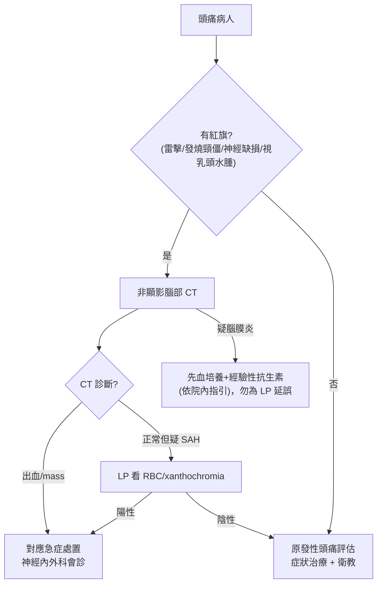

# Headache（頭痛）

> [!danger] 🚨 紅旗警訊（must-not-miss，先排除次發性致命頭痛）
> **助記「SNNOOP」精簡版 — 有紅旗先影像，不先當偏頭痛**
> 1. **雷擊頭痛（thunderclap，數秒內到最痛）** → [[Subarachnoid Hemorrhage(蜘蛛膜下腔出血)]]（先 CT，陰性做 LP 看 xanthochromia）
> 2. **發燒 + 頸僵 + 意識改變** → [[Meningitis(腦膜炎)]] / 腦炎（懷疑即先給抗生素，別等 LP）
> 3. **神經學缺損 / 抽搐 / 意識改變 / 視乳頭水腫** → 顱內佔位、出血、[[Increased Intracranial Pressure(顱內壓上升)]]
> 4. **>50 歲新發 + 顳部壓痛 + 顎跛行 + ESR↑** → 巨細胞（顳）動脈炎（延遲治療會失明，先給類固醇）
> 5. **單眼劇痛 + 紅眼 + 視力模糊 + 光暈 + 噁心嘔吐** → 急性隅角閉鎖性 [[Glaucoma(青光眼)]]（眼科急症）
> 6. **姿勢相關 / Valsalva 加劇 / 早晨加劇 + 嘔吐** → 顱內壓變化（mass / CVST / 低顱壓）
>
> ⚡ 其他必想：**CO 中毒**（多人同時頭痛 + 密閉空間）、高血壓急症、[[Cerebral Venous Sinus Thrombosis(腦靜脈竇栓塞)]]（產褥期 / 高凝）、頸動脈剝離、腦下垂體中風

## 🔀 鑑別診斷 DDx（值班從這裡連到疾病）
| 診斷 | 支持特徵 | rule-out 線索 |
| --- | --- | --- |
| [[Subarachnoid Hemorrhage(蜘蛛膜下腔出血)]] | 雷擊、此生最痛、頸僵、短暫意識喪失、運動中發作 | CT(-) + LP 無血/xanthochromia |
| [[Meningitis(腦膜炎)]] / 腦炎 | 發燒、頸僵、畏光、意識改變、Kernig/Brudzinski | 無發燒/腦膜刺激徵、LP 正常 |
| 巨細胞動脈炎 GCA | >50 歲、顳部壓痛、顎跛行、視力變化、ESR/CRP↑ | 年輕、發炎指標正常 |
| 顱內佔位 / 腫瘤 | 漸進、晨起加劇、Valsalva 惡化、局部缺損、視乳頭水腫 | 影像陰性 |
| 急性隅角閉鎖青光眼 | 單眼痛、紅眼、瞳孔中度散大固定、視力↓、噁心嘔吐 | 眼壓正常、無紅眼 |
| [[Migraine(偏頭痛)]] | 單側搏動、4–72h、噁心、畏光/畏聲、前兆、活動加劇 | 有紅旗、首發於老年 |
| 緊張型頭痛 | 雙側緊箍/壓迫、非搏動、不因活動惡化、無噁心 | 有搏動 + 噁心 + 畏光 |
| 叢集性頭痛 cluster | 單側眼周劇痛、成串發作、流淚/鼻塞/眼瞼下垂（自律神經） | 無自律神經症狀 |

> [!warning] **首發於 >50 歲、與平常型態不同、進行性惡化** 的頭痛，即使看似偏頭痛也要當次發性頭痛查（先影像）。

## ❓ 問診 / 身體檢查重點
- **發作方式**：雷擊（秒內到頂 → SAH）vs 漸進；**這次跟以前一樣嗎**（型態改變是紅旗）
- **時間 / 誘因**：晨起加劇 + 嘔吐（ICP↑）、姿勢相關、Valsalva、運動誘發、密閉空間（CO）
- **伴隨**：發燒、頸僵、畏光、局部無力/麻、複視、視力變化、抽搐、意識改變、噁心嘔吐
- **年齡 / 病史**：>50 新發、癌症史、免疫低下、懷孕 / 產褥、抗凝
- **關鍵理學**：生命徵象（含血壓）、神經學檢查、腦膜刺激徵、**眼底看視乳頭水腫**、顳動脈壓痛、瞳孔 + 眼睛紅痛、頸部

## 🩺 初步 workup（該開的檢查 / 影像）
> [!note] 黃金第一步：**有紅旗 → 非顯影腦部 CT**；雷擊頭痛 CT(-) 仍高度懷疑 SAH → **LP 看 RBC / xanthochromia**（發作 6 小時後 CT 敏感度下降）。
- **腦部 CT（非顯影）**：出血 / mass / 水腫首選
- **LP**：疑 SAH（CT 陰性）、疑腦膜炎（先血培養 + 抗生素，別為 LP 延誤）
- **抽血**：CBC、CRP；>50 疑 GCA → **ESR / CRP**（高度懷疑先給類固醇再切片）
- **眼壓**：疑急性青光眼
- **CO-oximetry / carboxyhemoglobin**：疑 CO 中毒
- **進階**：CTA/MRV（疑 [[Cerebral Venous Sinus Thrombosis(腦靜脈竇栓塞)]]、剝離、動脈瘤）

## ⚡ 值班即時處置（穩定 vs 不穩定分流）

- **不穩定線**：疑腦膜炎 → **不要為了 LP 延誤抗生素**（懷疑即依院內指引經驗性給藥 ± dexamethasone）；SAH → 控血壓、神外；GCA → 高度懷疑先給類固醇避免失明
- **穩定線（原發性）**：偏頭痛 / 緊張型 → 症狀治療 + 誘因衛教 + 門診追蹤
- ⚠️ 首次雷擊頭痛在門診/病房別輕忽 — SAH 早期可意識清醒、神經檢查正常

## 📊 臨床評分 / 風險分層（scoring）★本卡核心
> 兩把尺：**Ottawa SAH Rule** 幫你安全排除蜘蛛膜下腔出血；**POUND** 幫你抓偏頭痛可能性。

### ① Ottawa SAH Rule（適用：≥15 歲、清醒、非外傷、1 小時內達最痛的新發劇烈頭痛）
> 任一項為(+) → 需進一步檢查（CT ± LP）。全部(−) → 可安全排除 SAH（敏感度近 100%）。
| 項目 |
| --- |
| 年齡 ≥40 歲 |
| 頸痛或頸僵 |
| 目擊的意識喪失 |
| 運動/用力中發作 |
| 雷擊頭痛（瞬間達最痛） |
| 檢查時頸部屈曲受限 |

> 注意：高敏但**低特異度**（會過度檢查）；只適用於「新發、劇烈、快速達頂」的頭痛，不用於一般頭痛。

### ② POUND（偏頭痛可能性，符合幾項計幾分，共 5 項）
| 項目 |
| --- |
| **P**ulsatile 搏動性 |
| duration **4–72** h（**O**ne day 內） |
| **U**nilateral 單側 |
| **N**ausea 噁心 |
| **D**isabling 影響日常活動 |

| 符合項數 | 偏頭痛可能性 |
| --- | --- |
| **4–5** | 高（LR+ ~24，很可能是偏頭痛） |
| **3** | 中等 |
| **≤2** | 低（LR− ~0.4，偏頭痛可能性下降） |

> POUND 只在**已排除紅旗/次發性頭痛**後用來支持原發偏頭痛診斷，不能拿來排除致命病因。

## 🔗 相關
- 疾病：[[Subarachnoid Hemorrhage(蜘蛛膜下腔出血)]]　[[Meningitis(腦膜炎)]]　[[Migraine(偏頭痛)]]　[[Glaucoma(青光眼)]]　[[Cerebral Venous Sinus Thrombosis(腦靜脈竇栓塞)]]
- 症狀：[[Conscious Change(意識障礙)]]　[[Vertigo(頭暈)]]　[[Head Trauma(頭部外傷)]]

## 📚 來源
[^1]: Ottawa SAH Rule — Perry JJ et al. *JAMA* 2013 / *BMJ* 2017（驗證）
[^2]: POUND 偏頭痛 likelihood — *JAMA* Rational Clinical Examination（Does This Patient With Headache Have a Migraine?）
[^3]: SNNOOP10 紅旗清單 — Do TP et al. *Neurology* 2019

## 🎴 Flashcards & 自我測驗（Ollama qwen2.5:7b 自動生成 2026-07-03）
<!-- flashcard-gen:start -->

### 記憶卡（Spaced Repetition 相容 · `Q::A`）
雷擊頭痛應先排除何種疾病？::蜘蛛膜下腔出血（SAH）

發燒、頸僵、意識改變時疑何病？::腦膜炎或腦炎

>50歲新發頭痛應考慮何病？::巨細胞動脈炎GCA

急性隅角閉鎖性青光眼的典型症狀是？::單眼劇痛、紅眼、視力模糊、噁心嘔吐

偏頭痛POUND評分4-5分代表？::高可能性，很可能是偏頭痛

Ottawa SAH Rule的哪一項不是指標？::頸部屈曲受限

SAH患者CT陰性後應做何檢查？::腰椎穿刺看RBC/xanthochromia

急性青光眼需進行哪一項檢查？::眼壓測量

雷擊頭痛的特徵是？::數秒內到最痛

GCA患者常見症狀有哪些？::顳部壓痛、顎跛行、視力變化

### 自我測驗（選擇題，答案摺疊）
**Q1.** 病人50歲，新發頭痛伴頸僵和畏光，CT未見異常。下一步應如何處理？
- A. 立即腰穿
- B. 給予抗生素
- C. 進行MRI檢查
- D. 觀察並教育

> [!success]- 答案
> **B** — 根據筆記，50歲新發頭痛伴頸僵和畏光應考慮巨細胞動脈炎GCA，需先給類固醇治療。腰穿雖可排除腦膜炎，但不是首選。MRI費用高且不緊急。

**Q2.** 病人突然出現雷擊頭痛，CT未見異常。下一步應如何處理？
- A. 立即腰穿
- B. 給予抗生素
- C. 進行MRI檢查
- D. 觀察並教育

> [!success]- 答案
> **A** — 雷擊頭痛高度懷疑SAH，需立即進行腰穿檢查RBC/xanthochromia。CT陰性也不能排除SAH。

**Q3.** 病人有急性青光眼的症狀，下一步應如何處理？
- A. 立即腰穿
- B. 給予抗生素
- C. 進行眼壓測量
- D. 觀察並教育

> [!success]- 答案
> **C** — 急性青光眼需立即進行眼壓測量，以評估病情並開始治療。

<!-- flashcard-gen:end -->
