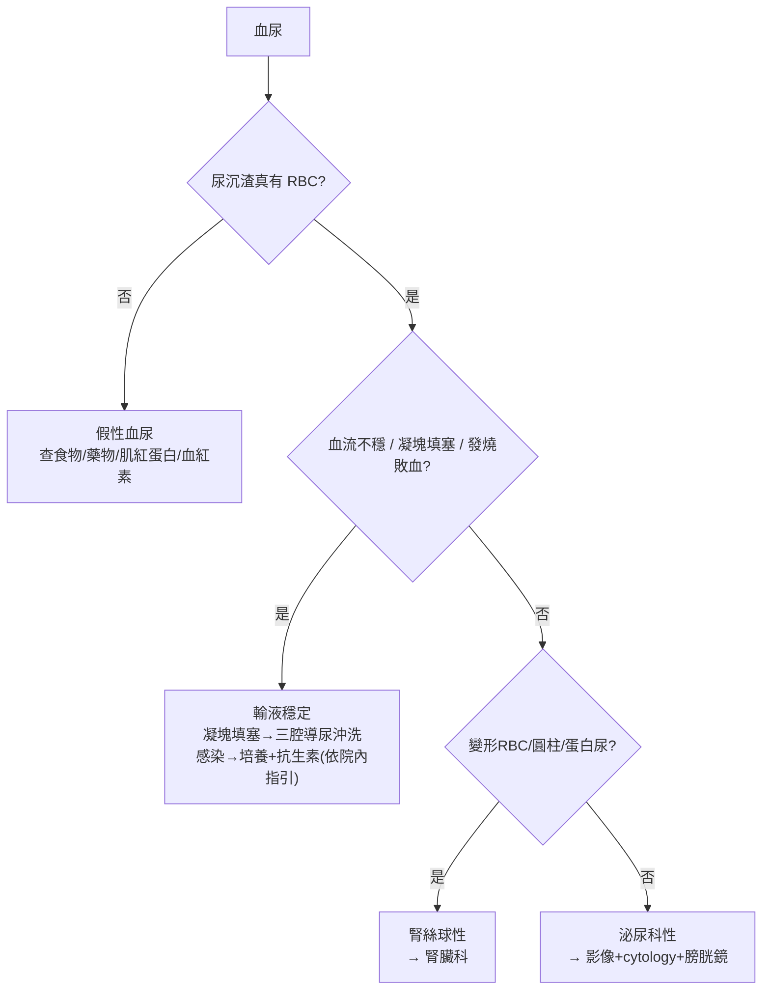

# Hematuria（血尿）

> [!danger] 🚨 紅旗警訊（must-not-miss，先排除惡性與重症）
> **助記「無痛、燒、塊、腎」**
> 1. **無痛性肉眼血尿**（尤其抽菸老年）→ 泌尿道惡性腫瘤（[[Bladder Cancer(膀胱癌)]] / [[Renal Cell Carcinoma(腎細胞瘤)]]）until proven otherwise
> 2. **發燒 + 腰痛 + 血尿** → [[Acute Pyelonephritis(腎盂腎炎)]] / 感染性結石 → urosepsis
> 3. **凝塊 + 解不出來（clot retention）** → 膀胱填塞、需三腔導尿沖洗
> 4. **血尿 + 高血壓 + 水腫 + 蛋白尿 + 紅血球圓柱** → 腎絲球腎炎（腎因性，腎臟科）
>
> ⚡ 先分「**腎絲球性 vs 非腎絲球性（泌尿科性）**」— 前者茶色/可樂色、變形紅血球、紅血球圓柱、蛋白尿；後者鮮紅、有凝塊、無蛋白尿

## 🔀 鑑別診斷 DDx（沿排尿路徑：腎→輸尿管→膀胱→尿道）
| 部位 / 類別 | 疾病 | 支持特徵 |
| --- | --- | --- |
| 腎臟 | [[Renal Cell Carcinoma(腎細胞瘤)]]、[[Kidney stones(腎結石)]]、[[Acute Pyelonephritis(腎盂腎炎)]]、多囊腎 | 腰痛、腫塊、發燒；結石常絞痛 |
| 腎（絲球） | IgA 腎病、[[Alport’s syndrome(艾柏症候群)]]、[[Thin Basement Membrane Syndrome(薄基底膜疾病)]] | 變形紅血球、紅血球圓柱、蛋白尿、高血壓 |
| 輸尿管 | [[Ureteral Stone(輸尿管結石)]]、腫瘤、息肉、醫源性（放 Double-J） | 側腹絞痛放射腹股溝 |
| 膀胱 | [[Bladder Cancer(膀胱癌)]]、[[Hemorrhagic Cystitis(出血性膀胱炎)]]（Cyclophosphamide）、放射線膀胱炎、[[Interstitial Cystitis(間質性膀胱炎)]]（K 他命）、[[S. haematobium(埃及血吸蟲)]] | 頻尿、尿急、灼痛；癌症常無痛 |
| 尿道 / 攝護腺 | 尿道創傷、[[Urethritis(尿道炎)]]、[[Prostate Cancer(攝護腺癌)]]、攝護腺術後、BPH | 排尿初/末血、分泌物 |
| 全身 / 其他 | 凝血異常、抗凝藥、運動性血尿、感染 | 有全身病因 |

> [!warning] **假性血尿 pseudohematuria**：紅色尿但尿潛血/鏡檢無 RBC — 食物（火龍果、甜菜根）、藥物（rifampin、phenazopyridine）、肌紅蛋白尿（橫紋肌溶解）、血紅素尿。**先確認尿沉渣真的有紅血球**再往下查。

## ❓ 問診 / 身體檢查重點
- **肉眼 vs 顯微血尿**；**有無疼痛**（無痛 → 想腫瘤；絞痛 → 結石；灼痛 → 感染）
- **血尿時機**：排尿初段（尿道）/ 末段（膀胱頸/攝護腺）/ 全程（膀胱以上）
- **凝塊有無**（有凝塊 → 非腎絲球性 / 泌尿科來源）
- **危險因子**：抽菸、年齡、化學暴露、環磷醯胺、放療、K 他命、旅遊史（血吸蟲）
- **系統回顧**：發燒、腰痛、體重減輕、水腫、近期感染（IgA：感染同時發生「synpharyngitic」）
- **關鍵理學**：生命徵象、看眼瞼貧血、敲 CVA（knocking pain）、心音/呼吸音/雙下肢水腫、尿道口是否有傷口、肛診攝護腺

## 🩺 初步 workup（該開的檢查 / 影像）
> [!note] 黃金第一步：**尿液分析 + 尿沉渣鏡檢** — 先確認真有紅血球（排假性血尿），再看紅血球形態 / 圓柱 / 蛋白尿分「腎因 vs 泌尿科因」。
- **尿液分析 + 鏡檢**：RBC 形態（變形 → 腎絲球）、紅血球圓柱、蛋白尿、白血球 / 亞硝酸鹽（感染）
- **尿液細胞學 cytology**：懷疑腫瘤
- **抽血**：CBC、腎功能、凝血；懷疑腎絲球 → 補體、自體抗體
- **影像**：KUB（尿酸石看不到）、**腎臟超音波**；高風險 → CT urography
- **膀胱鏡**：肉眼血尿 / 高風險顯微血尿的膀胱評估

## ⚡ 值班即時處置（穩定 vs 不穩定分流）

- **不穩定線**：大量血尿 + 凝塊填塞 → 三腔導尿 + 持續膀胱沖洗；感染性 → 輸液 + 培養後經驗性抗生素（依院內指引）
- **穩定線**：先分腎因/泌尿科因 → 對應科別 workup
- ⚠️ **無痛肉眼血尿別因為抗凝就停手** — 抗凝病人仍可能有潛在腫瘤，該做的影像/膀胱鏡照做

## 📊 臨床評分 / 風險分層（scoring）★顯微血尿分流
> 顯微血尿（microhematuria）用 **AUA 風險分層** 決定要不要做上尿路影像 + 膀胱鏡（肉眼血尿一律高風險，直接完整檢查）。

### AUA 顯微血尿風險分層（2020，需先確認 ≥3 RBC/HPF 且排除良性可逆病因）
| 風險 | 條件（大致需全部符合該級） |
| --- | --- |
| **低風險** | 女 <50 / 男 <40 歲；從不抽菸或 <10 pack-year；3–10 RBC/HPF；無其他危險因子 |
| **中風險** | 女 50–59 / 男 40–59 歲；10–30 pack-year；11–25 RBC/HPF |
| **高風險** | 女 / 男 ≥60 歲；>30 pack-year；>25 RBC/HPF；曾有肉眼血尿 |

| 風險 | 建議處置 |
| --- | --- |
| **低** | 共同決策：重複 U/A 或直接影像 + 膀胱鏡 |
| **中** | 腎臟超音波 + 膀胱鏡 |
| **高** | **CT urography + 膀胱鏡**（完整上下尿路評估） |

> 其他危險因子：抽菸、化學/染料職業暴露、環磷醯胺、慢性導尿/結石、骨盆放療、K 他命。**肉眼血尿 = 直接走高風險完整評估**，不套此分層。

## 🔗 相關
- 疾病：[[Bladder Cancer(膀胱癌)]]　[[Renal Cell Carcinoma(腎細胞瘤)]]　[[Kidney stones(腎結石)]]　[[Acute Pyelonephritis(腎盂腎炎)]]　[[Prostate Cancer(攝護腺癌)]]
- 症狀：[[Frequency(頻尿)]]　[[Acute Urine Retention(急性尿滯留)]]

## 📚 來源
[^1]: AUA Microhematuria Guideline 2020（低/中/高風險分層 + 影像建議）
[^2]: 血尿解剖路徑思考（腎→輸尿管→膀胱→尿道）+ 腎絲球 vs 非腎絲球區分 — 泌尿/腎臟標準
[^3]: 假性血尿與肌紅蛋白/血紅素尿鑑別 — 尿液分析共識

## 🎴 Flashcards & 自我測驗（Ollama qwen2.5:7b 自動生成 2026-07-03）
<!-- flashcard-gen:start -->

### 記憶卡（Spaced Repetition 相容 · `Q::A`）
無痛性肉眼血尿主要見於何種疾病？::泌尿道惡性腫瘤

發燒、腰痛及血尿可能指示哪種急性症狀？::急性腎盂腎炎

凝塊伴隨血尿提示哪些情況？::膀胱填塞

血尿伴有高血壓、水腫和蛋白尿，最可能的疾病是？::腎絲球腎炎

肉眼血尿與顯微血尿如何區分？::肉眼血尿為肉眼可見，顯微血尿需鏡檢確認

假性血尿常見於哪些情況？::食物、藥物（如rifampin）、肌紅蛋白尿、血紅素尿

AUA分層中低風險的定義是？::女<50歲/男<40歲，從不抽菸或<10包年，3-10 RBC/HPF，無其他危險因子

高血壓、水腫和蛋白尿支持哪種疾病診斷？::腎絲球腎炎

泌尿科性血尿常見於哪些部位？::膀胱、尿道、攝護腺

急性腎盂腎炎的典型症狀是？::發燒+腰痛+血尿

### 自我測驗（選擇題，答案摺疊）
**Q1.** 患者主訴肉眼血尿，無其他症狀。根據AUA分層，該患者的風險分級為？
- A. 低風險
- B. 中風險
- C. 高風險
- D. 不適用

> [!success]- 答案
> **A** — 患者為男性45歲，無抽菸史，血尿量為肉眼可見，符合低風險定義。

**Q2.** 患者有腰痛、發燒及血尿症狀，最可能的疾病是？
- A. 膀胱癌
- B. 急性腎盂腎炎
- C. 尿道結石
- D. 腎絲球腎炎

> [!success]- 答案
> **B** — 腰痛、發燒及血尿是急性腎盂腎炎的典型症狀。膀胱癌通常無痛，尿道結石常有絞痛，腎絲球腎炎則無腰痛。

**Q3.** 患者肉眼血尿伴隨凝塊，下一步應如何處理？
- A. 腸鏡檢查
- B. 尿液細胞學檢查
- C. 三腔導尿沖洗
- D. 抗生素治療

> [!success]- 答案
> **C** — 有凝塊提示非腎絲球性血尿，需進行三腔導尿沖洗以確保尿路暢通。

<!-- flashcard-gen:end -->
