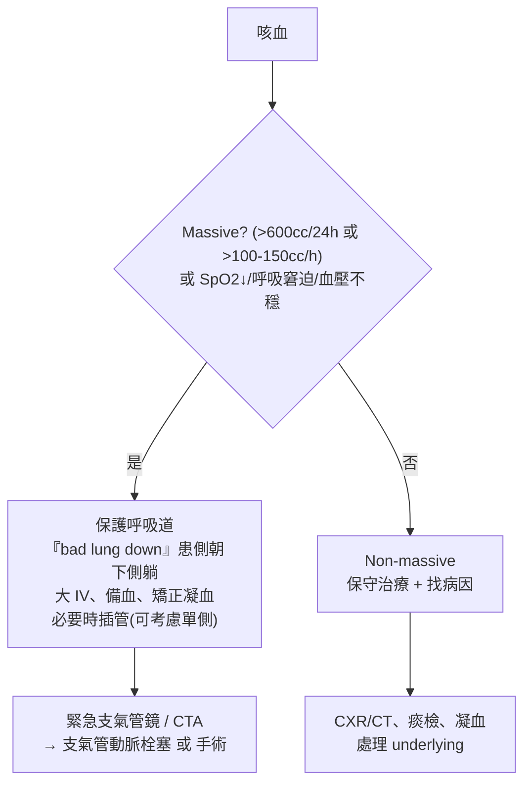

# Hemoptysis（咳血）

> [!danger] 🚨 紅旗警訊（must-not-miss，massive 是「窒息」不是「失血」而致命）
> **助記「量、氧、塌、腎」**
> 1. **大量咳血**（>600 cc/24h 或 >100–150 cc/h）→ 氣道被血淹沒 → **窒息**（死因是 asphyxiation 非 exsanguination）
> 2. **低血氧 / 呼吸窘迫 / 意識改變** → 立即保護呼吸道、必要時插管
> 3. **血壓不穩 / 持續出血** → 出血源氣道處理優先
> 4. **咳血 + 急性腎損傷 / 血尿** → 肺腎症候群（[[Goodpasture’s syndrome(古巴斯徹氏症候群)]] / [[Wegener’s granulomatosis(衛格式肉芽腫)]] 等血管炎）
>
> ⚡ **先分清咳血 vs 吐血 vs 假性咳血**：咳血=鮮紅帶泡沫、鹼性、伴咳嗽/痰；吐血=暗紅/咖啡渣、酸性、伴噁心；假性=鼻咽/上呼吸道來源

## 🔀 鑑別診斷 DDx（用 VITAMIN 系統性思考）
| 類別 | 疾病 | 支持特徵 |
| --- | --- | --- |
| (V) 血管 | [[ArterioVenous Malformation(動靜脈血管畸形)]]、[[Heart Failure(心臟衰竭)]]→[[Pulmonary Edema(肺水腫)]]（粉紅泡沫痰）、[[Pulmonary Embolism(肺栓塞)]] | 心衰病史、胸膜痛、單側腿腫 |
| (V) 凝血 | [[Thrombocytopenia(血小板減少症)]]、[[Disseminated Intravascular Coagulation(泛發性血管內血液凝固症)]]、抗凝藥 | 多處出血、凝血異常 |
| (I) 感染 | [[Chronic bronchitis(慢性支氣管炎)]] / [[Bronchiectasis(支氣管擴張症)]]、[[Pneumonia(肺炎)]]、[[Acute Bronchitis(急性支氣管炎)]] | 慢性膿痰、發燒、浸潤 |
| (I) 感染（cavity） | [[Tuberculosis(結核病)]]、[[Fungal Infection(真菌病)]] | 空洞病灶、慢性、體重減輕、盜汗 |
| (I) 醫源性 | 肺動脈受損、肺部 biopsy 後 | 近期侵入性處置 |
| (A) 自體免疫 | [[Goodpasture’s syndrome(古巴斯徹氏症候群)]]、[[Wegener’s granulomatosis(衛格式肉芽腫)]]→[[Pulmonary-Renal Syndrome(肺腎症候群)]]、[[Systemic Lupus Erythema(紅斑性狼瘡)]] | 合併腎損傷、血尿、全身症狀 |
| (N) 腫瘤 | [[Bronchogenic Carcinoma(支氣管源癌)]] | 老年抽菸、體重減輕、慢性咳嗽變化 |
| — | 原因不明（約 25%） | 常預後較好 |

> [!warning] 全球 / 台灣咳血最常見仍是**支氣管擴張、結核、肺癌、感染**；見到咳血務必問結核接觸史與抽菸史，並排除肺栓塞。

## ❓ 問診 / 身體檢查重點
- **確認是咳血非吐血 / 鼻咽出血**（顏色、pH、伴隨症狀）
- **量與速度**：一次多少 cc？24 小時累積？（估 massive 與否）
- **性狀**：粉紅泡沫（肺水腫）、膿血痰（感染/支擴）、鮮血
- **危險因子**：抽菸、結核接觸 / 過去史、體重減輕盜汗、抗凝、近期侵入處置、風濕免疫症狀、DVT/PE 風險
- **關鍵理學**：生命徵象 + SpO2、看眼睛（貧血）、淋巴結、呼吸音（囉音/局部）、心音、杵狀指、其他出血點、下肢腫

## 🩺 初步 workup（該開的檢查 / 影像）
> [!note] 黃金第一步：**評估氣道與出血量 + SpO2** — 先決定是不是 massive（需保護氣道 + 定位出血側），再往下找病因。
- **CXR**：第一線（浸潤、空洞、腫塊、肺水腫）
- **抽血**：CBC、凝血功能、腎功能 + 尿液（找肺腎症候群）、發炎指標
- **痰檢**：Gram / 抗酸染色 + 培養（結核 / 感染）、cytology（腫瘤）
- **CT chest（± CTA）**：定位、找腫瘤/支擴/PE
- **支氣管鏡**：定位出血、止血、洗 BAL
- **血管攝影**：定位 + 支氣管動脈栓塞（治療性）

## ⚡ 值班即時處置（穩定 vs 不穩定分流）

- **不穩定線（massive）**：① 保護氣道（必要時插管） ② **「bad lung down」患側朝下側躺**，讓好肺維持通氣、避免血流入健側 ③ 大 IV、備血、矯正凝血 ④ 定位（支氣管鏡 / CTA）後 **支氣管動脈栓塞**（首選介入）或手術切除
- **穩定線（non-massive）**：保守治療 + 處理 underlying（感染、支擴、腫瘤等），抗生素依院內指引
- ⚠️ **咳血死於窒息不是失血** — 重點是保護氣道與定位止血，不是狂輸血

## 📊 臨床評分 / 風險分層（scoring）★以「量」定嚴重度與分流
> 咳血**沒有像 HEART 那樣的通用計分表**（誠實標註）；臨床決策靠「**出血量 + 氣體交換 + 血流動力學**」分級，這是決定 disposition 的實質「評分」。

### 嚴重度分級（依出血量與生理影響 → 分流）
| 分級 | 大致出血量 / 生理 | 處置分流 |
| --- | --- | --- |
| **輕微 mild** | 痰帶血絲 ~ 少量（<20–30 cc/day）、SpO2 正常 | 門診 / 保守，找病因 |
| **中度 moderate** | 明顯咳血但 <大量閾值、生命徵象穩定 | 住院觀察、CT、支氣管鏡評估 |
| **大量 massive / life-threatening** | **>600 cc/24h 或 >100–150 cc/h**，或任何造成低血氧 / 血流不穩 / 氣道受損者 | **急救**：保護氣道、bad lung down、栓塞 / 手術、ICU |

> ⚠️ 「量」有多種定義（各文獻 100–600 cc/24h 不一）；**臨床更看「有沒有影響氣體交換 / 血流動力學」而非只看絕對 cc 數** — 少量血在氣道也可能致命。故實務上「造成生理不穩 = 當 massive 處理」。

> 若合併懷疑 [[Pulmonary Embolism(肺栓塞)]]，可另用 Wells / PERC；懷疑肺腎症候群則查 ANCA / anti-GBM（非咳血本身的評分，而是特定病因分流）。

## 🔗 相關
- 疾病：[[Bronchiectasis(支氣管擴張症)]]　[[Tuberculosis(結核病)]]　[[Bronchogenic Carcinoma(支氣管源癌)]]　[[Pulmonary Embolism(肺栓塞)]]　[[Goodpasture’s syndrome(古巴斯徹氏症候群)]]
- 症狀：[[Cough(咳嗽)]]　[[Shortness of breath(喘氣)]]　[[Upper GI bleeding(上消化道出血)]]（鑑別吐血）

## 📚 來源
[^1]: Massive hemoptysis 定義與「窒息非失血」處置原則、bad lung down、支氣管動脈栓塞 — 胸腔急症共識
[^2]: VITAMIN 鑑別診斷架構（血管 / 感染 / 自體免疫 / 腫瘤 / 凝血 / 醫源性）
[^3]: 肺腎症候群（anti-GBM / ANCA 血管炎）— 風濕免疫 / 腎臟標準

## 🎴 Flashcards & 自我測驗（Ollama qwen2.5:7b 自動生成 2026-07-03）
<!-- flashcard-gen:start -->

### 記憶卡（Spaced Repetition 相容 · `Q::A`）
大量咳血定義::>600 cc/24h 或 >100–150 cc/h

大量咳血的死因::窒息（asphyxiation）

低血氧症狀::呼吸窘迫 / 意識改變

急性腎損傷與咳血相關疾病::肺腎症候群 (Goodpasture’s syndrome, Wegener’s granulomatosis)

VITAMIN 系統性思考中的血管類疾病::動靜脈血管畸形、心臟衰竭、肺栓塞

咳血 vs 吐血 vs 假性咳血的區別::咳血=鮮紅帶泡沫、鹼性；吐血=暗紅/咖啡渣、酸性；假性=鼻咽/上呼吸道來源

急性腎損傷與哪些疾病相關::肺腎症候群 (Goodpasture’s syndrome, Wegener’s granulomatosis)

大量咳血的初步處置::保護呼吸道、bad lung down、大 IV、備血

非大量咳血的處理::保守治療 + 找病因

咳嗽帶血絲定義::輕微 (mild) 嚴重度分級

### 自我測驗（選擇題，答案摺疊）
**Q1.** 患者出現大量咳血，SpO2 下降至 85%，您應立即進行哪項處置？
- A. 立即插管
- B. 靜脈輸液並準備血液
- C. 嘗試止血藥物治療
- D. 訂定 CT 調查出血原因

> [!success]- 答案
> **A** — 大量咳血伴隨低氧，首要處置是保護呼吸道，立即插管以確保氣道通暢。

**Q2.** 患者有慢性咳嗽史，近期出現痰中帶血，您在問診時應特別注意哪個問題？
- A. 最近是否有服用抗凝藥
- B. 是否有抽菸史或結核接觸史
- C. 有無胸痛症狀
- D. 近期是否接受過侵入性手術

> [!success]- 答案
> **B** — 慢性咳嗽患者出現痰中帶血，應特別注意是否有抽菸史或結核接觸史。

**Q3.** 患者咳血 24 小時累積量為 500 cc，SpO2 為 96%，您如何評估其病情並決定下一步處置？
- A. 較為穩定，可住院觀察
- B. 需立即插管並準備支氣管鏡檢查
- C. 暫時靜脈補液並密切監測
- D. 立即進行 CT 調查出血原因

> [!success]- 答案
> **A** — 患者咳血量雖接近大量閾值，但 SpO2 正常，可初步評估為非大量，建議住院觀察並進一步檢查。

<!-- flashcard-gen:end -->
