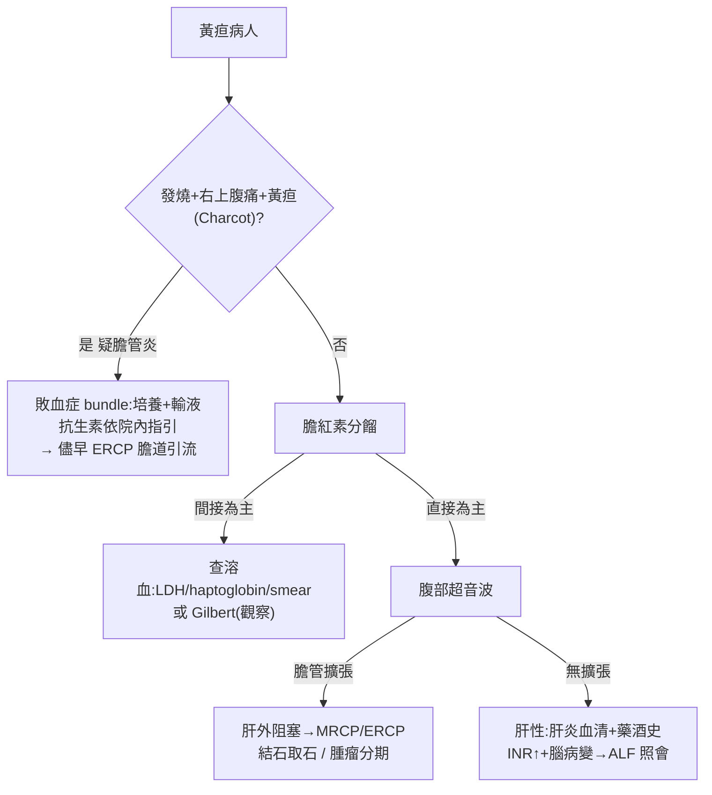

# Jaundice（黃疸）

> [!danger] 🚨 紅旗警訊（must-not-miss，黃疸先排「膽道敗血 + 猛爆肝衰」）
> **助記「炎衰阻溶」**
> 1. **急性膽管炎 / Ascending cholangitis** → **Charcot 三徵**（發燒+右上腹痛+黃疸）；進展成 **Reynolds 五徵**（+低血壓+意識改變）= 化膿性膽管炎，需緊急膽道引流
> 2. **猛爆性肝衰竭（ALF）** → 黃疸 + 凝血異常（INR↑）+ **肝腦病變**；Acetaminophen 過量、猛爆肝炎、Wilson
> 3. **總膽管結石阻塞** → 右上腹絞痛、clay-color stool、茶色尿、ALP/GGT↑ 為主
> 4. **溶血危象** → 間接膽紅素↑、貧血、LDH↑、haptoglobin↓；G6PD/自體免疫/敗血
> 5. **惡性阻塞（Courvoisier）** → 無痛性黃疸 + 可觸及脹大膽囊 → 胰頭癌/壺腹周圍癌/膽管癌
>
> ⚡ **發燒 + 右上腹痛 + 黃疸 → 想膽管炎，抽血培養 + 影像 + 儘早膽道引流，抗生素依院內指引**

## 🔀 鑑別診斷 DDx（值班先分 pre / hepatic / post）
| 類別 / 疾病 | 支持特徵 | rule-out 線索 |
| --- | --- | --- |
| **Pre-hepatic**（間接↑）[[Hemolytic Anemia(溶血性貧血)]]、[[G6PD deficiency(蠶豆症)]] | 間接 bil↑、Hb↓、LDH↑、haptoglobin↓、retic↑、尿膽素原↑但尿膽紅素(-) | 血球正常 + LDH/haptoglobin 正常 |
| **遺傳結合缺陷** [[Gilbert’s syndrome(吉伯特氏症候群)]]、[[Crigler-Najjar syndrome(克果納傑氏症)]] | 間接 bil 輕度↑、禁食/壓力惡化、肝功能其餘正常 | 有溶血或肝細胞損傷證據 |
| **Hepatic** [[Viral hepatitis(病毒性肝炎)]]、[[Alcoholic hepatitis(酒精性肝炎)]]、藥物性 | **AST/ALT↑↑** 為主、混合型 bil、旅遊/輸血/飲酒/藥物史 | 肝細胞酵素正常且以 ALP 為主 |
| **膽汁鬱積（肝內）** [[Primary Biliary Cholangitis(原發性膽汁性膽管炎)]]、[[Primary Sclerosing Cholangitis(原發性硬化性膽管炎)]] | 直接 bil↑、ALP/GGT↑、搔癢、抗 AMA(PBC) | 超音波見肝外膽管擴張（偏肝外阻塞） |
| **Post-hepatic（阻塞）** [[Cholelithiasis(膽結石)]]/總膽管結石、[[Klatskin tumor(膽管癌)]]、[[Periampulla Vater Cancer(壺腹周圍癌)]]、胰頭癌 | 直接 bil↑、ALP/GGT↑、clay stool、茶色尿、膽管擴張 | 影像無膽管擴張 |

> [!warning] **Direct（結合型）↑ 為主** → 想肝內鬱積或肝外阻塞（膽道問題）；**Indirect（未結合）↑ 為主** → 想溶血或結合缺陷。先靠分餾定方向再開影像

## ❓ 問診 / 身體檢查重點
- **病史**：起病快慢、**痛 vs 無痛**（無痛脹大膽囊→惡性；絞痛→結石）、發燒寒顫、尿色（茶色）與糞色（灰白）、搔癢、體重減輕
- **危險因子**：飲酒量、**藥物/中草藥/Acetaminophen 過量、自殺意圖**、旅遊疫區(HAV)、輸血/針具/性接觸(HBV/HCV)、家族史、自體免疫
- **關鍵理學**：**icteric sclera**、腹部視-聽-觸（**Murphy's sign**）-叩（肝脾大小）、Courvoisier 徵（可觸膽囊）、腹水/移動性濁音、脾大、蜘蛛痣/手掌紅斑/瘀青/水腫、**flapping tremor（撲翼樣震顫 → 肝腦病變）**、DRE 看糞色

## 🩺 初步 workup（該開的檢查 / 影像）
> [!note] 黃金第一步：**腹部超音波** — 決定「膽管有無擴張（阻塞 vs 肝性）」的分水嶺，同時抽血分餾膽紅素
- **膽紅素分餾**（total / direct / indirect）→ 定 pre / hepatic / post 方向
- **肝功能組合**：AST/ALT（肝細胞型）vs **ALP/GGT**（膽汁鬱積型）、Albumin、**PT/INR（合成功能 → ALF 指標）**
- **CBC/DC + 溶血組合**：retic、LDH、haptoglobin、peripheral smear、Coombs
- **肝炎血清學**：HAV IgM、HBsAg/anti-HBc IgM、anti-HCV
- **腹部超音波**（首選）→ 結石、腫瘤、膽管擴張、肝實質
- 升級影像：**MRCP**（膽道解剖）、**ERCP**（診斷兼治療性引流）、CT（腫瘤分期）；懷疑 Wilson 加銅/ceruloplasmin

## ⚡ 值班即時處置（穩定 vs 不穩定分流）

- **膽管炎**：血/尿培養 → 輸液 → 抗生素（**依院內指引**）→ **膽道引流（ERCP/PTCD）為決定性治療**，Reynolds 五徵/敗血休克需加護
- **ALF**：查 INR + 意識，Acetaminophen 過量給 **NAC**，早期照會肝臟移植中心
- **溶血**：找根因（停致病藥、治感染），支持性輸血依指引
- ⚠️ 阻塞性黃疸未解除前避免不必要的肝毒/經肝代謝藥物

## 📊 臨床評分 / 嚴重度分級（scoring）★本卡核心
> 黃疸值班的決斷點是「這是不是膽管炎？多嚴重？要不要緊急引流？」→ 用 **Tokyo Guidelines（TG18）**

### ① 急性膽管炎診斷（TG18，A+B+C 各至少一項 → 確診）
| 類別 | 項目 |
| --- | --- |
| **A. 全身發炎** | 發燒（>38°C）/寒顫；CRP↑ 或 WBC 異常 |
| **B. 膽汁鬱積** | 黃疸（T-bil ≥2 mg/dL）；肝功能 ALP/GGT/AST/ALT 異常 |
| **C. 影像** | 膽管擴張；影像見狹窄/結石/支架等病因 |

> 疑診：A + (B 或 C 之一)；**確診：A + B + C 各 ≥1 項**

### ② 急性膽管炎嚴重度分級（TG18 → 決定引流時機）
| 分級 | 定義 | 處置 |
| --- | --- | --- |
| **Grade III（重度）** | 合併**任一器官衰竭**：心血管（升壓劑）、神經（意識改變）、呼吸（P/F<300）、腎（Cr>2）、肝（INR>1.5）、血液（血小板<10萬） | 加護 + 器官支持 + **緊急膽道引流** |
| **Grade II（中度）** | 符合下列任二：WBC>12k或<4k、發燒≥39°C、年齡≥75、T-bil≥5、Alb 低下 | 早期（含緊急）引流 |
| **Grade I（輕度）** | 未達 II / III | 抗生素 + 初步治療反應不佳再引流 |

### ③ 溶血 vs 阻塞 vs 肝細胞 快速分型
| 型別 | 主升膽紅素 | 主升酵素 | 尿膽紅素 | 糞色 |
| --- | --- | --- | --- | --- |
| 溶血（pre） | 間接 | LDH↑ | (-) | 正常/深 |
| 肝細胞 | 混合 | AST/ALT↑↑ | (+) | 正常 |
| 阻塞（post） | 直接 | ALP/GGT↑↑ | (+) | 灰白(clay) |

## 🔗 相關
- 疾病：[[Viral hepatitis(病毒性肝炎)]]　[[Alcoholic hepatitis(酒精性肝炎)]]　[[Cholelithiasis(膽結石)]]　[[Klatskin tumor(膽管癌)]]　[[Primary Biliary Cholangitis(原發性膽汁性膽管炎)]]　[[Gilbert’s syndrome(吉伯特氏症候群)]]
- 檢查：[[Bilirubin(膽紅素)]]　[[Liver Function Test(肝功能)]]　[[Abdominal Ultrasound(腹部超音波)]]　[[ERCP(內視鏡逆行性膽胰管攝影)]]
- 症狀：[[Right Upper Quadrant Pain(右上腹痛)]]

## 📚 來源
[^1]: Tokyo Guidelines 2018（TG18）— acute cholangitis diagnostic criteria & severity grading（*J Hepatobiliary Pancreat Sci* 2018）
[^2]: Charcot triad / Reynolds pentad — 急診膽道敗血教學共識
[^3]: Approach to jaundice（pre/hepatic/post 分型）— AAFP / Harrison's；Courvoisier's law

## 🎴 Flashcards & 自我測驗（Ollama qwen2.5:7b 自動生成 2026-07-03）
<!-- flashcard-gen:start -->

### 記憶卡（Spaced Repetition 相容 · `Q::A`）
急性膽管炎的紅旗警訊是什麼？::發燒+右上腹痛+黃疸；進展成Reynolds五徵

猛爆性肝衰竭的主要症狀有哪些？::黃疸、凝血異常（INR↑）、肝腦病變

總膽管結石阻塞的典型症狀是什麼？::右上腹絞痛、clay-color stool、茶色尿、ALP/GGT↑

溶血危象的主要症狀有哪些？::間接膽紅素↑、貧血、LDH↑、haptoglobin↓

惡性阻塞的黃疸有何特徵？::無痛性黃疸+可觸及脹大膽囊

急性膽管炎的Charcot三徵是什麼？::發燒+右上腹痛+黃疸

Reynolds五徵有哪些症狀？::發燒+右上腹痛+黃疸+低血壓+意識改變

急性膽管炎的初步工作up包括哪些檢查？::腹部超音波、膽紅素分餾、肝功能組合、CBC/DC、肝炎血清學

Tokyo Guidelines中急性膽管炎分級為III級的定義是什麼？::合併任一器官衰竭：心血管（升壓劑）、神經（意識改變）、呼吸（P/F<300）、腎（Cr>2）、肝（INR>1.5）、血液（血小板<10萬）

急性膽管炎分級為II級的定義是什麼？::符合下列任二：WBC>12k或<4k、發燒≥39°C、年齡≥75、T-bil≥5、Alb 低下

### 自我測驗（選擇題，答案摺疊）
**Q1.** 一位60歲男性患者，主訴右上腹痛及黃疸已持續兩天。體檢發現有輕微發燒（38.2°C），腹部超音波顯示膽管擴張。根據Tokyo Guidelines，此患者的急性膽管炎分級是？
- A. Grade I
- B. Grade II
- C. Grade III
- D. 疑診

> [!success]- 答案
> **C** — 發燒38.2°C、右上腹痛（Charcot三徵）、黃疸及膽管擴張，符合Tokyo Guidelines中急性膽管炎確診標準。根據分級定義，合併膽管擴張即為Grade III。

**Q2.** 一位45歲女性患者因突然出現黃疸來院就診，腹部超音波顯示無膽管擴張，但膽紅素分餾發現間接膽紅素升高。請問此患者的溶血危象可能性如何？
- A. 低
- B. 中
- C. 高
- D. 疑診

> [!success]- 答案
> **C** — 間接膽紅素↑、貧血、LDH↑，符合溶血危象的症狀。腹部超音波無膽管擴張排除阻塞性黃疸，因此可能性高。

**Q3.** 一位80歲男性患者因急性腹痛及黃疸來院就診，體溫37.5°C，腹部超音波顯示膽管輕度擴張，WBC 12k/μL。請問此患者的急性膽管炎分級是？
- A. Grade I
- B. Grade II
- C. Grade III
- D. 疑診

> [!success]- 答案
> **B** — WBC 12k/μL、發燒37.5°C（符合分級定義），但無其他器官衰竭症狀，因此為Grade II。

<!-- flashcard-gen:end -->
