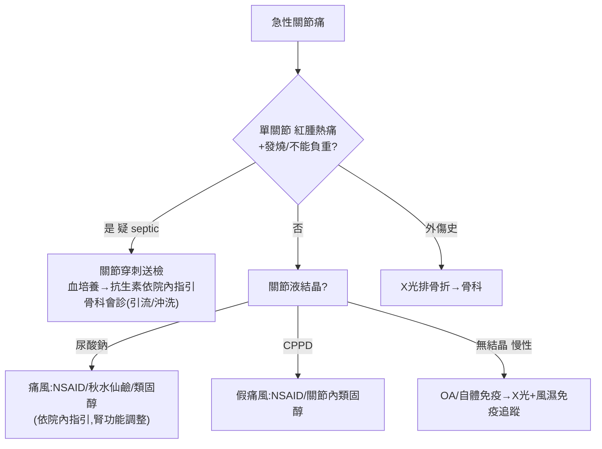

# Joint Pain（關節痛）

> [!danger] 🚨 紅旗警訊（must-not-miss，急性單關節炎「先排感染」）
> **助記「感血晶折」**
> 1. **化膿性關節炎 / Septic arthritis** → 急性單關節紅腫熱痛 + 不能負重、發燒；**不治療 24-48h 內軟骨破壞**，是關節急症 → **關節穿刺送檢是決定性動作**
> 2. **瀰漫性淋病雙球菌感染（DGI）** → 年輕性活躍者，移動性多關節炎 + 腱鞘炎 + 膿疱疹三聯
> 3. **出血性關節（Hemarthrosis）** → 抗凝血/血友病/創傷後急速腫脹
> 4. **關節旁骨折 / 惡性腫瘤** → 創傷史、夜間痛、體重減輕、病理性骨折
> 5. ⚠️ **痛風/假痛風可與敗血並存** → 有結晶不代表沒感染，可疑就送培養
>
> ⚡ **急性單關節熱腫 → 先當 septic arthritis 處理，關節穿刺（培養+結晶+細胞數）優先於推定診斷**

## 🔀 鑑別診斷 DDx（值班從這裡連到疾病）
| 疾病 | 支持特徵 | rule-out 線索 |
| --- | --- | --- |
| [[Septic arthritis(感染性關節炎)]] | 急性單關節、紅腫熱痛、不能負重、發燒、關節液 WBC 高（常 >50k、PMN>90%）、培養(+) | 關節液 WBC 低 + 培養(-) + 無結晶（仍需臨床綜合） |
| [[Disseminated gonococcal infection(瀰漫性淋病雙球菌感染)]] | 年輕性活躍、移動性多關節、腱鞘炎、膿疱疹、泌尿道分泌物 | 無性接觸史 + 培養/NAAT(-) |
| [[Gout(痛風)]] | 急性、第一蹠趾（podagra）/膝踝、夜間發作、尿酸/飲酒/利尿劑、負雙折射針狀結晶 | 關節液無單鈉尿酸鹽結晶 |
| [[Pseudo-gout(假痛風)]] | 大關節（膝/腕）、高齡、CPPD 正雙折射菱形結晶、軟骨鈣化 | 無 CPPD 結晶 |
| [[OsteoArthritis(退化性關節炎)]] | 慢性、負重/活動後加劇、晨僵<30min、骨刺、關節腔變窄 | 明顯發炎/發燒/急性腫脹 |
| 類風濕/自體免疫（[[Reactive arthritis(反應性關節炎)]]、[[Psoariatic arthritis(乾癬性關節炎)]]） | 對稱多關節、晨僵>1h、皮膚/眼/腸道外症狀 | 單關節急性熱腫為主 |
| 創傷 / 腫瘤 | 明確外傷史；或夜間痛+體重減輕+病理骨折 | 無外傷、影像無病灶 |

> [!warning] 關節液**結晶陽性不能排除感染**（可共存）；反之關節液 WBC 未達傳統閾值也**不能完全排除** septic arthritis，需結合臨床

## ❓ 問診 / 身體檢查重點
- **時序與分佈**：急性 vs 慢性、**單關節 vs 多關節**、對稱性、移動性、晨僵時間、負重能力
- **危險因子**：創傷/針灸/關節注射史、性生活史+泌尿道分泌物（DGI）、痛風危險因子（高尿酸、高普林、飲酒、利尿劑、代謝症候群）、免疫低下/糖尿病、抗凝血/血友病
- **關節外線索**：發燒、皮疹、指甲乾癬、葡萄膜炎/紅眼、腹瀉/尿道炎（reactive）、體重減輕/夜間痛（腫瘤）
- **關鍵理學**：步態、紅腫熱痛與 effusion（比較兩側、髕骨浮球）、joint line 局部壓痛、主動/被動活動度、韌帶穩定度（前/後抽屜、Valgus/Varus stress）、遠端脈搏與神經肌力

## 🩺 初步 workup（該開的檢查 / 影像）
> [!note] 黃金第一步：**急性單關節熱腫 → 關節穿刺（arthrocentesis）**，關節液送 **細胞數＋革蘭氏染色/培養＋結晶＋（葡萄糖）**，這是分辨感染 vs 結晶的決定性檢查
- **關節液分析**：WBC + 分類、Gram stain + 培養、**偏光顯微鏡結晶**
- **血液**：CBC/DC、CRP/ESR、尿酸（急性期可正常，勿以此排除痛風）、血培養（發燒時）
- **X 光**：骨折、軟骨鈣化（CPPD）、侵蝕、骨刺、腫瘤病灶
- **超音波**：evaluate effusion + 導引穿刺
- 懷疑 DGI：泌尿生殖道/咽喉/直腸 NAAT + 培養

## ⚡ 值班即時處置（穩定 vs 不穩定分流）

- **疑 septic arthritis**：穿刺送檢後**不等培養結果先經驗性抗生素（依院內指引）**，骨科會診做關節引流/灌洗
- **痛風/假痛風**：NSAID / 秋水仙鹼 / 類固醇（**劑量依院內指引**，注意腎功能與交互作用）
- **創傷**：X 光排骨折 → 骨科；血友病/抗凝出血依血液科指引處理
- ⚠️ 未排除感染前避免關節內注射類固醇

## 📊 臨床評分 / 決策工具（scoring）★本卡核心
> 值班關節痛的核心決斷是「這關節有沒有感染？」→ 靠**關節液細胞數**分層 + 臨床機率

### ① 關節液分析分型（決定 septic 機率的主軸）
| 型別 | 外觀 | WBC/µL | PMN% | 常見對應 |
| --- | --- | --- | --- | --- |
| 正常 | 清澈 | <200 | <25% | — |
| 非發炎性 | 清澈黃 | 200–2,000 | <25% | OA、創傷 |
| 發炎性 | 混濁 | 2,000–50,000 | ≥50% | 痛風、假痛風、RA、reactive |
| **化膿性/敗血** | 濃/膿 | **>50,000（常 >100k）** | **>90%** | **Septic arthritis** |
| 出血性 | 血樣 | 依情況 | — | 創傷、血友病、抗凝 |

> WBC 越高 septic 機率越高，但**無單一閾值可完全 rule-in/out**；結晶(+)不排除共存感染

### ② 成人化膿性關節炎風險因子（越多越警惕）
| 類別 | 因子 |
| --- | --- |
| 宿主 | 高齡、糖尿病、RA/免疫抑制、皮膚感染、靜脈藥癮、HIV |
| 關節 | 人工關節、近期關節手術/注射、既有關節病變 |
| 臨床 | 發燒、不能負重、關節液 WBC 極高 + PMN 高 |

### ③ 痛風臨床分類（ACR/EULAR 概念）
| 支持痛風 | 內容 |
| --- | --- |
| 部位 | 第一蹠趾關節（podagra）、足踝/膝 |
| 病程 | 急性發作 <24h 達高峰、自限、反覆 |
| 決定性 | 關節液**單鈉尿酸鹽（MSU）針狀負雙折射結晶** |
| 佐證 | 高尿酸血症、痛風石、影像雙軌徵/尿酸鹽沉積 |

## 🔗 相關
- 疾病：[[Septic arthritis(感染性關節炎)]]　[[Gout(痛風)]]　[[Pseudo-gout(假痛風)]]　[[OsteoArthritis(退化性關節炎)]]　[[Disseminated gonococcal infection(瀰漫性淋病雙球菌感染)]]
- 檢查：[[Arthrocentesis(關節穿刺)]]　[[Synovial Fluid Analysis(關節液分析)]]　[[Uric Acid(尿酸)]]
- 症狀：[[Fever(發燒)]]

## 📚 來源
[^1]: Synovial fluid WBC 分型 & septic arthritis 診斷 — Margaretten ME et al. *JAMA* "Does This Adult Patient Have Septic Arthritis?"
[^2]: ACR/EULAR Gout Classification Criteria（2015）；CPPD/假痛風 — *NEJM* review
[^3]: Approach to acute monoarthritis — AAFP；DGI — CDC STI treatment guideline

## 🎴 Flashcards & 自我測驗（Ollama qwen2.5:7b 自動生成 2026-07-03）
<!-- flashcard-gen:start -->

### 記憶卡（Spaced Repetition 相容 · `Q::A`）
急性單關節炎需首先排除何種情況？::化膿性關節炎

瀰漫性淋病雙球菌感染的典型症狀有哪些？::移動性多關節、腱鞘炎、膿皰疹

痛風急性發作時，最常見受累部位是哪個？::第一蹠趾（podagra）

化膿性關節炎的關節液細胞數和中性球比例是多少？::>50,000, >90%

急性單關節熱腫應首先考慮何種情況？::先當 septic arthritis 處理

痛風的決定性診斷是什麼？::單鈉尿酸鹽針狀負雙折射結晶

急性關節炎時，哪種情況需考慮關節穿刺？::急性單關節熱腫

化膿性關節炎的治療首選是什麼？::經驗性抗生素

痛風急性發作時，常見的治療藥物有哪些？::NSAID/秋水仙鹼/類固醇

化膿性關節炎與其他情況鑑別時，哪種檢查最關鍵？::關節穿刺

### 自我測驗（選擇題，答案摺疊）
**Q1.** 一位45歲男性患者主訴右膝疼痛，急性發作且伴隨紅腫熱痛。根據筆記內容，下列何者不是初步工作up的正確步驟？
- A. 確認是否有外傷史
- B. 血液檢查CBC/DC、CRP/ESR
- C. 開始使用抗生素治療
- D. 超音波評估關節積液

> [!success]- 答案
> **C** — 根據筆記，急性單關節熱腫需先考慮化膿性關節炎，因此初步步驟應為血液檢查、超音波評估及關節穿刺，而非直接開始使用抗生素治療。

**Q2.** 一位30歲女性患者主訴左膝疼痛，急性發作且伴隨紅腫熱痛。根據筆記內容，下列何種情況最不可能是該患者的病因？
- A. 痛風
- B. 退化性關節炎
- C. 感染性關節炎
- D. 假痛風

> [!success]- 答案
> **B** — 根據筆記，急性單關節紅腫熱痛需首先考慮感染性關節炎。而退化性關節炎通常是慢性、非急性發作，因此最不可能是該患者的病因。

**Q3.** 一位70歲男性患者主訴右膝疼痛，急性發作且伴隨紅腫熱痛。根據筆記內容，下列何種情況需考慮使用抗生素治療？
- A. 痛風
- B. 退化性關節炎
- C. 感染性關節炎
- D. 假痛風

> [!success]- 答案
> **C** — 根據筆記，感染性關節炎需先考慮化膿性關節炎，且急性單關節熱腫應首先考慮化膩性關節炎。因此，若確定為感染性關節炎，需使用抗生素治療。

<!-- flashcard-gen:end -->
