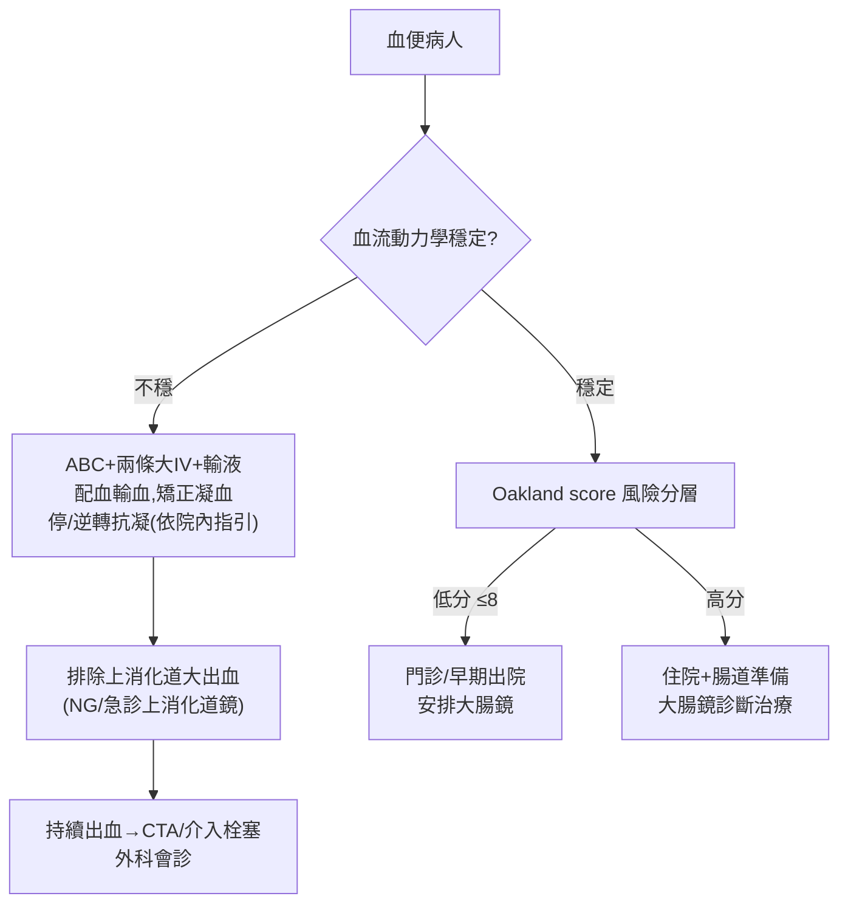

# Lower GI Bleeding（下消化道出血）

> [!danger] 🚨 紅旗警訊（must-not-miss，血便先穩生命徵象 + 排上消化道大出血）
> **助記「休上缺凝」**
> 1. **血流動力學不穩 / 出血性休克** → 心跳快、姿勢性低血壓、意識改變、尿量少 → 先 ABC + 兩條大 IV + 輸血準備
> 2. **快速血便其實是上消化道大出血** → 約 10-15% 的「血便」是急速 UGIB（NG/直腸鏡評估、BUN/Cr 比值升高提示）
> 3. **缺血性大腸炎** → 突發腹絞痛 + 血便，老年/低灌流/心律不整；分水嶺區
> 4. **抗凝/抗血小板相關出血** → 看到出血反射性問「有沒有用抗凝血/抗血小板/NOAC」
> 5. ⚠️ **持續大量鮮血 + 不穩 → 通知外科/介入放射線，別只等大腸鏡**
>
> ⚡ **看到血便第一動作：vital signs + 建立大 IV + 驗血型配血 + 問抗凝藥；不穩先復甦不追診斷**

## 🔀 鑑別診斷 DDx（值班從這裡連到疾病）
| 疾病 | 支持特徵 | rule-out 線索 |
| --- | --- | --- |
| [[Diverticulitis(憩室炎)]] / 憩室出血 | **LGIB 最常見**、老年、無痛大量鮮血/暗紅、常自限 | 影像/內視鏡無憩室 |
| 血管增生 / [[Angiodysplasia(血管增生)]] | 老年、無痛間歇出血、主動脈狹窄/腎病相關 | — |
| [[Ischemic Colitis(缺血性大腸炎)]] | 突發腹絞痛→血便、老年/低灌流/AF、左側結腸/脾曲 | 無腹痛且灌流正常 |
| [[Inflammatory Bowel Disease(發炎性腸道疾病)]] | 年輕、慢性血性腹瀉、裏急後重、腹痛、體重減輕 | 無慢性腸道症狀 |
| [[Infectious Colitis(感染性大腸炎)]] | 發燒、旅遊/飲食史、急性血性腹瀉、群聚 | 培養(-) + 無暴露史 |
| [[Colon Cancer(大腸癌)]] | 排便習慣改變、缺鐵性貧血、體重減輕、細便 | — |
| 肛門疾患 [[Hemorrhoids(痔瘡)]]/[[Anal Fissure(肛裂)]] | 年輕常見、鮮紅覆於糞表/滴血、外痔可觸痛、肛裂便秘伴劇痛 | 量大/貧血/全身不穩 → 找近端源 |
| 放射性直腸炎、術後、息肉切除後出血 | 放療史 / 近期內視鏡處置 | 無相關病史 |

> [!warning] **鮮紅血便≠一定是下消化道**：快速上消化道大出血也可鮮紅；**黑便（melena）多為上消化道**。BUN/Cr 比值升高、NG 抽出血 → 偏上消化道

## ❓ 問診 / 身體檢查重點
- **出血特徵**：顏色（鮮紅 vs 暗紅 vs 黑便）、量、與糞便關係（覆蓋表面 vs 混合）、次數、持續時間
- **伴隨症狀**：腹痛（憩室出血多無痛、缺血性有痛）、發燒、腹瀉、裏急後重、體重減輕、排便習慣改變
- **關鍵病史**：**抗凝血/抗血小板/NOAC/NSAID**、肝硬化/靜脈曲張、放療史、近期內視鏡處置、腫瘤/IBD 病史、旅遊飲食
- **關鍵理學**：**vital signs + 姿勢性血壓**（評估失血量）、腹部壓痛/腹膜炎徵象、**DRE**（血色、腫塊、痔瘡、糞便潛血）、心律（AF → 缺血性/栓塞）

## 🩺 初步 workup（該開的檢查 / 影像）
> [!note] 黃金第一步：**評估血流動力學 + 建立大口徑 IV + 配血**；診斷可以慢，復甦不能慢
- **抽血**：CBC（Hb 初期可正常勿被騙）、**血型交叉配血**、凝血（PT/INR/aPTT）、BUN/Cr（比值升高提示上消化道）、電解質、肝功能
- **DRE + 糞便檢查**：血色、潛血
- **NG 抽吸 / 考慮上消化道評估**：不穩或疑 UGIB 時排除上源
- **大腸鏡**：穩定後的診斷+治療主力（可電燒/夾閉）
- **不穩且持續出血**：**CT 血管攝影 / 介入放射線栓塞**、必要時外科；核醫紅血球掃描（低速出血定位）

## ⚡ 值班即時處置（穩定 vs 不穩定分流）

- **復甦**：兩條大 IV、晶體液、依失血/Hb 輸血（限制性策略，目標依院內指引，一般 Hb≥7 g/dL；心臟病患放寬）
- **抗凝逆轉**：停藥 + 依藥物與院內指引逆轉（warfarin→維生素K/PCC；NOAC→特異逆轉劑）
- **定位/止血**：穩定後大腸鏡；持續大出血 → CTA + 介入栓塞，失敗 → 外科
- ⚠️ 大部分憩室/血管出血會**自限**，但不穩者需積極；勿因「看起來像痔瘡」而漏掉近端惡性/大出血

## 📊 臨床評分 / 風險分層（scoring）★本卡核心
> LGIB 值班決斷「能不能安全回家 vs 要不要住院/介入」→ 用 **Oakland Score**（專為 LGIB 設計，UGIB 用 Glasgow-Blatchford）

### ① Oakland Score（下消化道出血，總 0–35；≤8 分 → 可考慮安全出院）
| 項目 | 分層 | 分數 |
| --- | --- | --- |
| **年齡** | <40 / 40–69 / ≥70 | 0 / 1 / 2 |
| **性別** | 女 / 男 | 0 / 1 |
| **既往 LGIB 住院** | 否 / 是 | 0 / 1 |
| **DRE 發現血** | 否 / 是 | 0 / 1 |
| **心跳（/min）** | <70 / 70–89 / 90–109 / ≥110 | 0 / 1 / 2 / 3 |
| **收縮壓（mmHg）** | ≥160 / 130–159 / 120–129 / 100–119 / 90–99 / 50–89 | 0 / 2 / 3 / 4 / 5 / 6 |
| **血紅素（g/L）** | ≥160；140–159；120–139；100–119；90–99；70–89；<70 | 0；6；11；17；20；22；23 |

> **≤8 分**：出血自限、可安全門診處理（95% 未來無不良事件）；分數越高越需住院/積極介入

### ② 「這其實是上消化道出血嗎？」快速判別
| 提示上消化道源 | 提示下消化道源 |
| --- | --- |
| 黑便 melena | 鮮紅/暗紅血便為主 |
| BUN/Cr 比值明顯升高 | BUN/Cr 比值正常 |
| NG 抽出咖啡渣/鮮血 | NG 清亮含膽汁 |
| 肝硬化/靜脈曲張/消化性潰瘍史 | 憩室/血管增生/腫瘤史 |

## 🔗 相關
- 疾病：[[Diverticulitis(憩室炎)]]　[[Ischemic Colitis(缺血性大腸炎)]]　[[Inflammatory Bowel Disease(發炎性腸道疾病)]]　[[Colon Cancer(大腸癌)]]　[[Hemorrhoids(痔瘡)]]
- 檢查：[[Colonoscopy(大腸鏡)]]　[[CT Angiography(電腦斷層血管攝影)]]　[[Complete Blood Count(全血球計數)]]
- 症狀：[[Upper GI bleeding(上消化道出血)]]

## 📚 來源
[^1]: Oakland K et al. *Lancet Gastroenterol Hepatol* 2017 — Oakland Score for safe discharge in LGIB
[^2]: ACG Clinical Guideline: Management of Patients With Acute Lower GI Bleeding（2016）
[^3]: BSG/NICE acute LGIB pathway；BUN:Cr ratio 區分 upper vs lower — 急診教學共識

## 🎴 Flashcards & 自我測驗（Ollama qwen2.5:7b 自動生成 2026-07-03）
<!-- flashcard-gen:start -->

### 記憶卡（Spaced Repetition 相容 · `Q::A`）
下消化道出血紅旗警訊？::血流動力學不穩

快速血便可能是什麼？::上消化道大出血

缺血性大腸炎的關鍵症狀？::突發腹絞痛 + 血便

抗凝/抗血小板相關出血，首先要問什麼？::有沒有用抗凝血/抗血小板/NOAC

鮮紅血便不一定是下消化道出血？::快速上消化道大出血也可能鮮紅

Oakland Score 分數多少可考慮安全出院？::≤8分

BUN/Cr比值升高提示什麼？::上消化道大出血

CTA/介入栓塞適用於哪種情況？::不穩且持續出血

DRE+糞便檢查主要看什麼？::血色、潛血

門診處理的Oakland Score分數上限是多少？::8分

### 自我測驗（選擇題，答案摺疊）
**Q1.** 患者出現鮮紅血便，無痛，年齡45歲。根據Oakland Score評估其風險分數為6分。最適當的處理方式是：
- A. 立即住院並準備大腸鏡
- B. 觀察並安排門診隨訪
- C. 限制性輸血，密切監測
- D. 避免任何治療，等待自然痊癒

> [!success]- 答案
> **B** — 根據Oakland Score分數6分，屬於低風險，可考慮安全出院。A和C過於保守，D則忽略了專業建議。

**Q2.** 患者出現黑便，BUN/Cr比值升高，NG抽吸為清亮含膽汁。最可能的出血源是：
- A. 下消化道
- B. 上消化道
- C. 膀胱
- D. 心臟

> [!success]- 答案
> **B** — 黑便和BUN/Cr比值升高提示上消化道出血，NG清亮含膽汁也支持此診斷。A、C、D不符合症狀。

**Q3.** 患者出現大量鮮血便，心跳105次/分，收縮壓95mmHg，血紅素85g/L。根據情境最優先的處理是：
- A. 立即安排大腸鏡
- B. 建立兩條大IV並配血輸血
- C. 開始抗凝藥物逆轉治療
- D. 腹部CT檢查

> [!success]- 答案
> **B** — 患者出現大量鮮血便，且有失血症狀，首要處理是確保血流動力學穩定。B是最優先的措施。A、C、D不是當前最緊急的處理。

<!-- flashcard-gen:end -->
