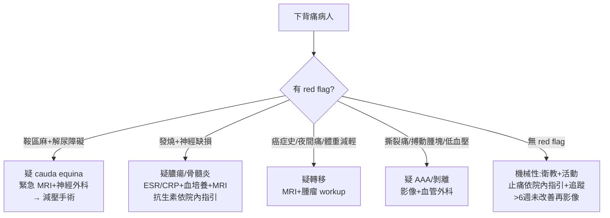

# Lower Back Pain（下背痛）

> [!danger] 🚨 紅旗警訊（must-not-miss，85% 是良性肌肉骨骼，但先排 6 大 red flags）
> **助記「馬膿瘤折感血」**
> 1. **馬尾症候群 Cauda equina** → 鞍區麻木、雙側坐骨神經痛、**尿滯留/失禁、大便失禁、肛門張力↓** → 外科急症，需緊急 MRI + 減壓
> 2. **脊椎硬膜外膿瘍 / 骨髓炎** → 背痛 + 發燒 + 神經缺損；靜脈藥癮、免疫低下、近期感染/手術、結核（Pott）
> 3. **惡性腫瘤骨轉移** → 年齡>50、癌症史、夜間痛/休息不緩解、體重減輕（乳/肺/攝護腺/甲狀腺/腎、multiple myeloma）
> 4. **脊椎壓迫性骨折** → 高齡/骨鬆/類固醇/創傷、突發劇痛
> 5. **腹主動脈瘤 / 主動脈剝離** → 撕裂痛、搏動性腫塊、低血壓（致命的「內科性下背痛」）
> 6. ⚠️ **馬鞍麻+解尿障礙 = cauda equina 直到證實為止** → 立即影像，別排到隔天
>
> ⚡ **問到 red flag（發燒、神經缺損、解尿障礙、癌症史、體重減輕、外傷）→ 提前影像；純機械性下背痛不需常規影像**

## 🔀 鑑別診斷 DDx（值班從這裡連到疾病）
| 疾病 | 支持特徵 | rule-out 線索 |
| --- | --- | --- |
| **非特異性機械性下背痛（~85%）** | 活動加劇/休息緩解、無神經缺損、無紅旗、自限 | 有任何 red flag |
| [[Herniated disc(椎間盤突出)]] / [[Radiculopathy(神經根病變)]] | 放射至下肢皮節（L5/S1 最常見）、SLRT(+)、麻木/無力 | 無神經根性分佈 |
| [[Cauda Equine Syndrome(馬尾症候群)]] | 鞍區麻、雙側症狀、尿滯留/失禁、肛門張力↓、LMN 表現 | 排尿正常 + 肛門張力正常 |
| [[Spinal Epidural Abscess(脊椎硬膜外膿瘍)]] / [[Vertebral Osteomyelitis(脊柱骨髓炎)]] | 發燒 + 背痛 + 神經缺損、IVDU/免疫低下、ESR/CRP↑ | 無發炎指標 + 無感染源 |
| 惡性骨轉移 / [[Multiple myeloma(多發性骨髓瘤)]] | 年齡>50、癌症史、夜間痛、體重減輕、貧血/高血鈣 | 影像/實驗室無惡性證據 |
| [[Spinal Stenosis(脊椎狹窄)]] | 老年、神經性跛行、前傾/坐下緩解、站立/後仰加劇 | 無姿勢相關跛行 |
| [[Ankylosing spondylitis(僵直性脊椎炎)]] | 年輕男、**發炎性背痛**（晨僵>30min、活動改善、半夜痛）、HLA-B27、葡萄膜炎 | 機械性型態（休息緩解） |
| [[Vertebral compression fracture(脊椎壓迫性骨折)]] | 骨鬆/高齡/類固醇/創傷、突發、局部叩擊痛 | X 光無壓迫變形 |
| **內臟轉移痛**（[[Aortic dissection(主動脈剝離)]]/AAA、[[Kidney stones(腎結石)]]、[[Pancreatitis(胰臟炎)]]、[[Herpes zoster(帶狀疱疹)]]） | 撕裂/絞痛、搏動腫塊、皮節水疱、與姿勢無關 | 影像/尿檢/皮膚正常 |

> [!warning] **發炎性背痛**（年輕、晨僵久、活動後改善、夜間痛）與**機械性背痛**（活動加劇、休息緩解）型態相反，問診就能大方向分流

## ❓ 問診 / 身體檢查重點
- **紅旗篩檢**：年齡（<20 或 >50）、癌症史、**不明體重減輕**、發燒/畏寒、免疫低下/IVDU、**大小便功能改變、鞍區麻木、進行性神經無力**、近期創傷、夜間痛/休息不緩解、類固醇使用
- **疼痛型態**：機械性 vs 發炎性、放射分佈（皮節）、神經性跛行（站立/走路痛、前傾緩解）
- **脊椎理學**：視診側彎/異常曲度、觸診局部壓痛/叩擊痛/紅腫熱、**Schober's test**（僵直性脊椎炎活動度）
- **神經學**：Motor / Sensory（含**鞍區**）/ DTR / 步態；**SLRT**（30–70° 誘發放射痛 → L4–S1 神經根壓迫）
- **不可漏**：**DRE 肛門張力 + 膀胱殘尿（cauda equina）**、周邊脈搏/搏動腫塊（AAU）

## 🩺 初步 workup（該開的檢查 / 影像）
> [!note] 黃金原則：**無紅旗的急性下背痛 6 週內不需常規影像**；有紅旗（尤其 cauda equina / 感染 / 腫瘤）→ **緊急 MRI**
- **無紅旗**：不需影像，保守治療 + 衛教 + 追蹤
- **有紅旗**：**MRI**（cauda equina / 膿瘍 / 轉移 / 脊髓壓迫首選）
- **X 光**：疑骨折/骨鬆/滑脫/退化的初步
- **實驗室**：疑感染 → CBC、**ESR/CRP**、血培養；疑 myeloma → 蛋白電泳、鈣、腎功能
- 疑 AAA/剝離 → 腹部超音波 / CTA；疑腎結石 → U/A + 影像

## ⚡ 值班即時處置（穩定 vs 不穩定分流）

- **cauda equina**：**時間就是神經** → 緊急 MRI + 神經外科會診減壓，勿延到隔天
- **感染（膿瘍/骨髓炎）**：血培養後依院內指引經驗性抗生素 + 影像定位 + 必要引流
- **機械性**：維持活動（避免臥床過久）、止痛（NSAID/paracetamol，**依院內指引**）、衛教、追蹤紅旗變化
- ⚠️ 別對無紅旗病人過度影像；別對有紅旗病人只給止痛就回家

## 📊 臨床評分 / 紅旗分層（scoring）★本卡核心
> 下背痛沒有單一「分數」，值班靠 **red-flag 分層** 決定「要不要今晚就影像/會診」

### ① Red Flags → 對應致命診斷與行動
| Red flag | 對應急症 | 行動 |
| --- | --- | --- |
| 鞍區麻木、尿滯留/失禁、雙側下肢無力、肛門張力↓ | **Cauda equina** | 緊急 MRI + 神經外科 |
| 發燒、IVDU、免疫低下、近期感染、ESR/CRP↑ | 硬膜外膿瘍 / 骨髓炎 | 血培養 + MRI + 抗生素 |
| 年齡>50、癌症史、體重減輕、夜間痛、休息不緩解 | 惡性轉移 / myeloma | MRI + 腫瘤 workup |
| 重大創傷（或高齡/類固醇的輕創傷） | 骨折 | X 光 ±CT/MRI |
| 進行性/嚴重運動缺損 | 脊髓/神經根壓迫 | 影像 + 會診 |
| 撕裂痛、搏動腫塊、低血壓 | AAA / 主動脈剝離 | 急診影像 + 血管外科 |

### ② 發炎性 vs 機械性下背痛（決定風濕免疫轉介）
| 特徵 | 發炎性（如 AS） | 機械性 |
| --- | --- | --- |
| 發病年齡 | 常 <40 | 任何 |
| 晨僵 | >30 min | 短暫 |
| 活動 | **改善** | 加劇 |
| 休息/夜間 | 加劇、半夜痛醒 | 緩解 |
| 起病 | 隱匿、>3 月 | 常急性 |

### ③ 神經根定位速查（SLRT(+) 支持）
| 椎間盤 | 受壓神經根 | 無力/反射 | 感覺 |
| --- | --- | --- | --- |
| L3–L4 | L4 | 股四頭肌、膝反射↓ | 大腿前/小腿內側 |
| L4–L5 | L5 | 拇趾背屈、垂足 | 小腿外側/足背 |
| L5–S1 | S1 | 蹠屈、踝反射↓ | 足外側/足底 |

## 🔗 相關
- 疾病：[[Herniated disc(椎間盤突出)]]　[[Cauda Equine Syndrome(馬尾症候群)]]　[[Spinal Epidural Abscess(脊椎硬膜外膿瘍)]]　[[Spinal Stenosis(脊椎狹窄)]]　[[Ankylosing spondylitis(僵直性脊椎炎)]]
- 檢查：[[MRI(磁振造影)]]　[[Straight Leg Raise Test(直腿抬高試驗)]]　[[ESR(紅血球沉降速率)]]
- 症狀：[[Radiculopathy(神經根病變)]]

## 📚 來源
[^1]: ACP Clinical Guideline — Noninvasive Treatments for Low Back Pain（2017）；紅旗與影像時機
[^2]: Cauda equina syndrome — 神經外科急症共識；ASAS 發炎性背痛判準
[^3]: Approach to low back pain red flags — AAFP；neurologic level 定位表

## 🎴 Flashcards & 自我測驗（Ollama qwen2.5:7b 自動生成 2026-07-03）
<!-- flashcard-gen:start -->

### 記憶卡（Spaced Repetition 相容 · `Q::A`）
馬尾症候群的紅旗警訊有哪些？::鞍區麻木、雙側坐骨神經痛、尿滯留/失禁、大便失禁、肛門張力↓

脊椎硬膜外膿瘍的紅旗警訊有哪些？::發燒+背痛+神經缺損、IVDU/免疫低下、近期感染/手術、結核（Pott）

惡性腫瘤骨轉移的紅旗警訊有哪些？::年齡>50、癌症史、夜間痛/休息不緩解、體重減輕

脊椎壓迫性骨折的紅旗警訊有哪些？::高齡/骨鬆/類固醇/創傷、突發劇痛

腹主動脈瘤或主動脈剝離的紅旗警訊有哪些？::撕裂痛、搏動性腫塊、低血壓

非特異性機械性下背痛的支持特徵有哪些？::活動加劇/休息緩解、無神經缺損、無紅旗、自限

椎間盤突出或神經根病變的支撐症狀有哪些？::放射至下肢皮節（L5/S1 最常見）、SLRT(+)、麻木/無力

僵直性脊椎炎的紅旗警訊有哪些？::發炎性背痛（晨僵>30min、活動改善、半夜痛）

初步工作up中，有紅旗時應開哪些檢查？::MRI（cauda equina / 膿瘍 / 轉移 / 脊髓壓迫首選）

無紅旗的急性下背痛 6 個月內不需常規影像，但有哪種情況例外？::鞍區麻+解尿障礙

### 自我測驗（選擇題，答案摺疊）
**Q1.** 一位50歲男性患者主訴腰痛已持續2週，無其他症狀。根據筆記內容，下列哪項是正確的初步工作up?
- A. 立即MRI
- B. 開X光檢查
- C. 保守治療+追蹤
- D. 開血常規

> [!success]- 答案
> **C** — 根據筆記，無紅旗的急性下背痛6週內不需常規影像，因此應開保守治療和追蹤。

**Q2.** 一位45歲女性患者主訴腰痛伴發燒1天，且有近期手術史。根據筆記內容，下列哪項是正確的初步工作up?
- A. 立即MRI
- B. 開X光檢查
- C. 保守治療+追蹤
- D. 開血常規

> [!success]- 答案
> **A** — 根據筆記，發燒+神經缺損是脊椎硬膜外膿瘍的紅旗警訊，因此應立即開MRI和抗生素。

**Q3.** 一位70歲男性患者主訴腰痛伴夜間痛，無其他症狀。根據筆記內容，下列哪項是正確的初步工作up?
- A. 立即MRI
- B. 開X光檢查
- C. 保守治療+追蹤
- D. 開血常規

> [!success]- 答案
> **B** — 根據筆記，年齡>50、癌症史、夜間痛/休息不緩解是惡性腫瘤骨轉移的紅旗警訊，因此應開X光檢查。

<!-- flashcard-gen:end -->
