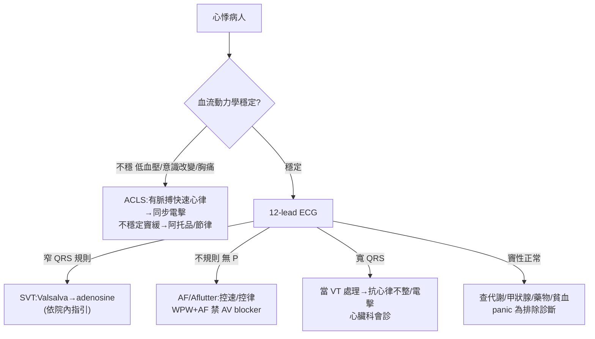

# Palpitation（心悸）

> [!danger] 🚨 紅旗警訊（must-not-miss，心悸先排「惡性心律不整 + 結構性心臟病」）
> **助記「暈胸心猝結」**
> 1. **暈厥/近暈厥伴心悸** → 惡性心律不整（VT/VF、完全性房室阻斷）先想，非「單純焦慮」
> 2. **心悸合併胸痛/呼吸困難** → 合併 [[Acute Coronary Syndrome(急性冠心症)]] 或心衰
> 3. **持續不規則快速心律** → **快速心室反應的 AF/Aflutter**、SVT；血流動力學不穩需電擊
> 4. **猝死家族史 / 已知結構性心臟病** → 遺傳性心律不整（長 QT、Brugada、HOCM、ARVC）
> 5. **代謝/內分泌急症** → 甲狀腺風暴、[[Pheochromocytoma(嗜鉻細胞瘤)]]、**低血糖**、電解質異常（低 K/Mg）
> 6. ⚠️ **WPW + AF → 禁用 AV node blocker（digoxin/verapamil/adenosine）**，可能誘發 VF
>
> ⚡ **不穩定（低血壓/意識改變/胸痛/心衰）的快速心律 → 依 ACLS 同步電擊，別等診斷**

## 🔀 鑑別診斷 DDx（值班從這裡連到疾病）
| 類別 / 疾病 | 支持特徵 | rule-out 線索 |
| --- | --- | --- |
| **心律不整（~43%）** PAC/[[Premature Ventricular Contractions(室性早搏)]]、SVT、AF/Aflutter、VT | 突發突止、規則/不規則、ECG/Holter 捕捉到心律、暈厥 | 症狀期 ECG 正常竇性 + 監測無異常 |
| **結構/瓣膜** [[Mitral valve prolapse(二尖瓣脫垂)]]、[[Aortic Regurgitation(主動脈瓣逆流)]] | 雜音、心臟病史、運動相關 | 心臟超音波正常 |
| **精神科（~31%）** [[Panic disorder(恐慌症)]] | 發作 >15min、伴窒息感/瀕死感/手足麻、情境誘發 | 需先排器質性；監測捕捉到真心律不整 |
| **甲狀腺** [[Thyrotoxicosis(甲狀腺毒症)]] | 怕熱、體重減輕食慾增、手抖、突眼、甲狀腺腫/bruit、竇速/AF | TSH 正常 |
| [[Pheochromocytoma(嗜鉻細胞瘤)]] | **5P**：高血壓、頭/胸痛、心悸、盜汗、蒼白，陣發 | 兒茶酚胺代謝物正常 |
| **代謝** [[Hypoglycemia(低血糖)]]、電解質異常 | 冒冷汗+心悸+手抖（交感）、低 K/Mg | 血糖/電解質正常 |
| **藥物/物質** | 咖啡因、菸酒、古柯鹼、安非他命、擬交感、茶鹼、甲狀腺素、戒斷 | 無相關暴露 |
| 其他：[[Vasomotor Symptoms(停經血管舒縮症狀)]]、[[Malignant Carcinoid Syndrome(惡性類癌症候群)]]、貧血、發燒 | 停經潮紅；類癌潮紅腹瀉喘鳴 | — |

> [!warning] 「像焦慮」的心悸仍需**至少一次 12-lead ECG + 基本抽血排器質性**；精神科診斷是排除性的，恐慌與陣發性心律不整可互相偽裝

## ❓ 問診 / 身體檢查重點
- **心悸特徵**：突發 vs 漸進、規則 vs 不規則、快 vs 慢、持續時間、終止方式（Valsalva 可止 → SVT）、**用手敲出節律**
- **伴隨紅旗**：**暈厥/近暈厥、胸痛、呼吸困難、運動誘發**（器質性強烈提示）
- **誘因**：咖啡因/菸酒/藥物/違禁藥、壓力/情境（panic）、發燒/失血、體重減輕怕熱（甲亢）
- **家族史**：**猝死、遺傳性心律不整、心肌病變**
- **關鍵理學**：vital signs（含姿勢性）、心律規則性、**心雜音**（MVP/AR）、心衰徵象；**甲狀腺理學**（突眼、眼瞼退縮、甲狀腺腫/bruit、手抖、下肢黏液水腫）

## 🩺 初步 workup（該開的檢查 / 影像）
> [!note] 黃金第一步：**12-lead ECG**（最好在症狀發作當下捕捉），並找「基礎 ECG 的隱藏危險」（WPW delta 波、QT 延長、Brugada、預激）
- **ECG**：發作時捕捉心律；靜止 ECG 找 WPW/長 QT/Brugada/肥厚/陳舊梗塞
- **抽血**：CBC（貧血）、電解質（**K/Mg/Ca**）、**TSH**、血糖；疑 ACS 加 troponin
- **門診延伸監測**：Holter（頻繁）/ event recorder / 植入式監測（罕發但高危）
- **心臟超音波**：疑結構性/瓣膜/心肌病變
- 疑嗜鉻細胞瘤：血漿/尿 metanephrine

## ⚡ 值班即時處置（穩定 vs 不穩定分流）

- **不穩定 + 快速心律** → 依 **ACLS 同步電擊**；不穩定緩脈 → atropine / 經皮節律
- **穩定 SVT** → Valsalva/頸動脈按摩 → adenosine（**依院內指引**）
- **AF/Aflutter** → 控速或控律；**WPW 合併 AF 禁用 AV node blocker**
- **寬 QRS 心搏過速** → 除非確定否則**當 VT 處理**，心臟科會診
- 矯正可逆因子：電解質（低 K/Mg）、甲亢、低血糖、貧血、停致病藥物；具體藥物/劑量**依院內指引**

## 📊 臨床評分 / 風險分層（scoring）★本卡核心
> 心悸沒有像 HEART 那樣的單一分數，值班靠「**高危特徵計數**」決定 admit/監測 vs 門診追蹤

### ① 高危（器質性/需住院監測）特徵 — 越多越該收治
| 面向 | 高危特徵 |
| --- | --- |
| **症狀** | 伴**暈厥/近暈厥**、胸痛、呼吸困難、運動誘發、突發突止的快速心律 |
| **心律** | 持續性心搏過速、寬 QRS 心搏過速、不規則快速（AF-RVR） |
| **基礎 ECG** | WPW（delta 波）、QTc 延長、Brugada type1、肥厚、陳舊梗塞/病理 Q |
| **病史** | 已知結構性心臟病/心衰、**猝死或遺傳性心律不整家族史**、年齡較大 |
| **理學/實驗室** | 心雜音、心衰徵象、明顯電解質異常、troponin↑ |

> **任一高危特徵 → 監測/住院 + 心臟科**；全無高危 + ECG 正常 + 可逆因子已矯正 → 門診 Holter 追蹤

### ② 病因分佈（提醒別漏非心因性）
| 病因 | 約占比 | 值班要點 |
| --- | --- | --- |
| 心因性（心律不整/結構） | ~43% | ECG 捕捉、排惡性心律 |
| 精神科（panic 等） | ~31% | **排除性診斷**，先排器質性 |
| 其他（甲亢/嗜鉻/低血糖/藥物/貧血） | ~10% | 抽血 + 病史找可逆因子 |
| 不明原因 | ~16% | 門診延伸監測 |

### ③ 心律型態速判（配 ECG）
| ECG 型態 | 常見對應 | 陷阱 |
| --- | --- | --- |
| 窄 QRS、規則、快 | AVNRT/AVRT（SVT） | Valsalva/adenosine 可診斷兼治療 |
| 不規則、無明顯 P 波 | AF | 合併 WPW 禁 AV blocker |
| 規則鋸齒波 | Aflutter | 常 2:1 傳導心跳約 150 |
| 寬 QRS、規則 | **VT 直到證實為止** | 勿當 SVT 亂給藥 |

## 🔗 相關
- 疾病：[[Premature Ventricular Contractions(室性早搏)]]　[[Mitral valve prolapse(二尖瓣脫垂)]]　[[Thyrotoxicosis(甲狀腺毒症)]]　[[Pheochromocytoma(嗜鉻細胞瘤)]]　[[Panic disorder(恐慌症)]]
- 檢查：[[ECG(心電圖)]]　[[Holter Monitor(24小時心電圖)]]　[[TSH(甲狀腺刺激素)]]
- 症狀：[[Syncope(暈厥)]]

## 📚 來源
[^1]: Evaluation of palpitations — AAFP / *NEJM* review（病因分佈 43/31/10/16%）
[^2]: ACC/AHA/HRS SVT & AF guidelines；WPW + AF 禁 AV nodal blocker
[^3]: High-risk palpitation features → admission — 急診心臟科教學共識

## 🎴 Flashcards & 自我測驗（Ollama qwen2.5:7b 自動生成 2026-07-03）
<!-- flashcard-gen:start -->

### 記憶卡（Spaced Repetition 相容 · `Q::A`）
心悸先排哪兩種情況？::惡性心律不整、結構性心臟病

何時需同步電擊治療？::血流動力學不穩的快速心律

WPW + AF 禁用哪種藥物？::AV node blocker（如 digoxin/verapamil/adenosine）

何時需做 12-lead ECG？::症狀發作當下捕捉心律

SVT 的典型治療為？::Valsalva 或 adenosine

AF/Aflutter 控速/控律的藥物？::依院內指引，常見有 β 適應素、胺碘酮等

何時需考慮心臟超音波？::疑結構性/瓣膜/心肌病變

低血糖的典型症狀？::冒冷汗+心悸+手抖（交感）

高危特徵中，何種情況需住院監測？::任一高危特徵

SVT 的 ECG 特徵為？::窄 QRS、規則、快

### 自我測驗（選擇題，答案摺疊）
**Q1.** 患者主訴心悸伴胸痛，近期有運動誘發的症狀，您首先考慮哪種情況？
- A. 暫時性焦慮
- B. 心肌梗塞
- C. 甲狀腺毒症
- D. 突發性心律不整

> [!success]- 答案
> **B** — 根據筆記，心悸伴胸痛需考慮急性冠脈綜合徵，因此首選 B。A 和 C 是非器質性原因，D 需進一步 ECG 來區分 SVT 或其他心律不整。

**Q2.** 患者為 WPW 與 AF 病人，突然出現快速的心搏過速，您應如何處理？
- A. 使用阿托品
- B. 使用腺苷
- C. 避免使用 AV node blocker
- D. 同步電擊

> [!success]- 答案
> **C** — 根據筆記 WPW + AF 禁用 AV node blocker，因此 C 是正確答案。A 和 B 會誘發 VF，D 只在血流動力學不穩時使用。

**Q3.** 患者有心悸病史，近期出現低血壓和意識改變，您首先考慮哪種情況？
- A. 心律不整
- B. 甲狀腺毒症
- C. 嗜鉻細胞瘤
- D. 突發性心衰

> [!success]- 答案
> **D** — 根據筆記，血流動力學不穩的快速心律需依 ACLS 同步電擊處理。因此 D 是正確答案。A 和 C 需進一步 ECG 來區分，B 主要表現為高血壓而非低血壓。

<!-- flashcard-gen:end -->
