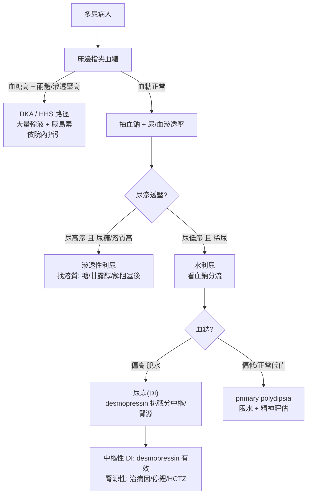

# Polyuria（多尿）

> [!danger] 🚨 紅旗警訊（must-not-miss，先排除致命 / 內分泌急症）
> **助記「糖鈉鋰腦」**：先想會不會是急症背景下的多尿
> 1. **DKA / HHS**（糖尿病酮酸血症 / 高血糖高滲透壓）→ 多尿 + 脫水 + 意識改變、深快呼吸(Kussmaul)、水果味 → **先驗指尖血糖**
> 2. **重度高血鈉 + 脫水**（水利尿失控）→ 神經症狀、癲癇、昏迷；老人 / 無法自主喝水者最危險
> 3. **高血鈣危象**（惡性腫瘤 / 副甲亢）→ 多尿 + 便祕 + 意識混亂 + 心律；「stones, bones, groans, psychiatric moans」
> 4. **神經手術 / 頭部外傷後新發中樞性尿崩**（Central DI）→ 術後大量稀尿 + 血鈉快速上升 → 未補水會致命
>
> ⚡ **床邊第一件事永遠是指尖血糖 + 抽血鈉/鈣**，先排糖尿病與電解質急症，再想尿崩

## 🔀 鑑別診斷 DDx（值班從這裡連到疾病）
> 先分兩大機轉：**滲透性利尿（尿中溶質多）** vs **水利尿（尿被稀釋）**。關鍵靠尿滲透壓分流。

| 疾病 | 支持特徵 | rule-out 線索 |
| --- | --- | --- |
| [[Diabetes Mellitus(糖尿病)]]（滲透性利尿·最常見） | 吃多喝多尿多 + 體重↓、血糖↑、尿糖陽性、尿滲透壓偏高 | 血糖正常 + 尿糖(-) |
| [[Central Diabetes Insipidus(中樞性尿崩症)]]（ADH 缺乏） | 腦垂腺創傷 / 手術 / 缺氧 / 腫瘤病史、稀尿、血鈉偏高、給 desmopressin 後尿濃縮 >50% | 給 desmopressin 無反應 → 改想腎源性 |
| [[Nephrogenic diabetes insipidus(腎源性尿崩症)]]（ADH 阻抗） | 用藥史（**鋰鹽**）、高血鈣 / 低血鉀、遺傳、稀尿、給 desmopressin 尿仍不濃縮 | desmopressin 後尿濃縮 → 屬中樞型 |
| [[Primary Polydipsia(原發性多飲症)]]（強迫性喝水） | 中年女性、常合併精神疾病、血鈉偏低 / 正常低值、口渴驅動喝水在前 | 血鈉偏高（DI 才會脫水到高鈉） |
| 其他滲透性 | 甘露醇、高蛋白灌食、解除尿路阻塞後利尿、ATN 恢復期多尿 | 有明確誘因 / 病程可追 |

> [!warning] 「多尿」要先跟「頻尿 / 夜尿 / 尿失禁」分開 — 真正多尿定義為 **尿量 > 3 L/day（或 >40–50 mL/kg/day）**，頻尿是次數多但總量不大（膀胱 / 攝護腺 / 泌尿道感染問題），別把兩者混為一談

## ❓ 問診 / 身體檢查重點
- **量化尿量**：真的 24h > 3 L 嗎？還是頻尿？夜尿？
- **口渴 vs 多尿誰先**：先口渴狂喝 → primary polydipsia；先大量排尿再被迫喝 → DI / 滲透性
- **用藥史**：**鋰鹽**（腎源性 DI 經典）、利尿劑、甘露醇、demeclocycline、灌食配方
- **病史**：糖尿病、頭部外傷 / 神經手術、精神疾病、惡性腫瘤（高血鈣）、遺傳家族史
- **系統回顧**：體重變化、多飲、夜尿、意識、視野缺損（腦垂腺）、便祕（高血鈣）
- **關鍵理學**：脫水評估（黏膜、皮膚彈性 skin turgor、[[Orthostatic Hypotension(姿勢性低血壓)]]、capillary refill <2 秒）、意識狀態、視野、[[Panhypopituitarism(全腦垂體機能低下症)]] 徵象

## 🩺 初步 workup（該開的檢查 / 影像）
> [!note] 黃金第一步：**床邊指尖血糖** — 先一秒鐘排除高血糖滲透性利尿（最常見 + 可能是急症），再談其他
- **血糖 + 尿糖 / 尿酮**（DKA/HHS）
- **血清電解質**：Na、K、**Ca**、Glucose、BUN/Cr
- **血清滲透壓 + 尿滲透壓**（分流核心）＋ **尿比重**
- **尿量精算**（24h 或每小時記錄，術後 DI 用小時尿量抓）
- **確診分流**：**水剝奪測試（water deprivation test）→ 給 desmopressin 挑戰**；有條件驗 **copeptin**（ADH 替代指標，比水剝奪更快）
- 影像：疑中樞性 DI → **腦下垂體 MRI**；疑高血鈣 / 惡性腫瘤 → 依情境

## ⚡ 值班即時處置（穩定 vs 不穩定分流）

- **不穩定 / 急症**：DKA·HHS·高血鈣危象 → 先大量輸液穩定 + 針對病因，抗急症一律**依院內指引**劑量
- **術後 / 外傷後新發稀尿多尿 + 血鈉快升**：高度警覺中樞性 DI，**嚴密監測每小時尿量 + serial 血鈉**，避免脫水高鈉
- **中樞性 DI**：desmopressin（dDAVP）為主；腎源性：可能的話停鋰 / 治病因、限鈉 + HCTZ；1° polydipsia：限水 + 治精神病因
- ⚠️ 補充自由水糾正高血鈉要**慢**（避免腦水腫），依院內指引速率

## 📊 臨床評分 / 鑑別分流（interpretation）★本卡核心
> 多尿沒有像 HEART 那樣的單一分數，靠的是**滲透壓 + 血鈉 + desmopressin 反應**三者的「解讀矩陣」定位病因。

### ① 溶質 vs 水利尿分流（尿滲透壓門檻）
| 尿滲透壓 | 意義 | 下一步 |
| --- | --- | --- |
| **> 300 mOsm/kg**（偏濃） | 滲透性利尿（溶質拖水） | 找溶質：血糖 / 甘露醇 / 尿素 / 解除阻塞後 |
| **< 300 mOsm/kg**（偏稀，尤其 <150） | 水利尿（ADH 問題） | 看血鈉 → 進 desmopressin 測試 |

### ② 水剝奪 + desmopressin 挑戰（區分三型水利尿）
| 病因 | 水剝奪後尿滲透壓 | 給 desmopressin 後尿滲透壓變化 |
| --- | --- | --- |
| **中樞性 DI** | 仍偏低（無法濃縮） | **上升 > 50%**（外源 ADH 有效） |
| **腎源性 DI** | 仍偏低 | **上升 < 50% / 幾乎無反應**（腎臟不聽 ADH） |
| **原發性多飲** | 可濃縮（>正常一半以上） | 已能濃縮，額外上升 < 10% |

> [!caution] 水剝奪測試有脫水風險，**需嚴密監測血鈉 / 體重 / 生命徵象**，重度脫水或血鈉持續上升即停止。有條件時 **copeptin** 可較安全快速取代部分流程。

### ③ 血鈉的快速指向
- **血鈉偏高（脫水）** → 傾向 DI（水一直流失來不及補）
- **血鈉偏低 / 正常低值** → 傾向 primary polydipsia（喝太多把血稀釋）

## 🔗 相關
- 疾病：[[Diabetes Mellitus(糖尿病)]]　[[Central Diabetes Insipidus(中樞性尿崩症)]]　[[Nephrogenic diabetes insipidus(腎源性尿崩症)]]　[[Primary Polydipsia(原發性多飲症)]]　[[Panhypopituitarism(全腦垂體機能低下症)]]
- 症狀：[[Weight loss(體重減輕)]]　[[Orthostatic Hypotension(姿勢性低血壓)]]

## 📚 來源
[^1]: 多尿分流（尿滲透壓 300 mOsm/kg 門檻、水利尿 vs 滲透利尿）— Pocket Medicine 8th ed. p.269（Polyuria / DI 段）
[^2]: 水剝奪 + desmopressin 挑戰判讀（中樞 >50% vs 腎源 <50%）+ 治療（dDAVP / HCTZ / 限水）— Pocket Medicine 8th ed.；長庚銀蛋口袋書 p.47
[^3]: copeptin 取代水剝奪 — Fenske W et al. *NEJM* 2018（copeptin-based approach to DI）

## 🎴 Flashcards & 自我測驗（Ollama qwen2.5:7b 自動生成 2026-07-03）
<!-- flashcard-gen:start -->

### 記憶卡（Spaced Repetition 相容 · `Q::A`）
多尿的紅旗警訊有哪些？::糖尿病酮酸血症、高血糖高滲透壓、重度高血鈉、高血鈣危象、中樞性尿崩

先驗檢查應該做什麼？::指尖血糖 + 抽血鈉/鈣

多尿的常見原因是什麼？::糖尿病

鑑別診斷時，如何區分滲透性利尿和水利尿？::通過尿滲透壓檢查

中樞性尿崩症的主要治療藥物是什麼？::desmopressin (dDAVP)

高血鈣危象的臨床表現有哪些？::多尿、便秘、意識混亂、心律失常

術後的稀尿和血鈉快速上升應考慮什麼？::中樞性尿崩症

鑑別診斷時，如何區分原發性多飲與中樞性尿崩症？::desmopressin 挑戰反應

血鈉偏高的患者傾向於哪種疾病？::尿崩症（DI）

水剝奪試驗的脫水風險如何監測？::嚴密監測血鈉、體重和生命體徵

### 自我測驗（選擇題，答案摺疊）
**Q1.** 一患者出現多尿症狀，24小時尿量超過3L。首先應進行哪項檢查以排除急性疾病？
- A. 尿常規
- B. 血糖 + 尿糖/尿酮
- C. 電解質
- D. 腦部MRI

> [!success]- 答案
> **B** — 首先應進行血糖和尿糖/尿酮檢查，以排除糖尿病酮酸血症或高血糖高滲壓狀態。

**Q2.** 患者出現多飲、多尿症狀，但無明顯脫水錶現，且有長期精神疾病史，最可能的診斷是什麼？
- A. 中樞性尿崩症
- B. 腎源性尿崩症
- C. 原發性多飲
- D. 糖尿病

> [!success]- 答案
> **C** — 根據症狀，患者可能有長期精神疾病史，最有可能是原發性多飲。中樞性尿崩症通常會伴隨脫水和電解質紊亂。

**Q3.** 一名術後患者出現稀尿和血鈉快速上升的症狀，應首先考慮哪種情況？
- A. 高血糖
- B. 中樞性尿崩症
- C. 腎源性尿崩症
- D. 原發性多飲

> [!success]- 答案
> **B** — 術後出現稀尿和血鈉快速上升的症狀，高度提示中樞性尿崩症。需要密切監測每小時尿量及血鈉水平以避免脫水。

<!-- flashcard-gen:end -->
