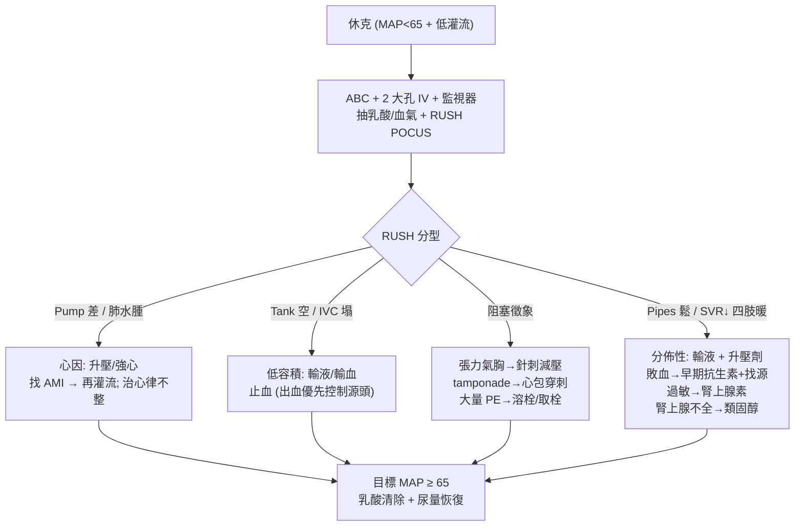

# Shock（休克）

> [!danger] 🚨 紅旗警訊（休克本身就是急症 — 先救再想分類）
> **助記「4 型 → 冷暖 → RUSH」**：休克 = 組織灌流不足，未及時處理數分鐘內器官衰竭
> - **低血壓（MAP < 65）+ 組織低灌流徵象**：意識改變、少尿（<0.5 mL/kg/hr）、四肢濕冷或異常溫熱、微血管回填延遲、**乳酸上升（>2 mmol/L）**
> - **可立即致命的阻塞型**：**張力性氣胸**（患側呼吸音消失 + 氣管偏移 + 頸靜脈怒張）、**心包填塞**（Beck 三徵）、**大量肺栓塞**（RV strain）→ 這幾個不靠輸液，要立刻減壓 / 穿刺 / 溶栓
> - **注意「暖休克」**：敗血 / 過敏 / 神經性早期四肢是溫熱的，血壓已掉但皮膚不冷 → 別被「不冷」騙過去
>
> ⚡ **先 ABC + 大孔徑 IV × 2 + 監視器 + 抽乳酸/血氣，同時做 RUSH POCUS 找型**，不要等血壓數字慢慢惡化

## 🔀 鑑別診斷 DDx（四大休克型 — 值班從這裡連到病因）
| 型別 | 支持特徵（血流動力學） | 常見病因 / rule-out 線索 |
| --- | --- | --- |
| **Hypovolemic**（低容積） | 前負荷↓、CO↓、SVR↑、四肢冷；IVC 塌陷 | [[Massive Hemorrhage(大量失血)]]、[[Electrolyte loss(電解質留失)]]、嘔吐腹瀉燒傷、脫水 |
| [[Cardiogenic shock(心源性休克)]]（心因） | 前負荷↑（肺水腫、頸靜脈怒張）、CO↓、SVR↑、四肢冷 | 大範圍 AMI、[[Arrythmia(心律不整)]]、瓣膜 / 機械性、心肌炎 |
| **Obstructive**（阻塞） | 前負荷依部位、CO↓、SVR↑ | [[Tension Pneumothorax(張力性氣胸)]]、[[Cardiac tamponade(心包膜填塞)]]、[[Constrictive pericarditis(縮窄性心包膜炎)]]、[[Pulmonary embolism(肺栓塞)]] |
| **Distributive**（分佈性 / 血管張力↓） | 前負荷↓/正常、CO↑（早期）、**SVR↓**、四肢暖 | [[Septic shock(敗血性休克)]]、[[Anaphylactic shock(過敏性休克)]]、[[Neurogenic shock(神經性休克)]]、[[Adrenal insufficiency(腎上腺不全)]] |

> [!warning] 常混合存在（如敗血症合併心肌抑制 + 相對低容積）。**RUSH 三步（Pump 心臟 → Tank 容積/IVC/肺/腹 → Pipes 大血管）** 快速把四型分出來，比單看血壓有用。

## ❓ 問診 / 身體檢查重點
- **快速情境**：外傷 / 出血？發燒感染源？胸痛？過敏暴露（藥物、食物、蜂螫）？脫水（嘔吐腹瀉）？近期停類固醇？
- **四肢溫度**：冷（低容積 / 心因 / 阻塞）vs 暖（分佈性早期）— 一摸就有方向
- **頸靜脈 (JVP)**：↑ → 心因 / 阻塞（tamponade、tension PTX、massive PE）；↓ → 低容積 / 分佈性
- **關鍵理學**：兩側呼吸音（張力氣胸）、心音遙遠 + Beck 三徵（tamponade）、皮疹 / 喉頭水腫（過敏）、暖 + bounding pulse（敗血 / 神經性）、bradycardia + 溫暖 + 高位脊損（神經性）
- **監測**：MAP、乳酸趨勢、尿量、意識

## 🩺 初步 workup（該開的檢查 / 影像）
> [!note] 黃金第一步：**RUSH POCUS（Pump-Tank-Pipes）+ 乳酸** — 床邊數分鐘內把四型休克分出來並抓可立即處理的阻塞型
- **血氣 + 乳酸**（灌流指標 + 趨勢追蹤）、血糖
- **CBC/DC、電解質、腎肝功能、凝血、type & cross**（懷疑出血）
- **ECG + Troponin**（心因）、**培養 × 2 + 感染源評估**（敗血）、cortisol（疑腎上腺不全）
- **POCUS / RUSH**：心臟收縮力 + 心包積液、IVC 容積狀態、肺（B-line / 氣胸 / 肋膜積液）、腹部游離液、主動脈
- **CXR**、依情境 CTA（PE / dissection）

## ⚡ 值班即時處置（穩定 vs 病因分流）

- **通則**：MAP 目標 ≥ 65 mmHg；輸液反應性用被動抬腿 / IVC / POCUS 評估，避免盲目大量輸液（心因型會惡化肺水腫）
- **分型快速動作**：出血 → 止血 + 輸血；敗血 → **1 小時內**廣效抗生素（依院內指引）+ 找源 + 輸液；過敏 → **肌注腎上腺素**第一線；張力氣胸 → 針刺 / 胸管減壓；tamponade → 心包穿刺
- **升壓劑**：分佈型多首選 norepinephrine（依院內指引），劑量與品項一律遵循單位規範
- ⚠️ 腎上腺不全 / 長期類固醇病人休克 → 早給壓力劑量類固醇（依院內指引）

## 📊 臨床評分 / 風險分層（scoring）★本卡核心
> 休克床邊靠 **Shock Index 快速警示** + **qSOFA 抓敗血** + **SOFA / 乳酸** 定嚴重度。

### ① Shock Index（SI，床邊最快的休克警示）
> **SI = 心率 (HR) ÷ 收縮壓 (SBP)**
| SI 值 | 判讀 | 意義 |
| --- | --- | --- |
| **< 0.7** | 正常 | — |
| **0.7 – 0.9** | 警戒 | 隱性低灌流可能，密切追蹤 |
| **≥ 0.9** | 異常 | 與較高死亡 / 需大量輸血相關，即使 SBP 尚未明顯掉 |

> [!tip] SI 對**「血壓還正常但已代償中」的早期休克**特別敏感 — 心搏過速 + 血壓偏低界時就該警覺，不要等 SBP 掉到 90 才反應。

### ② qSOFA（快速篩敗血症惡化風險，床邊 3 項，各 1 分）
| 項目 | 1 分標準 |
| --- | --- |
| **呼吸** | 呼吸速率 ≥ 22 /min |
| **意識** | 意識改變（GCS < 15） |
| **血壓** | 收縮壓 ≤ 100 mmHg |

| 總分 | 意義 |
| --- | --- |
| **≥ 2** | 敗血症預後不良風險↑ → 加驗乳酸、找源、升級照護 / 送 ICU 評估 |

> [!caution] qSOFA 是「警示 / 分流」工具，**敏感度不足以拿來排除敗血症**；分數低但臨床像敗血仍要積極處理。正式敗血性休克定義：需升壓劑維持 MAP ≥ 65 + 乳酸 > 2（已充分輸液後）。

### ③ 嚴重度指標
- **乳酸**：> 2 mmol/L 提示低灌流；**乳酸清除率**（治療後下降）是復甦成效指標
- **SOFA score**：ICU 器官衰竭量化（呼吸 / 凝血 / 肝 / 心血管 / 中樞 / 腎 六系統），敗血症定義用「SOFA 上升 ≥ 2」

## 🔗 相關
- 疾病：[[Septic shock(敗血性休克)]]　[[Cardiogenic shock(心源性休克)]]　[[Anaphylactic shock(過敏性休克)]]　[[Tension Pneumothorax(張力性氣胸)]]　[[Cardiac tamponade(心包膜填塞)]]　[[Pulmonary embolism(肺栓塞)]]　[[Adrenal insufficiency(腎上腺不全)]]
- 症狀：[[Chest pain(胸痛)]]　[[Shortness of breath(喘氣)]]　[[Upper GI bleeding(上消化道出血)]]

## 📚 來源
[^1]: 四型休克血流動力學（preload / CO / SVR）+ RUSH POCUS 分型 — Weingart / EM 重症共識；Pocket Medicine 8th ed. Shock 段
[^2]: qSOFA / Sepsis-3 定義（敗血性休克：升壓劑維持 MAP≥65 + 乳酸>2）— Singer M et al. *JAMA* 2016（Sepsis-3）
[^3]: Shock Index 與死亡 / 大量輸血相關性 — Rady MY et al.；trauma / sepsis SI 文獻

## 🎴 Flashcards & 自我測驗（Ollama qwen2.5:7b 自動生成 2026-07-03）
<!-- flashcard-gen:start -->

### 記憶卡（Spaced Repetition 相容 · `Q::A`）
休克的紅旗警訊是什麼？::低血壓（MAP < 65）+ 組織低灌流徵象

休克分為哪四種型態？::低容積、心因性、阻塞、分佈性

RUSH POCUS 的順序是什麼？::Pump-Tank-Pipes

休克的 SI 值正常範圍是多少？::< 0.7

qSOFA 指標總分多少時需高度警覺敗血症風險？::≥2

低容積型休克的主要支持特徵是什麼？::前負荷↓、CO↓、SVR↑、四肢冷；IVC 塌陷

心因性休克的主要支持特徵是什麼？::前負荷↑（肺水腫、頸靜脈怒張）、CO↓、SVR↑、四肢冷

阻塞型休克的常見病因有哪些？::張力性氣胸、心包填塞、大量肺栓塞

分佈性休克的主要支持特徵是什麼？::前負荷↓/正常、CO↑（早期）、SVR↓、四肢暖

休克初期的目標 MAP 是多少？::≥ 65 mmHg

### 自我測驗（選擇題，答案摺疊）
**Q1.** 一名患者因車禍受傷，出現低血壓和四肢冰冷，您首先應該進行哪項操作？
- A. 等待血壓自然回升
- B. 開始心肺復甦
- C. 尋找出血點並止血
- D. 輸液補充體液

> [!success]- 答案
> **D** — 根據筆記，休克本身就是急症，應先進行 ABC + 大孔徑 IV × 2 + 監視器 + 抽乳酸/血氣，同時做 RUSH POCUS 找型。因此選項 D 是正確的，而其他選項都未遵循此原則。

**Q2.** 一名患者出現呼吸速率 24/min、意識模糊和收縮壓 95 mmHg 的症狀，您應該如何評估其敗血症風險？
- A. 計算 SI 值
- B. 使用 qSOFA 指標
- C. 立即開始抗生素治療
- D. 開始升壓劑治療

> [!success]- 答案
> **B** — 根據筆記，qSOFA 是快速篩敗血症惡化風險的工具，因此選項 B 是正確的。SI 值和 qSOFA 指標可以幫助評估敗血症風險，但本題情境更適合使用 qSOFA。

**Q3.** 一名患者因心肌梗塞導致休克，您應該首先考慮哪種治療方式？
- A. 輸液補充體液
- B. 升壓劑治療
- C. 心包穿刺
- D. 急速再灌流

> [!success]- 答案
> **D** — 根據筆記，心因性休克的處理方式是先考慮升壓/強心，找 AMI → 再灌流；因此選項 D 是正確的。其他選項都適用於不同類型的休克。

<!-- flashcard-gen:end -->
