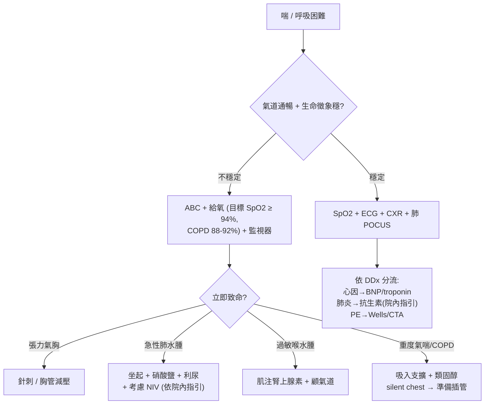

# Shortness of Breath（喘氣 / 呼吸困難）

> [!danger] 🚨 紅旗警訊（must-not-miss，先看「快不快掛」再想診斷）
> **助記「先看氣道，再看六殺手」**
> 1. **上呼吸道阻塞 / 過敏性喉頭水腫**（stridor、口唇腫、喘鳴）→ 氣道優先
> 2. **張力性氣胸**（患側呼吸音消失 + 氣管偏移 + 頸靜脈怒張 + 低血壓）→ 立刻針刺減壓
> 3. **急性肺水腫 / 心衰竭惡化**（端坐呼吸、粉紅泡沫痰、雙側濕囉音、S3）
> 4. **大量肺栓塞**（突發喘 + 低血氧 + 心搏過速 + 單側腿腫 + RV strain）
> 5. **重度氣喘 / COPD 惡化**（講不出完整句子、輔助肌、**silent chest 無呼吸音 = 快衰竭**）
> 6. **代謝性酸中毒代償**（DKA Kussmaul 深快呼吸 — 是「代償」不是原發肺病，別當氣喘打）
>
> ⚡ **即刻警訊**：SpO₂ 持續 < 90%、用力吸凹（accessory muscle / tripod）、講話斷句、意識改變、silent chest → 準備氣道 / 呼吸支持，不要只給氧觀察

## 🔀 鑑別診斷 DDx（值班從這裡連到疾病）
> 三大來源分：**心因 / 肺因 / 其他（代謝·血液·焦慮）**

| 疾病 | 支持特徵 | rule-out 線索 |
| --- | --- | --- |
| [[Heart Failure(心臟衰竭)]] / 肺水腫 | 端坐 / 陣發性夜間呼吸困難、雙側濕囉音、下肢水腫、頸靜脈怒張、BNP↑、S3 | BNP 低 + CXR 無鬱血 |
| [[Pneumonia(肺炎)]] | 發燒、咳嗽有痰、局部囉音 / 支氣管呼吸音、CXR 浸潤、白血球↑ | CXR 清 + 無發炎指標 |
| 氣喘惡化 | 反覆發作史、過敏原 / 感冒誘發、廣泛喘鳴（wheeze）、可逆 | 對支氣管擴張劑無反應 → 想其他 |
| [[Chronic Obstructive Pulmonary Disease(慢性阻塞性肺病)]] 惡化 | 吸菸史、慢性咳痰、桶狀胸、痰量 / 膿性改變、CO₂ 滯留 | 無吸菸 / 慢性病史 |
| [[Pulmonary embolism(肺栓塞)]] | 突發喘 + 胸膜性痛、低血氧、心搏過速、單側腿腫、D-dimer↑ | Wells 低 + PERC(-) / D-dimer(-) |
| [[Tension Pneumothorax(張力性氣胸)]] / 氣胸 | 突發單側喘 + 痛、患側呼吸音↓、瘦高年輕男 / COPD | POCUS 有 lung sliding + CXR 正常 |
| 肋膜積液 | 單側呼吸音↓ + 叩診濁音、CXR 鈍角 | 積液不多不解釋嚴重喘 |
| [[Anemia(貧血)]] | 蒼白結膜、活動性喘、Hb↓、心搏過速 | Hb 正常 |
| 代謝性酸中毒（DKA 等） | Kussmaul 深快呼吸、血氣 pH↓、HCO₃↓、AG↑ | 血氣正常 |
| 過度換氣 / 焦慮 | 誘發情境、四肢 / 口周麻、無低血氧、呼吸性鹼中毒 | **排除診斷**，先排器質性 |

> [!warning] **焦慮 / 過度換氣是排除診斷** — 年輕人喘 + SpO₂ 正常也不能直接扣帽子，PE、氣胸、DKA、心律不整都可能血氧正常；先排器質性再說。

## ❓ 問診 / 身體檢查重點
- **時間軸**：突發（PE / 氣胸 / 肺水腫 / 過敏）vs 漸進（肺炎 / 心衰 / 貧血 / 積液）
- **誘發 / 緩解**：躺下加劇（心衰端坐呼吸）、過敏原 / 感冒（氣喘）、久坐 / 術後 / 長途（PE）、胸痛伴隨（PE / 氣胸 / ACS）
- **系統回顧**：發燒咳痰（肺炎）、下肢單側腫（DVT/PE）、水腫 + 夜間陣發喘（心衰）、心悸（心律不整）、口渴多尿（DKA）
- **關鍵理學**：SpO₂ + 呼吸速率 + 講話能否成句、輔助肌 / tripod、兩側呼吸音對稱、囉音（濕 = 水腫 / 肺炎；乾喘鳴 = 氣喘 / COPD；**無音 = 氣胸 / silent chest**）、頸靜脈、下肢水腫 / 單側腫、皮疹 / 喉水腫

## 🩺 初步 workup（該開的檢查 / 影像）
> [!note] 黃金第一步：**SpO₂ + 12-lead ECG + CXR + 床邊肺 POCUS（BLUE protocol）** — 幾分鐘內把心 / 肺 / 氣胸分出來
- **SpO₂ + ABG**（換氣 / 氧合 / 酸鹼 + AG）
- **ECG**（心律不整、ACS、右心 strain S1Q3T3）+ **Troponin**
- **CXR**（浸潤 / 鬱血 / 氣胸 / 積液）
- **BNP / NT-proBNP**（心衰）、**D-dimer**（搭配 Wells / PERC，非人人開）
- **CBC**（貧血 / 白血球）、電解質 + 血糖（DKA）
- **肺 POCUS（BLUE）**：B-line（肺水腫）、lung sliding 消失（氣胸）、consolidation、肋膜積液；心臟看收縮力 + RV strain（PE）
- 升級：**CTA**（PE 確診）

## ⚡ 值班即時處置（穩定 vs 不穩定分流）

- **給氧目標**：一般 SpO₂ ≥ 94%；**COPD / CO₂ 滯留者 88–92%**（過度給氧會抑制呼吸驅動）
- **對因處置**（劑量 / 抗生素一律**依院內指引**）：肺水腫坐起 + 利尿 + 硝酸鹽 ± NIV；氣喘 / COPD 吸入支擴 + 全身類固醇；肺炎抗生素；PE 抗凝（大量 → 溶栓）；過敏肌注腎上腺素
- ⚠️ **silent chest / 講不出話 / 意識改變** → 呼吸衰竭前兆，及早求援 + 準備氣道，不要拖

## 📊 臨床評分 / 風險分層（scoring）★本卡核心
> 喘沒有單一分數，但值班常用 **Wells 排 PE** + **CURB-65 定肺炎嚴重度**。

### ① Wells Score for PE（肺栓塞可能性，逐項加分）
| 項目 | 分數 |
| --- | --- |
| 臨床有 DVT 徵象（腿腫 + 觸痛） | 3.0 |
| **PE 比其他診斷更可能** | 3.0 |
| 心率 > 100 /min | 1.5 |
| 近 4 週內制動 / 手術 | 1.5 |
| 曾有 DVT / PE 病史 | 1.5 |
| 咳血 | 1.0 |
| 惡性腫瘤（治療中 / 6 個月內 / 安寧） | 1.0 |

| 總分（三分法） | 機率 | 處置 |
| --- | --- | --- |
| **≤ 1** | 低 | 符合 **PERC 全陰性** → 免驗 D-dimer 排除 |
| **2 – 6** | 中 | 驗 **D-dimer**（可 age-adjusted）；陰性排除，陽性 → CTA |
| **≥ 7** | 高 | **直接 CTA**，不靠 D-dimer |

> [!tip] 二分法：**≤ 4 = PE unlikely → D-dimer**；**> 4 = PE likely → CTA**。低機率記得配 **PERC rule** 進一步免抽血排除。

### ② CURB-65（社區型肺炎嚴重度 / 收治決策，各 1 分）
| 項目 | 1 分標準 |
| --- | --- |
| **C**onfusion 意識混亂（新發） | 有 |
| **U**rea 尿素氮 | BUN > 19 mg/dL（urea > 7 mmol/L） |
| **R**espiratory rate 呼吸速率 | ≥ 30 /min |
| **B**lood pressure 血壓 | SBP < 90 或 DBP ≤ 60 mmHg |
| **65** 年齡 | ≥ 65 歲 |

| 總分 | 30 天死亡風險 | 處置分流 |
| --- | --- | --- |
| **0 – 1** | 低（~1.5%） | 多可門診口服治療 |
| **2** | 中（~9%） | 考慮住院 / 短期觀察 |
| **3 – 5** | 高（~22%） | 住院，4–5 分評估 ICU |

> [!caution] CURB-65 只評「肺炎」嚴重度，不評其他喘因；且是**輔助**臨床判斷（低分但缺氧 / 共病多仍可住院）。院外無 BUN 時可用 **CRB-65**。

### ③ 其他情境
- **心衰**：Framingham criteria / BNP 輔助；急性肺水腫看臨床 + POCUS B-line
- **氣喘惡化**：PEFR（尖峰呼氣流速）% 個人最佳值定嚴重度；silent chest 是臨床危險徵不需分數

## 🔗 相關
- 疾病：[[Heart Failure(心臟衰竭)]]　[[Pneumonia(肺炎)]]　[[Chronic Obstructive Pulmonary Disease(慢性阻塞性肺病)]]　[[Pulmonary embolism(肺栓塞)]]　[[Tension Pneumothorax(張力性氣胸)]]　[[Anemia(貧血)]]
- 症狀：[[Chest pain(胸痛)]]　[[Shock(休克)]]

## 📚 來源
[^1]: Wells PE score + PERC + D-dimer 策略 — Wells PS et al.；PERC (Kline JA); age-adjusted D-dimer (ADJUST-PE, *JAMA* 2014)
[^2]: CURB-65 肺炎嚴重度 / 死亡分層 — Lim WS et al. *Thorax* 2003
[^3]: 給氧目標（一般 ≥94% / COPD 88–92%）+ silent chest 危險徵 — BTS oxygen guideline；GINA / GOLD 惡化處置共識

## 🎴 Flashcards & 自我測驗（Ollama qwen2.5:7b 自動生成 2026-07-03）
<!-- flashcard-gen:start -->

### 記憶卡（Spaced Repetition 相容 · `Q::A`）
喘氣的紅旗警訊先看哪兩項？::上呼吸道阻塞 / 過敏性喉頭水腫, 張力性氣胸

急性肺水腫或心衰竭惡化的典型症狀是什麼？::端坐呼吸, 粉紅泡沫痰, 雙側濕囓音, S3

大量肺栓塞的臨床表現有哪些？::突發喘 + 低血氧, 心搏過速, 單側腿腫, RV strain

重度氣喘或COPD惡化的關鍵指標是什麼？::講不出完整句子, 腹肌 / tripod, silent chest

代謝性酸中毒的典型呼吸模式是什麼？::Kussmaul 深快呼吸

喘氣時SpO₂低於多少需要立即處理？::持續 < 90%

急性肺水腫或心衰竭惡化的即刻處置是什麼？::坐起 + 硝酸鹽 + 利尿, 考慮NIV

張力性氣胸的處理方法是什麼？::立刻針刺減壓

CURB-65分數多少表示肺炎嚴重度高？::≥3

Wells評分用於評估什麼疾病的可能？::肺栓塞

### 自我測驗（選擇題，答案摺疊）
**Q1.** 一位40歲男性患者突然出現呼吸困難，SpO₂為85%，心率為120次/分鐘。根據紅旗警訊，首先應考慮哪種情況？
- A. 張力性氣胸
- B. 急性肺水腫或心衰竭惡化
- C. 大量肺栓塞
- D. 重度氣喘/COPD惡化

> [!success]- 答案
> **A** — 張力性氣胸的SpO₂會顯著下降，且患者可能伴有呼吸音消失、氣管偏移等症狀。

**Q2.** 一名65歲女性患者出現發熱和咳嗽，SpO₂為92%，心率為108次/分鐘。根據CURB-65評分標準，她的總分是多少？
- A. 1
- B. 3
- C. 4
- D. 2

> [!success]- 答案
> **B** — 該患者發熱（1分）和呼吸速率≥30次/分鐘（1分），總分為2。

**Q3.** 一位70歲男性患者出現急性喘息，SpO₂為94%，心率為85次/分鐘。根據Wells評分標準，他是否需要進行D-dimer檢測？
- A. ≤1分，不需要
- B. 2-6分，需要D-dimer
- C. ≥7分，直接CTA
- D. 不確定

> [!success]- 答案
> **A** — Wells評分≤1分時，如果符合PERC全陰性標準，則可以排除PE，無需進行D-dimer檢測。

<!-- flashcard-gen:end -->
