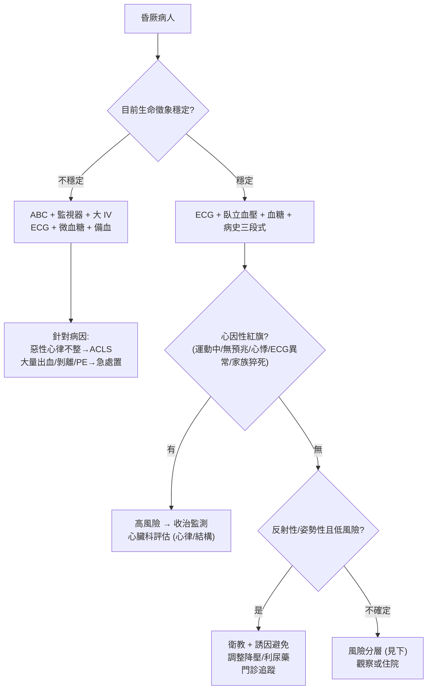

# Syncope（昏厥）

> [!info] 定義：**暫時性全腦灌流不足 → 短暫意識喪失，且快速、完全自行恢復**。值班核心是「分辨良性反射性 vs 致命心因性」。

> [!danger] 🚨 紅旗警訊（must-not-miss，暗示心因性/結構性 → 高猝死風險）
> **助記：運動中暈、躺著暈、暈前無預兆、家族猝死史 → 當心臟看**
> 1. **運動中/用力時昏厥**（syncope with exertion）→ 主動脈瓣狹窄、[[Hypertrophic Cardiomyopathy(肥厚型心肌病)]]
> 2. **心悸後突發、無預兆、瞬間倒下** → [[Arrythmia(心律不整)]]（VT、完全房室阻斷、長 QT、Brugada）
> 3. **胸痛/背痛/呼吸困難合併昏厥** → [[Acute Myocardial infarction(急性心肌梗塞)]]、[[Aortic dissection(主動脈剝離)]]、大量肺栓塞（PE）
> 4. **結構/大血管** → 嚴重瓣膜病、[[Aneurysm(動脈瘤)]]破裂、剝離
> 5. **家族猝死史 / 已知心臟病 / 植入裝置** → 心因性風險大增
> 6. **年長、平躺姿勢下昏厥、外傷嚴重** → 高風險，勿當單純迷走神經
>
> ⚡ **昏厥若是「心因性」，一年死亡率顯著上升 → 值班的任務是把心因性揪出來收治，不是解釋成「太累暈倒」**

## 🔀 鑑別診斷 DDx（值班先分三大類，再排致命）
| 分類 / 病因 | 支持特徵 | rule-out / 危險線索 |
| --- | --- | --- |
| **反射性 Reflex（最常見，約 25%）** Vasovagal / Situational / 頸動脈竇 | 有誘因（久站、疼痛、情緒、悶熱、排尿/咳嗽/排便後）、**前驅症**（噁心、冷汗、臉色蒼白、視野發黑）、快速完全恢復 | 若「運動中」或「無任何前驅」發作 → 反而要小心心因性 |
| **姿勢性低血壓 Orthostatic（約 10%）** | **站立後即刻**發作、量躺-坐-站血壓收縮壓↓≥20 或舒張↓≥10、利尿/降壓藥、脫水、自律神經病變（[[Diabetes Mellitus(糖尿病)]]、帕金森、MSA） | 臥立血壓無變化 |
| **心因性 Cardiac（約 20%，最致命）** 心律不整 / 結構性 | 運動中或平躺發作、無預兆瞬間倒、心悸先兆、ECG 異常、新雜音、家族猝死史 | 需主動排除，**ECG 正常不能完全排除陣發性心律不整** |
| **神經性 / 大血管** 基底動脈供血不足、[[Aortic dissection(主動脈剝離)]]、蜘蛛膜下腔出血 | 合併局部神經缺損、劇烈頭/胸/背痛、複視 | 神經學檢查正常且無疼痛可降權重 |
| **「假性昏厥」（非真昏厥，恢復慢/意識非全失）** [[Seizure(癲癇)]]、[[Transient Ischemic Attack(暫時性腦缺血)]]、[[Hypoglycemia(低血糖)]]、[[Hypoxmia(低血氧)]]、精神性 | 抽搐/舌咬/尿失禁+發作後混亂(癲癇)、血糖低、局部神經徵象 | 意識喪失短且完全恢復、無 postictal → 較支持真昏厥 |

> [!warning] **鑑別「昏厥 vs 癲癇」**：癲癇常有 aura、強直陣攣、舌側緣咬傷、**發作後混亂期（postictal）**；昏厥恢復快且清醒。少數昏厥可有短暫抽動（convulsive syncope），別誤當癲癇。

## ❓ 問診 / 身體檢查重點
- **發作三段式**（診斷關鍵，盡量問到目擊者）：
  - **發作前**：姿勢、誘因、前驅症（有預兆偏反射性；無預兆偏心因性）、運動中否、胸悸/胸痛
  - **發作中**：目擊者描述持續時間、抽搐、臉色、脈搏、舌咬/尿失禁
  - **發作後**：恢復速度、混亂期（癲癇）、局部神經缺損、外傷
- **病史**：心臟病/瓣膜/心衰、**家族猝死或早發心臟病史**、用藥（降壓、利尿、延長 QT 藥物）、脫水/出血徵象
- **理學**：**躺-坐-站血壓（orthostatic）**、雙臂血壓（剝離）、心臟視觸扣聽（雜音/心衰）、頸動脈聽診、完整神經學檢查、DRE 驗糞潛血（疑消化道出血致低血容）

## 🩺 初步 workup（該開的檢查 / 影像）
> [!note] 值班黃金第一步：**12-lead [[ECG(心電圖)]]**（找心律不整/傳導阻滯/預激/長 QT/Brugada/缺血）＋ **臥立血壓**
- **ECG**（每位昏厥病人必做）→ 連 [[Arrythmia(心律不整)]]
- **微血糖**（排低血糖）、CBC/DC（貧血/出血）、電解質、育齡女性 β-hCG（子宮外孕致低血容）
- **監測**：住院者接心電監視器 / 出院前考慮 Holter、事件記錄器（陣發性心律不整）
- **心臟結構**：疑結構性 → 心臟超音波；運動相關 → 進一步評估
- **選擇性**：疑 reflex 且反覆 → **tilt table test**；有局部神經徵象/劇痛 → 腦部影像 / CTA（排剝離、出血）
- ⚠️ **無神經徵象的單純昏厥，不需常規做腦部 CT/EEG/頸動脈超音波**（低產出）

## ⚡ 值班即時處置（穩定 vs 不穩定分流）

- **不穩定線**：先穩定 ABC；惡性心律不整走 ACLS；懷疑大量出血/剝離/PE → 對應急處置
- **穩定線**：ECG + 臥立血壓 + 三段式病史 → 用紅旗與風險分層決定 **收治 vs 出院**
- **反射性/姿勢性且低風險**：衛教（避誘因、症狀前躺下）、檢視並調整致病藥物；反覆 vasovagal → tilt table
- ⚠️ **昏厥合併外傷（尤其臉部/無防禦動作）暗示無預兆的心因性**，勿只處理外傷忽略心臟

## 📊 臨床評分 / 風險分層（scoring）★決定 admit / discharge
> 昏厥的核心決策是「**這次昏厥要不要收住院監測**」→ 用風險分層工具輔助

### ① 高風險特徵（任一 → 傾向收治監測）
- 運動中/平躺昏厥、無前驅、心悸先兆
- **ECG 異常**（心律不整、傳導阻滯、預激、長/短 QT、Brugada、缺血、Q 波）
- 已知結構性心臟病/心衰、家族早發猝死史
- 昏厥合併胸痛/呼吸困難/嚴重頭背痛、持續低血壓、貧血/出血

### ② 常用分層工具
| 評分 | 用途 | 重點 |
| --- | --- | --- |
| **Canadian Syncope Risk Score** | 急診 30 天嚴重不良事件風險 | 整合病史/理學/ECG/troponin，分低→極高風險 |
| **San Francisco Syncope Rule（CHESS）** | 快速篩高風險 | **C**HF、**H**ct<30%、**E**CG 異常、**S**OB、**S**BP<90；任一(+) → 高風險 |
| **EGSYS** | 偏心因性可能性 | 分數高 → 心因性機率↑，優先心臟評估 |

> [!caution] 各評分為**輔助**，不取代臨床判斷；低分但臨床高度可疑（如運動中昏厥）仍應收治。

## 🔗 相關
- 疾病：[[Arrythmia(心律不整)]]　[[Hypertrophic Cardiomyopathy(肥厚型心肌病)]]　[[Valvular Heart Disease(瓣膜性心臟病)]]　[[Orthostatic Hypotension(姿勢性低血壓)]]　[[Aortic dissection(主動脈剝離)]]
- 檢查：[[ECG(心電圖)]]
- 症狀：[[Palpitation(心悸)]]　[[Conscious Change(意識障礙)]]　[[Vertigo(頭暈)]]　[[Chest pain(胸痛)]]

## 📚 來源
[^1]: 昏厥三大類與占比（reflex/orthostatic/cardiac）+ 三段式病史 — 延續舊卡臨床架構
[^2]: 2017 ACC/AHA/HRS Syncope Guideline / 2018 ESC Syncope Guideline — 風險分層與 workup
[^3]: Canadian Syncope Risk Score（Thiruganasambandamoorthy V et al. *CMAJ* 2016）
[^4]: San Francisco Syncope Rule（CHESS）/ EGSYS — 高風險篩檢與心因性可能性

## 🎴 Flashcards & 自我測驗（Ollama qwen2.5:7b 自動生成 2026-07-03）
<!-- flashcard-gen:start -->

### 記憶卡（Spaced Repetition 相容 · `Q::A`）
昏厥的定義是什麼？::暫時性全腦灌流不足 → 短暫意識喪失，且快速、完全自行恢復

哪種情況屬於紅旗警訊？::運動中/用力時昏厥、心悸後突發、無預兆瞬間倒下、胸痛/背痛/呼吸困難合併昏厥、結構/大血管問題、家族猝死史

反射性昏厥的前驅症有哪些？::久站、疼痛、情緒、悶熱、排尿/咳嗽/排便後，出現噁心、冷汗、臉色蒼白、視野發黑

姿勢性低血壓的典型特徵是什麼？::站立後即刻發作、量躺-坐-站血壓收縮壓↓≥20 或舒張↓≥10

心因性昏厥的紅旗警訊有哪些？::運動中或平躺發作、無預兆瞬間倒、心悸先兆、ECG異常、新雜音、家族猝死史

哪種情況需要考慮做 tilt table test？::疑反射且反覆的昏厥患者

昏厥病人初步工作up必做的檢查是什麼？::12-lead ECG（找心律不整/傳導阻滯/預激/長 QT/Brugada/缺血）＋臥立血壓

ECG正常不能完全排除哪種情況？::陣發性心律不整

昏厥病人生命徵象穩定時，下一步該做什麼？::ECG + 臥立血壓 + 三段式病史

哪種昏厥合併外傷暗示無預兆的心因性？::運動中/無預兆的昏厥合併外傷

### 自我測驗（選擇題，答案摺疊）
**Q1.** 一位45歲男性患者，運動後突然昏倒，目擊者稱其在倒地前有心悸感。ECG顯示正常，但患者有家族猝死史。根據上述資訊，最有可能的診斷是？
- A. 反射性昏厥
- B. 心律不整
- C. 姿勢性低血壓
- D. 神經性昏厥

> [!success]- 答案
> **B** — 運動後突然昏倒且有心悸感，加上家族猝死史，提示可能是心因性昏厥。ECG正常不能完全排除陣發性心律不整，因此選擇B。A、C和D均不符合所有條件。

**Q2.** 一位60歲女性患者，平躺時突然昏倒，目擊者稱其倒地前無任何症狀。ECG及血壓檢查正常，但患者有長期使用利尿劑的病史。根據上述資訊，最有可能的診斷是？
- A. 反射性昏厥
- B. 姿勢性低血壓
- C. 心因性昏厥
- D. 神經性昏厥

> [!success]- 答案
> **A** — 平躺時突然昏倒且無任何症狀，ECG及血壓檢查正常，但患者有長期使用利尿劑的病史，提示可能是姿勢性低血壓。因此選擇A。B、C和D均不符合所有條件。

**Q3.** 一位30歲男性患者，運動後突然昏倒，目擊者稱其在倒地前有心悸感。ECG顯示正常，但患者有家族猝死史。根據上述資訊，值班時最應該注意什麼？
- A. 立即開始心肺復甦
- B. 調整降壓藥物
- C. 收治監測並評估心臟結構
- D. 觀察並建議休息

> [!success]- 答案
> **C** — 運動後突然昏倒且有心悸感，加上家族猝死史，提示可能是心因性昏厥。根據高風險特徵，最應該收治監測並評估心臟結構。因此選擇C。A、B和D均不符合所有條件。

<!-- flashcard-gen:end -->
