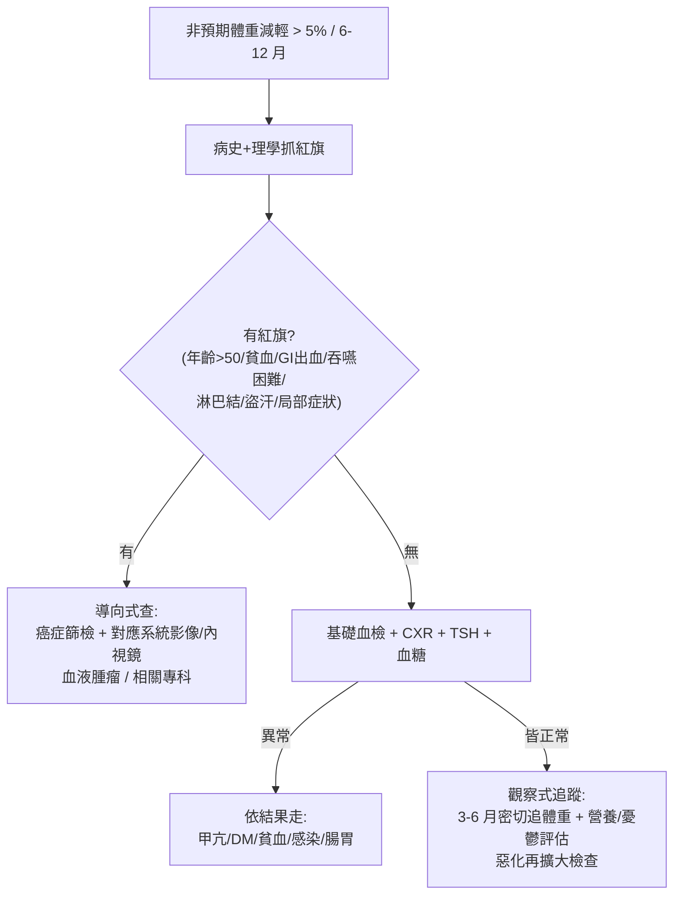

# Weight Loss（體重減輕 / 非預期體重減輕）

> [!danger] 🚨 紅旗警訊（must-not-miss，先分「器質性 vs 沒事」）
> **助記「快、老、貧、局部警訊」** — 非預期體重減輕約**四分之一查不到病因**，但漏掉的常是癌症
> 1. **惡性腫瘤警訊**：年齡 > 50、**貧血 / 缺鐵**、[[Upper GI bleeding(上消化道出血)]] / 血便、吞嚥困難、淋巴結腫大、腫塊、夜間盜汗
> 2. **快速 / 大幅減輕**（短期掉很多）＋ 食慾明顯改變
> 3. **合併全身症狀**：發燒、盜汗（結核 / 淋巴瘤）、咳血（肺癌 / 結核）
> 4. **重度營養不良徵象**（惡病質 cachexia、肌肉流失、低白蛋白）
>
> ⚡ 定義先確認：**非刻意、6–12 個月內體重掉 > 5%（或 > 4.5 kg）** 才算病理性；先排「有沒有紅旗」再決定查多深

## 🔀 鑑別診斷 DDx（值班 / 門診從這裡連到疾病）
> 記憶可用 **「癌·內分泌·腸胃·感染·精神·慢病·藥物·社會」** 八大類。器質性以惡性 / 腸胃 / 內分泌為大宗，功能性 / 精神社會亦不少。

| 類別 | 常見疾病 | 支持特徵 |
| --- | --- | --- |
| **惡性腫瘤** | GI 癌、[[Lung Cancer(肺癌)]]、[[Renal Cell Carcinoma(腎細胞瘤)]]、攝護腺癌、[[Lymphoma(淋巴瘤)]] | 食慾差 + 惡病質、貧血、局部症狀、盜汗、淋巴結 |
| **內分泌代謝** | [[Hyperthyroidism(甲狀腺機能亢進)]]、[[Diabetes Mellitus(糖尿病)]]、[[Adrenal insufficiency(腎上腺不全)]] | 甲亢：怕熱手抖心悸 + 食慾↑卻變瘦；DM：吃多喝多尿多（連 [[Polyuria(多尿)]]） |
| **腸胃道** | 消化性潰瘍、[[Inflammatory Bowel Disease(發炎性腸道疾病)]]、吸收不良 / 慢性胰臟炎 / 乳糜瀉 | 腹痛腹瀉、脂肪便、食慾差、消化道症狀 |
| **慢性感染** | [[Tuberculosis(結核病)]]、[[Human Immunodeficiency Virus(人類免疫缺乏病毒)]]、[[Hepatitis C(C型肝炎)]]、寄生蟲 | 發燒盜汗、咳嗽（TB）、危險因子暴露 |
| **精神 / 認知** | [[Major depressive disorder(嚴重憂鬱疾患)]]、[[Nervosa(厭食症)]]、失智 | 情緒 / 食慾 / 認知改變、進食行為異常 |
| **嚴重慢性病（惡病質）** | [[Heart Failure(心臟衰竭)]]、[[Chronic Obstructive Pulmonary Disease(慢性阻塞性肺病)]]、CKD、肝硬化 | 慢性病病程 + 肌肉流失、lean body weight↓ |
| **藥物 / 物質** | 減肥藥、酗酒、娛樂性用藥、多重用藥副作用 | 用藥 / 物質史、味覺 / 食慾改變 |
| **社會 / 功能** | 貧困、獨居、進食困難、口腔 / 牙齒問題 | 取得食物 / 咀嚼吞嚥受限（尤其長者） |

> [!warning] 先分清「**食慾正常但變瘦**」（甲亢、DM、吸收不良、惡性代謝）vs「**食慾下降變瘦**」（癌、憂鬱、慢病惡病質、社會因素）— 這個分岔比背疾病清單更快指出方向。

## ❓ 問診 / 身體檢查重點
- **確認真實性 + 量化**：有客觀紀錄嗎？6–12 個月掉多少 %？衣服變鬆？（主觀常高估 / 低估）
- **食慾方向**：食慾↑卻變瘦（甲亢 / DM / 吸收不良）vs 食慾↓（癌 / 憂鬱 / 慢病 / 社會）
- **系統回顧掃紅旗**：發燒盜汗、咳嗽咳血、吞嚥困難、腹痛腹瀉血便、多尿多飲、怕熱心悸、情緒低落、性行為 / 輸血 / 藥癮（HIV / 肝炎）、旅遊接觸史（TB / 寄生蟲）
- **藥物 / 物質 / 社會史**：新藥、酗酒、獨居、經濟、牙口
- **關鍵理學**：全身營養 / 精神狀態、頭頸（[[Anemia(貧血)]]、舌炎 / 口角炎、黏膜乾、**淋巴結**、甲狀腺腫）、心肺（慢性 [[Heart Failure(心臟衰竭)]] / [[Chronic Obstructive Pulmonary Disease(慢性阻塞性肺病)]]）、腹部（肝脾腫、腹水、腫塊）、體液狀態（黏膜、capillary refill、[[Orthostatic Hypotension(姿勢性低血壓)]]、皮膚彈性）、甲亢徵象（甲狀腺腫、手抖、皮膚溫濕、心搏過速、腸音快、凸眼 → [[Graves' disease(葛瑞夫茲氏症)]]）

## 🩺 初步 workup（該開的檢查 / 影像）
> [!note] 黃金第一步：**病史 + 理學抓紅旗 + 一組基礎血檢 + CXR + 年齡別癌症篩檢** — 沒紅旗且初檢正常者，「密切追蹤體重」常比亂槍打鳥的影像更划算
- **基礎抽血**：CBC/DC（貧血 / 血球）、生化（電解質 / 腎肝功能 / 血糖 / 白蛋白）、**TSH ± free T4**、**HbA1c / 血糖**、CRP / ESR
- **感染 / 慢病**：疑 TB → CXR + 痰 acid-fast stain / TB culture；疑 HIV → 徵得同意驗血；肝炎血清
- **腸胃**：stool routine ± 潛血；依症狀安排內視鏡
- **癌症導向**：CXR、**年齡別癌症篩檢**（大腸 / 乳房 / 子宮頸等）、有局部症狀順該系統查；不建議無方向的全身影像亂做
- **精神 / 社會**：憂鬱篩檢、營養 / 進食能力評估（尤其長者）

## ⚡ 值班即時處置（分流思路）

- **住院 / 值班角色**：多為背景症狀，重點是**別漏紅旗** + 啟動導向式檢查 + 營養支持 + 轉介適當專科
- **對因處理一律依各專科 / 院內指引**（甲亢、DM、TB、IBD、憂鬱各有其治療）；本卡定位為 decision-support 分流，不下最終診斷 / 確切劑量

## 📊 臨床評分 / 風險分層（stratification）★本卡核心
> [!caution] **誠實說明**：非預期體重減輕**沒有像 HEART / GBS 那樣被廣泛驗證的單一床邊分數**。臨床靠「**紅旗分層 → 決定查多深**」+ 營養不良篩檢工具。下面用「器質性風險分層」與「營養風險工具」取代假分數。

### ① 器質性 vs 功能性 — 紅旗分層（決定 workup 深度）
| 層級 | 特徵 | 處置傾向 |
| --- | --- | --- |
| **高風險（器質 / 惡性可能高）** | 年齡 > 50、貧血 / 缺鐵、GI 出血 / 吞嚥困難、淋巴結 / 腫塊、盜汗發燒、咳血、快速大幅減輕、白蛋白 / CRP 異常 | 積極導向式檢查 + 癌症篩檢 + 專科轉介 |
| **低風險** | 年輕、無紅旗、基礎血檢 + CXR 正常、可解釋的社會 / 精神因素 | **3–6 月觀察式追蹤**，惡化再擴大檢查（多數低風險者追蹤下不惡化） |

### ② 營養風險篩檢工具（住院常用，逐項式）
- **MUST（Malnutrition Universal Screening Tool）**：BMI 分級 + 非計畫體重減輕 % + 急性疾病影響進食 → 分低 / 中 / 高營養風險，對應監測 / 營養介入
- **MST / NRS-2002**：住院營養不良篩檢，抓需營養師介入者
> 這些評「營養風險 / 該不該營養介入」，**不是評病因**；病因仍靠紅旗分層 + 導向檢查。

### ③ 提醒
- **實驗室紅旗**（貧血、白蛋白↓、CRP / ESR↑、鹼性磷酸酶 / 肝指數異常）會顯著提高器質性 / 惡性機率 → 見到就下修「觀察」門檻、上調檢查強度。

## 🔗 相關
- 疾病：[[Hyperthyroidism(甲狀腺機能亢進)]]　[[Diabetes Mellitus(糖尿病)]]　[[Tuberculosis(結核病)]]　[[Human Immunodeficiency Virus(人類免疫缺乏病毒)]]　[[Lymphoma(淋巴瘤)]]　[[Inflammatory Bowel Disease(發炎性腸道疾病)]]
- 症狀：[[Polyuria(多尿)]]　[[Upper GI bleeding(上消化道出血)]]

## 📚 來源
[^1]: 非預期體重減輕約 25% 查無病因、器質性以惡性 / GI / 內分泌為大宗、紅旗導向 workup — AAFP "Unintentional Weight Loss in Older Adults"；Pocket Medicine 8th ed. 相關段
[^2]: 營養不良篩檢工具（MUST / NRS-2002 / MST） — BAPEN MUST；ESPEN nutrition screening guideline
[^3]: 實驗室紅旗（貧血 / 白蛋白 / 發炎指標）提高器質性機率 — weight loss 診斷取徑文獻

## 🎴 Flashcards & 自我測驗（Ollama qwen2.5:7b 自動生成 2026-07-03）
<!-- flashcard-gen:start -->

### 記憶卡（Spaced Repetition 相容 · `Q::A`）
非預期體重減輕的定義是什麼？::6–12 個月內體重掉 > 5% 或 > 4.5 kg

哪些情況屬於快速 / 大幅減輕？::短期掉很多，且食慾明顯改變

非預期體重減輕的紅旗警訊有哪些？::年齡 > 50、貧血 / 缺鐵、上消化道出血 / 血便、吞嚥困難、淋巴結腫大、腫塊、夜間盜汗

非預期體重減輕的鑑別診斷主要分為哪八大類？::癌·內分泌·腸胃·感染·精神·慢病·藥物·社會

惡性腫瘤警訊有哪些特徵？::年齡 > 50、貧血 / 缺鐵、上消化道出血 / 血便、吞嚥困難、淋巴結腫大、腫塊、夜間盜汗

內分泌代謝疾病如何鑑別診斷？::甲亢：怕熱手抖心悸 + 食慾↑卻變瘦；DM：吃多喝多尿多（連多尿）

腸胃道疾病的常見支持特徵有哪些？::腹痛腹瀉、脂肪便、食慾差、消化道症狀

慢性感染的常見疾病是哪些？::結核病、人類免疫缺乏病毒、C型肝炎、寄生蟲

精神 / 認知疾病的常見支持特徵有哪些？::情緒 / 食慾 / 認知改變、進食行為異常

嚴重慢性病的常見疾病是哪些？::心臟衰竭、慢性阻塞性肺病、CKD、肝硬化

### 自我測驗（選擇題，答案摺疊）
**Q1.** 患者主訴過去半年內體重下降5公斤，無其他症狀。初步工作up應該先做哪項檢查?
- A. 全身影像
- B. 基礎血檢 + CXR
- C. 上消化道內視鏡
- D. 甲狀腺功能

> [!success]- 答案
> **B** — 根據筆記，非預期體重減輕的初步工作up是先做基礎血檢和胸部X光片（CXR），再考慮癌症篩檢和其他系統檢查。全身影像不是首選。

**Q2.** 患者65歲，過去3個月內無意中發現體重下降10%，伴有吞嚥困難及淋巴結腫大，下一步應該如何處理?
- A. 立即轉介心臟科
- B. 實施癌症篩檢 + 相應系統影像/內視鏡
- C. 基礎血檢 + CXR
- D. 轉介消化內科

> [!success]- 答案
> **B** — 根據筆記，年齡>50且有吞嚥困難及淋巴結腫大是惡性腫瘤的紅旗警訊，應導向式查：癌症篩檢 + 對應系統影像/內視鏡。

**Q3.** 患者40歲，過去6個月無意中發現體重下降5%，伴有腹痛及腹瀉，但食慾正常。下一步應該如何處理?
- A. 立即轉介消化內科
- B. 實施癌症篩檢 + 相應系統影像/內視鏡
- C. 基礎血檢 + CXR
- D. 轉介精神科

> [!success]- 答案
> **A** — 根據筆記，腹痛及腹瀉是腸胃道疾病的常見支持特徵，40歲患者無其他紅旗警訊，應轉介消化內科。

<!-- flashcard-gen:end -->
